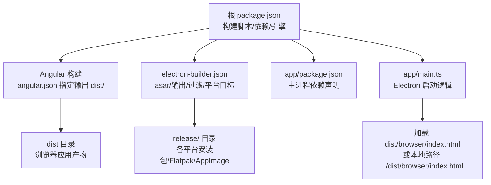
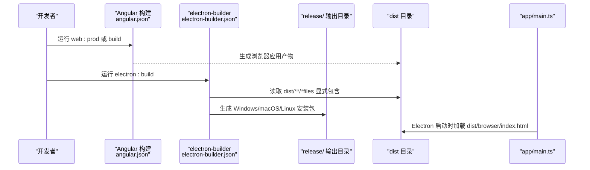
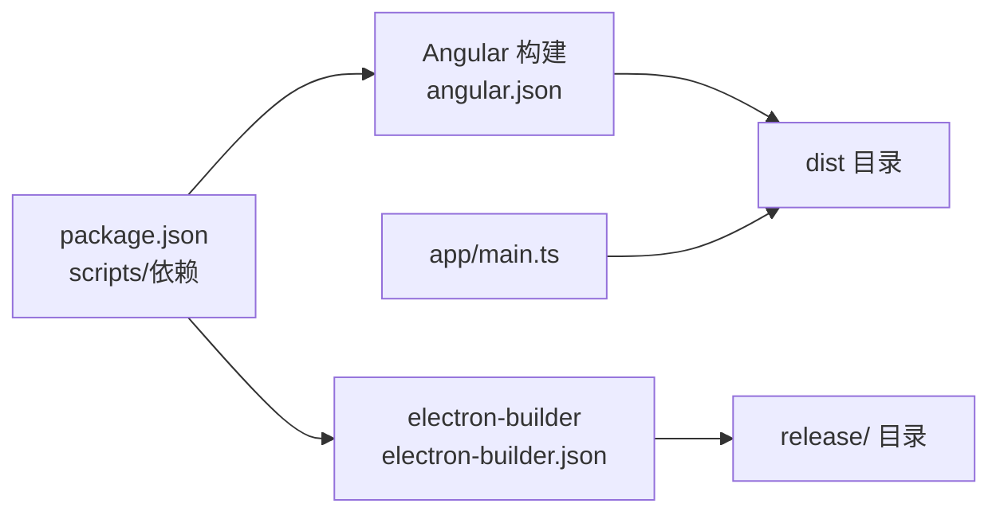

# 构建配置

<cite>
**本文引用的文件**
- [electron-builder.json](file://electron-builder.json)
- [package.json](file://package.json)
- [angular.json](file://angular.json)
- [README.md](file://README.md)
- [app/main.ts](file://app/main.ts)
- [src/main.ts](file://src/main.ts)
- [app/package.json](file://app/package.json)
- [tsconfig.json](file://tsconfig.json)
- [tsconfig.serve.json](file://tsconfig.serve.json)
</cite>

## 目录
1. [简介](#简介)
2. [项目结构](#项目结构)
3. [核心组件](#核心组件)
4. [架构总览](#架构总览)
5. [详细组件分析](#详细组件分析)
6. [依赖分析](#依赖分析)
7. [性能考虑](#性能考虑)
8. [故障排查指南](#故障排查指南)
9. [结论](#结论)
10. [附录](#附录)

## 简介
本文件面向构建工程师与维护者，系统化解读 electron-builder.json 的各项配置，重点覆盖：
- asar 打包策略与影响
- 输出目录与 dist 映射关系
- 文件包含/排除规则与过滤机制
- 平台目标配置（Windows、macOS、Linux）
- Flatpak 与 AppImage 的构建细节（依赖、权限、运行时）
- 构建流程最佳实践与常见问题

## 项目结构
该项目采用“双 package.json”结构以优化最终打包体积并保留 Angular CLI 的生态能力：
- 根目录 package.json：定义构建脚本、开发依赖（含 electron-builder）、引擎版本等
- app/package.json：Electron 主进程依赖声明（当前为空，实际依赖由根依赖提供）
- angular.json：Angular 构建配置，指定浏览器产物输出到 dist 目录
- electron-builder.json：打包与分发配置，定义 asar、输出目录、文件过滤、平台目标及 Flatpak 参数

图表来源
- [package.json:27-47](file://package.json#L27-L47)
- [angular.json:28-30](file://angular.json#L28-L30)
- [electron-builder.json:3-5](file://electron-builder.json#L3-L5)
- [electron-builder.json:12-15](file://electron-builder.json#L12-L15)
- [app/main.ts:43-50](file://app/main.ts#L43-L50)

章节来源
- [package.json:1-108](file://package.json#L1-L108)
- [angular.json:1-188](file://angular.json#L1-L188)
- [electron-builder.json:1-61](file://electron-builder.json#L1-L61)
- [app/main.ts:1-94](file://app/main.ts#L1-L94)

## 核心组件
本节聚焦 electron-builder.json 的关键字段与其作用机理。

- asar 打包
  - 配置位置：顶层布尔值
  - 作用：将应用资源打包为不可直接编辑的归档格式，提升安全性与加载性能
  - 影响：Electron 主进程读取资源时需通过特殊路径或 API 访问；对热重载有影响
- 输出目录
  - 配置位置：directories.output
  - 默认值：release/
  - 说明：构建产物统一输出到该目录，便于 CI/CD 聚合与发布
- 文件过滤规则
  - 配置位置：files 数组
  - 通配符与排除：支持 **/*、!*.map、!*.ts 等模式
  - 特殊条目：使用对象形式从 dist 目录映射所有文件
  - 与 Angular 构建的关系：dist 作为浏览器端产物根目录，被显式纳入打包范围
- 平台目标
  - Windows：便携版 portable（可选带启动图）
  - macOS：DMG 安装包
  - Linux：AppImage 与 Flatpak 双目标，后者包含架构与运行时参数
- Flatpak 特定参数
  - category、base/baseVersion、runtime/runtimeVersion、sdk
  - finishArgs 权限：Wayland/X11、共享 IPC、GPU、音频、用户目录、网络、通知等

章节来源
- [electron-builder.json:1-61](file://electron-builder.json#L1-L61)
- [angular.json:28-30](file://angular.json#L28-L30)

## 架构总览
下图展示从 Angular 构建到 electron-builder 打包的关键流程与文件映射关系。

图表来源
- [package.json:32-41](file://package.json#L32-L41)
- [electron-builder.json:12-15](file://electron-builder.json#L12-L15)
- [app/main.ts:43-50](file://app/main.ts#L43-L50)

## 详细组件分析

### asar 打包配置
- 配置要点
  - asar: true 开启归档
  - 影响：Electron 渲染进程访问静态资源需遵循 asar 路径约定；主进程可通过内置 API 读取
- 性能与安全
  - 减少文件数量，提升加载速度；内容不可直接修改，增强抗篡改性
- 注意事项
  - 与热重载：asar 会阻止直接替换已打包文件，开发阶段建议关闭或配合开发工具
  - 资源路径：确保渲染进程按 asar 规范访问资源

章节来源
- [electron-builder.json:2](file://electron-builder.json#L2)

### 输出目录与 dist 映射
- 输出目录
  - directories.output: release/
  - 说明：所有平台产物统一输出至 release/，便于发布与分发
- dist 映射
  - files: 使用对象条目从 ../dist 复制所有文件
  - 说明：Angular 构建输出到 dist，electron-builder 将其作为打包输入之一
- 启动时加载
  - app/main.ts 在非开发模式下优先尝试 ../dist/browser/index.html，再回退到 ./browser/index.html
  - 保证在打包后仍能正确加载浏览器产物

章节来源
- [electron-builder.json:3-5](file://electron-builder.json#L3-L5)
- [electron-builder.json:12-15](file://electron-builder.json#L12-L15)
- [angular.json:28-30](file://angular.json#L28-L30)
- [app/main.ts:43-50](file://app/main.ts#L43-L50)

### 文件包含/排除规则与过滤机制
- 通配符与排除
  - 包含：**/*
  - 排除：!**/*.ts、!*.map、!package.json、!package-lock.json
  - 说明：排除源码与映射文件，避免污染最终包
- dist 显式包含
  - 对象条目 from: ../dist，filter: ["**/*"]，确保 dist 下所有文件进入打包
- 过滤器类型
  - 字符串：glob 模式
  - 对象：from/filter 组合，用于将外部目录映射到包内
- 与 Angular 构建的协同
  - dist 由 Angular 构建生成，electron-builder 通过 files 显式包含，确保产物完整

章节来源
- [electron-builder.json:6-16](file://electron-builder.json#L6-L16)
- [angular.json:28-30](file://angular.json#L28-L30)

### 平台目标配置（Windows、macOS、Linux）
- Windows（便携版）
  - win.icon：图标目录
  - win.target：["portable"]
  - portable.splashImage：可选启动图
- macOS（DMG）
  - mac.icon：图标目录
  - mac.target：["dmg"]
- Linux（AppImage + Flatpak）
  - linux.icon：图标目录
  - linux.target：["AppImage", { target: "flatpak", arch: ["x64"] }]
  - Flatpak 参数：category、base/baseVersion、runtime/runtimeVersion、sdk、finishArgs

章节来源
- [electron-builder.json:17-41](file://electron-builder.json#L17-L41)

### Flatpak 构建细节
- 基础与运行时
  - base: org.electronjs.Electron2.BaseApp
  - baseVersion: 25.08
  - runtime: org.freedesktop.Platform
  - runtimeVersion: 25.08
  - sdk: org.freedesktop.Sdk
- 权限设置（finishArgs）
  - 图形：--socket=wayland、--socket=x11、--device=dri
  - IPC：--share=ipc
  - 音频：--socket=pulseaudio
  - 文件系统：--filesystem=home
  - 网络：--share=network
  - 通知：--talk-name=org.freedesktop.Notifications
- 依赖与运行时安装
  - README 提供了安装 Flatpak、flatpak-builder 与所需运行时的步骤
  - electron:build 会在安装运行时后生成 Flatpak 产物

章节来源
- [electron-builder.json:42-59](file://electron-builder.json#L42-L59)
- [README.md:115-132](file://README.md#L115-L132)

### 构建流程与入口脚本
- 构建脚本
  - web:prod：调用 Angular 构建生成 dist
  - electron:build：先生成 web 产物，再调用 electron-builder 执行打包
- 启动逻辑
  - app/main.ts 在非开发模式下加载 ../dist/browser/index.html，确保打包后可正常启动

章节来源
- [package.json:32-41](file://package.json#L32-L41)
- [app/main.ts:43-50](file://app/main.ts#L43-L50)

## 依赖分析
- 构建链路
  - Angular 构建（angular.json）→ dist 输出
  - electron-builder（electron-builder.json）→ release/ 产物
  - app/main.ts 加载 dist/browser/index.html
- 关键依赖
  - electron-builder：26.8.1
  - electron：41.0.2
  - Angular 生态：@angular/build、@angular/cli 等

图表来源
- [package.json:27-47](file://package.json#L27-L47)
- [angular.json:28-30](file://angular.json#L28-L30)
- [electron-builder.json:3-5](file://electron-builder.json#L3-L5)
- [app/main.ts:43-50](file://app/main.ts#L43-L50)

章节来源
- [package.json:1-108](file://package.json#L1-L108)
- [angular.json:1-188](file://angular.json#L1-L188)
- [electron-builder.json:1-61](file://electron-builder.json#L1-L61)
- [app/main.ts:1-94](file://app/main.ts#L1-L94)

## 性能考虑
- asar 的收益与代价
  - 收益：减少文件数量、提升加载速度、增强安全性
  - 代价：开发期热重载受限，调试不便
- 输出目录集中化
  - release/ 统一输出，利于缓存与分发
- 文件过滤最小化
  - 仅包含必要文件，避免冗余资源进入包体
- 平台目标选择
  - Linux 同时产出 AppImage 与 Flatpak，满足不同分发渠道需求

## 故障排查指南
- 构建后无法加载页面
  - 检查 dist 是否存在且包含 index.html
  - 确认 app/main.ts 的路径解析逻辑（../dist/browser/index.html 与 ./browser/index.html）
- Flatpak 无法运行
  - 确认已安装所需运行时与 SDK（org.freedesktop.Platform、org.freedesktop.Sdk、org.electronjs.Electron2.BaseApp）
  - 检查 finishArgs 权限是否满足应用需求（Wayland/X11、音频、网络等）
- Windows 便携版缺少启动图
  - 检查 portable.splashImage 路径是否存在
- 开发期热重载异常
  - asar 模式下热重载受限，建议在开发脚本中禁用 asar 或使用开发模式

章节来源
- [app/main.ts:43-50](file://app/main.ts#L43-L50)
- [electron-builder.json:23-25](file://electron-builder.json#L23-L25)
- [README.md:115-132](file://README.md#L115-L132)

## 结论
本项目通过 electron-builder.json 实现了跨平台打包与分发，结合 Angular 的 dist 产物，形成清晰的构建链路。asar 打包提升了安全性与性能，但需要在开发体验与生产部署之间权衡。Linux 平台同时产出 AppImage 与 Flatpak，满足多样化的分发场景。建议在团队内明确 asar 开关策略、文件过滤规则与 Flatpak 权限清单，以保障构建稳定性与可维护性。

## 附录
- 最佳实践
  - 明确区分开发与生产构建，合理使用 asar
  - 严格控制 files 过滤规则，避免将源码与映射文件打包
  - Linux 分发优先考虑 Flatpak，以获得更好的运行时隔离与权限管理
  - CI/CD 中固定 electron-builder 版本，确保构建一致性
- 常见问题
  - dist 缺失：确认先执行 web:prod 再执行 electron:build
  - Flatpak 权限不足：根据应用功能调整 finishArgs
  - Windows 便携版图标缺失：检查 win.icon 与 portable.splashImage 路径