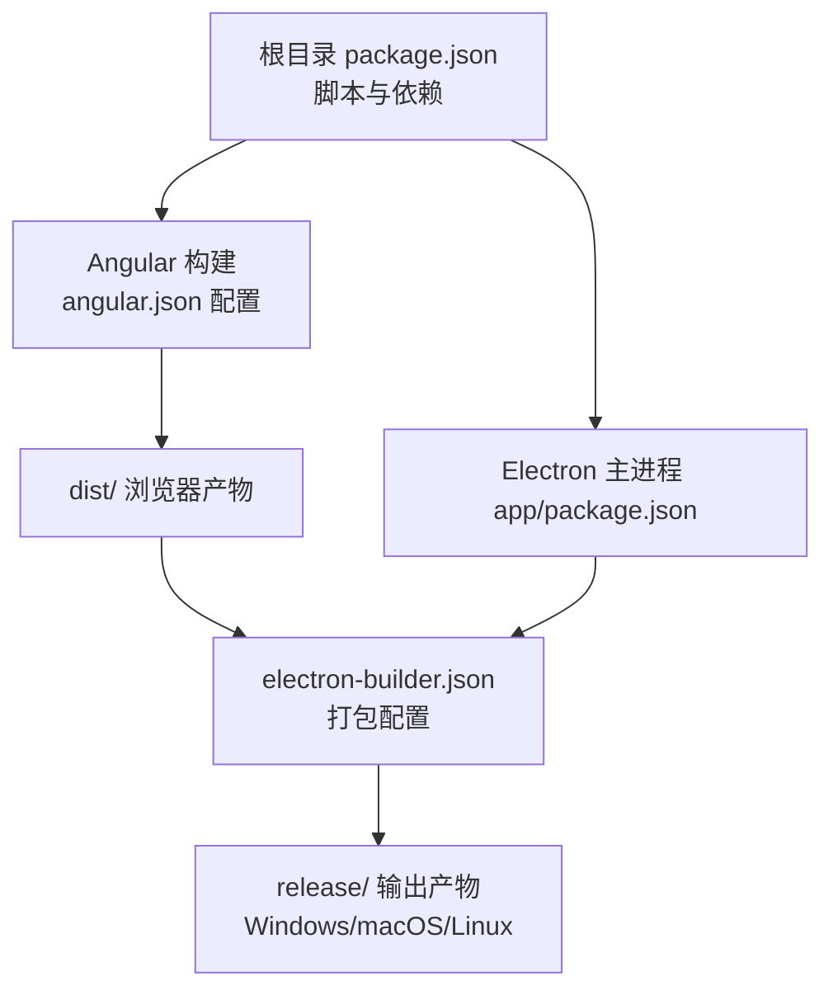
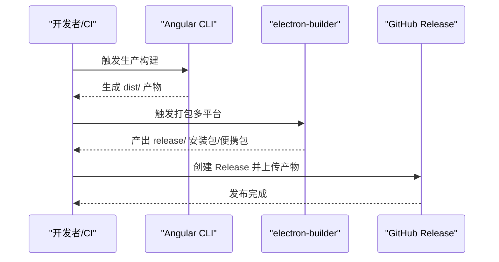
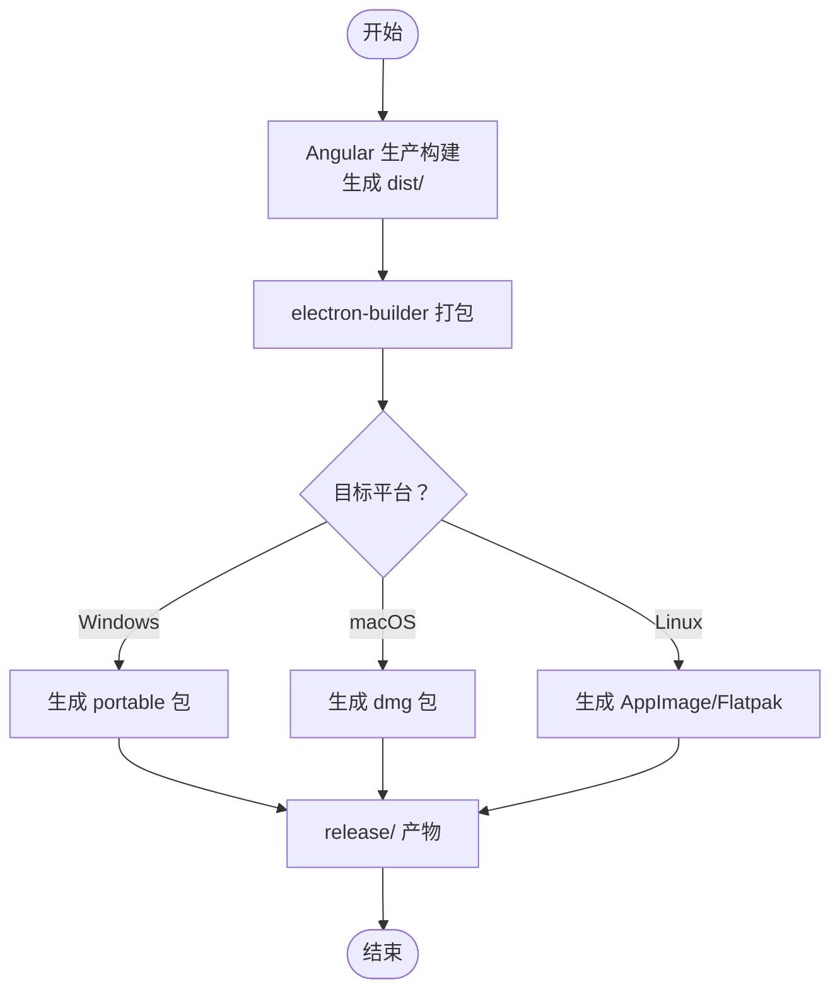
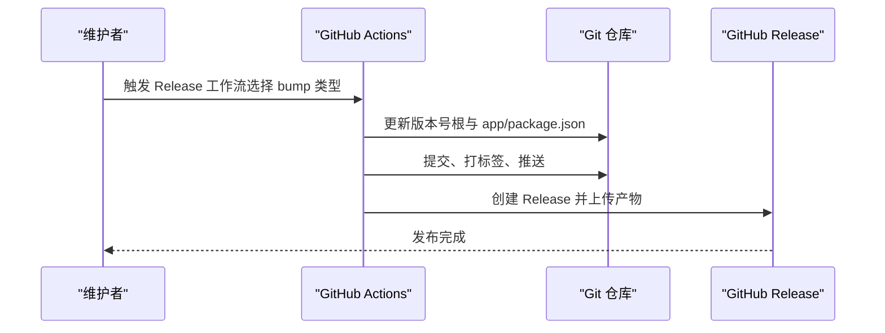
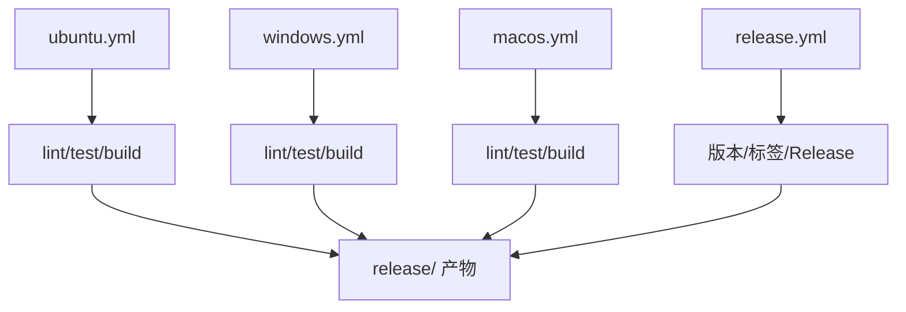
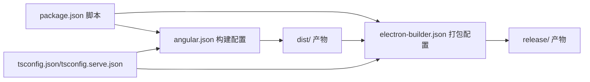

# 生产部署

<cite>
**本文引用的文件**
- [package.json](file://package.json)
- [angular.json](file://angular.json)
- [electron-builder.json](file://electron-builder.json)
- [app/package.json](file://app/package.json)
- [src/environments/environment.prod.ts](file://src/environments/environment.prod.ts)
- [src/environments/environment.dev.ts](file://src/environments/environment.dev.ts)
- [tsconfig.json](file://tsconfig.json)
- [tsconfig.serve.json](file://tsconfig.serve.json)
- [.github/workflows/release.yml](file://.github/workflows/release.yml)
- [.github/workflows/ubuntu.yml](file://.github/workflows/ubuntu.yml)
- [.github/workflows/windows.yml](file://.github/workflows/windows.yml)
- [.github/workflows/macos.yml](file://.github/workflows/macos.yml)
- [README.md](file://README.md)
</cite>

## 目录
1. [简介](#简介)
2. [项目结构](#项目结构)
3. [核心组件](#核心组件)
4. [架构总览](#架构总览)
5. [详细组件分析](#详细组件分析)
6. [依赖关系分析](#依赖关系分析)
7. [性能考量](#性能考量)
8. [故障排查指南](#故障排查指南)
9. [结论](#结论)
10. [附录](#附录)

## 简介
本指南面向生产环境部署，围绕该 Angular + Electron 桌面应用的构建、打包、发布与运行进行系统化说明。内容涵盖版本管理策略、发布流程控制与回滚机制、CI/CD（GitHub Actions）集成、应用签名与安全加固、监控与日志、性能优化与资源管理等。文档同时给出可操作的步骤与最佳实践，帮助团队在不同平台（Windows、macOS、Linux）稳定交付高质量产品。

## 项目结构
该项目采用“双 package.json”结构：根目录用于前端构建与脚本，app/ 目录用于 Electron 主进程（Node.js）。Angular CLI 负责浏览器端产物生成，electron-builder 负责跨平台打包与分发。

图表来源
- [package.json:27-48](file://package.json#L27-L48)
- [angular.json:24-82](file://angular.json#L24-L82)
- [electron-builder.json:1-61](file://electron-builder.json#L1-L61)
- [app/package.json:1-13](file://app/package.json#L1-L13)

章节来源
- [README.md:75-81](file://README.md#L75-L81)
- [package.json:25-48](file://package.json#L25-L48)
- [angular.json:10-139](file://angular.json#L10-L139)
- [electron-builder.json:1-61](file://electron-builder.json#L1-L61)
- [app/package.json:1-13](file://app/package.json#L1-L13)

## 核心组件
- 构建与打包
  - 前端构建：通过 Angular CLI 在生产模式下生成 dist/ 产物，并启用 AOT、严格优化与输出哈希。
  - 打包：使用 electron-builder 将 dist/ 与主进程代码合并为可执行安装包或便携式包。
- 版本与发布
  - 使用 npm version 进行语义化版本升级，配合 GitHub Actions 自动打标签与创建 Release。
- 平台支持
  - Windows：便携式包；macOS：DMG；Linux：AppImage 与 Flatpak。
- 环境配置
  - 通过环境文件区分开发/生产配置，便于注入运行时参数。

章节来源
- [angular.json:47-82](file://angular.json#L47-L82)
- [electron-builder.json:17-41](file://electron-builder.json#L17-L41)
- [.github/workflows/release.yml:40-110](file://.github/workflows/release.yml#L40-L110)
- [src/environments/environment.prod.ts:1-5](file://src/environments/environment.prod.ts#L1-L5)
- [src/environments/environment.dev.ts:1-5](file://src/environments/environment.dev.ts#L1-L5)

## 架构总览
下图展示从源码到发布产物的关键流程：本地开发/CI 触发 → Angular 构建 → Electron 打包 → 产物分发。

图表来源
- [package.json:32-41](file://package.json#L32-L41)
- [.github/workflows/ubuntu.yml:84-89](file://.github/workflows/ubuntu.yml#L84-L89)
- [.github/workflows/windows.yml:76-81](file://.github/workflows/windows.yml#L76-L81)
- [.github/workflows/macos.yml:78-83](file://.github/workflows/macos.yml#L78-L83)
- [.github/workflows/release.yml:105-110](file://.github/workflows/release.yml#L105-L110)

## 详细组件分析

### 构建与打包配置
- Angular 生产构建
  - 启用 AOT、严格模板检查、移除 SourceMap、开启输出哈希，确保体积最小化与缓存友好。
  - 通过 fileReplacements 注入生产环境常量。
- Electron 打包
  - asar 打包提升安全性与加载效率。
  - 多目标输出：Windows 便携式、macOS DMG、Linux AppImage 与 Flatpak。
  - 文件过滤仅包含必要资源，排除 TypeScript 源与映射文件。

图表来源
- [angular.json:62-75](file://angular.json#L62-L75)
- [electron-builder.json:2-61](file://electron-builder.json#L2-L61)
- [package.json:41](file://package.json#L41)

章节来源
- [angular.json:24-82](file://angular.json#L24-L82)
- [electron-builder.json:1-61](file://electron-builder.json#L1-L61)
- [package.json:32-41](file://package.json#L32-L41)

### 版本管理与发布流程
- 版本升级
  - 通过 GitHub Actions 的 workflow_dispatch 输入选择 patch/minor/major，自动更新根与 app/package.json 的版本号。
  - 使用 postversion 脚本同步 app/package.json 版本，保证主进程与渲染进程一致。
- 标签与发布
  - 推送分支后打标签并创建 GitHub Release，自动写入变更日志。
- 回滚策略
  - 建议保留最近 N 个版本的 Release 与对应标签，回滚时直接切换到上一稳定标签并重新触发打包。

图表来源
- [.github/workflows/release.yml:3-110](file://.github/workflows/release.yml#L3-L110)
- [package.json:47](file://package.json#L47)

章节来源
- [.github/workflows/release.yml:40-110](file://.github/workflows/release.yml#L40-L110)
- [package.json:47](file://package.json#L47)

### CI/CD 集成（GitHub Actions）
- 多平台并行构建
  - Ubuntu/Windows/macOS 分别执行：安装依赖、代码检查、单元测试、E2E 测试、打包。
  - 使用缓存加速 npm 与 Electron 二进制下载。
- 测试与覆盖率
  - 单元测试基于 Vitest，E2E 基于 Playwright，均以无头方式运行。
- 打包与产物
  - 统一调用 npm run electron:build，产出各平台安装包。

图表来源
- [.github/workflows/ubuntu.yml:1-90](file://.github/workflows/ubuntu.yml#L1-L90)
- [.github/workflows/windows.yml:1-82](file://.github/workflows/windows.yml#L1-L82)
- [.github/workflows/macos.yml:1-84](file://.github/workflows/macos.yml#L1-L84)
- [.github/workflows/release.yml:1-110](file://.github/workflows/release.yml#L1-L110)

章节来源
- [.github/workflows/ubuntu.yml:30-89](file://.github/workflows/ubuntu.yml#L30-L89)
- [.github/workflows/windows.yml:33-81](file://.github/workflows/windows.yml#L33-L81)
- [.github/workflows/macos.yml:29-83](file://.github/workflows/macos.yml#L29-L83)

### 应用签名与安全加固
- 代码签名
  - Windows：为便携包与安装包配置签名（需在 CI 中注入证书与密码）。
  - macOS：为 DMG 配置签名与公证，确保 Gatekeeper 放行。
  - Linux：Flatpak 可通过沙箱与权限声明增强安全。
- 安全加固
  - asar 打包、关闭开发者工具、最小权限原则、输入校验与 CSP（如适用）。
- 供应链安全
  - 使用 package-lock.json 与 engines 约束 Node/TypeScript 版本，定期更新依赖并启用 Dependabot。

章节来源
- [electron-builder.json:17-59](file://electron-builder.json#L17-L59)
- [package.json:96-99](file://package.json#L96-L99)
- [.github/dependabot.yml](file://.github/dependabot.yml)

### 监控、日志与错误上报
- 日志
  - Electron 主进程可通过标准输出/文件记录；渲染进程使用浏览器控制台与服务端日志。
- 错误捕获
  - 在主进程注册未处理异常与 Promise 拒绝监听，统一上报至错误收集服务。
- 性能监控
  - 记录启动耗时、内存占用、页面渲染时间等指标，结合 APM 工具进行可视化。

[本节为通用指导，不直接分析具体文件]

### 运行时配置与环境变量
- 环境文件
  - 通过环境文件注入生产/开发开关与后端地址等配置。
- 构建替换
  - 使用 fileReplacements 在构建阶段注入目标环境常量。

章节来源
- [src/environments/environment.prod.ts:1-5](file://src/environments/environment.prod.ts#L1-L5)
- [src/environments/environment.dev.ts:1-5](file://src/environments/environment.dev.ts#L1-L5)
- [angular.json:55-74](file://angular.json#L55-L74)

## 依赖关系分析
- 构建链路
  - package.json 的脚本驱动 Angular CLI 与 electron-builder；angular.json 定义构建选项；electron-builder.json 决定打包目标与文件过滤。
- 编译配置
  - tsconfig.json 与 tsconfig.serve.json 分别服务于 Web 与 Electron 主进程编译目标，确保模块解析与目标语言版本正确。

图表来源
- [package.json:27-48](file://package.json#L27-L48)
- [angular.json:24-82](file://angular.json#L24-L82)
- [electron-builder.json:1-61](file://electron-builder.json#L1-L61)
- [tsconfig.json:1-34](file://tsconfig.json#L1-L34)
- [tsconfig.serve.json:1-28](file://tsconfig.serve.json#L1-L28)

章节来源
- [package.json:27-48](file://package.json#L27-L48)
- [angular.json:24-82](file://angular.json#L24-L82)
- [electron-builder.json:1-61](file://electron-builder.json#L1-L61)
- [tsconfig.json:1-34](file://tsconfig.json#L1-L34)
- [tsconfig.serve.json:1-28](file://tsconfig.serve.json#L1-L28)

## 性能考量
- 构建优化
  - 生产构建启用 AOT、移除 SourceMap、输出哈希，缩短首屏加载与缓存命中。
- 运行时优化
  - 关闭开发者工具、禁用不必要的日志、延迟初始化非关键模块。
- 资源管理
  - 合理拆分代码块、预加载关键资源、压缩静态资源。

章节来源
- [angular.json:62-75](file://angular.json#L62-L75)
- [README.md:71-73](file://README.md#L71-L73)

## 故障排查指南
- 构建失败
  - 检查 Node/TypeScript 版本是否满足 engines 约束；确认 package-lock.json 与缓存一致性。
- 打包失败
  - 确认 electron-builder.json 的目标平台与依赖已安装；Linux 需要额外系统依赖。
- 测试失败
  - 确保 Playwright 浏览器安装完成；Xvfb 已在 CI 中启用。
- 回滚
  - 切换到上一稳定标签并重新触发打包；保留历史 Release 以便快速回退。

章节来源
- [package.json:96-99](file://package.json#L96-L99)
- [.github/workflows/ubuntu.yml:54-59](file://.github/workflows/ubuntu.yml#L54-L59)
- [.github/workflows/windows.yml:57-62](file://.github/workflows/windows.yml#L57-L62)
- [.github/workflows/macos.yml:53-64](file://.github/workflows/macos.yml#L53-L64)
- [.github/workflows/release.yml:92-110](file://.github/workflows/release.yml#L92-L110)

## 结论
本指南提供了从版本管理、CI/CD 到打包发布与安全加固的完整生产部署路径。建议在正式环境中启用代码签名与公证、完善监控与日志体系，并保持依赖与工具链的持续更新，以确保交付质量与长期可维护性。

## 附录
- 快速参考
  - 生产构建：npm run web:prod
  - 本地打包：npm run electron:build
  - 触发发布：GitHub Actions Release 工作流（选择补丁/小改/大改）
  - 平台依赖：Linux 安装 Flatpak 与运行时；macOS 安装 GNU tar 与 coreutils；Windows 默认支持

章节来源
- [README.md:104-132](file://README.md#L104-L132)
- [.github/workflows/ubuntu.yml:54-59](file://.github/workflows/ubuntu.yml#L54-L59)
- [.github/workflows/macos.yml:53-57](file://.github/workflows/macos.yml#L53-L57)
- [.github/workflows/release.yml:6-10](file://.github/workflows/release.yml#L6-L10)