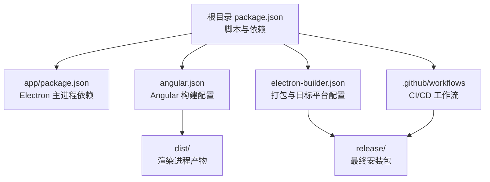
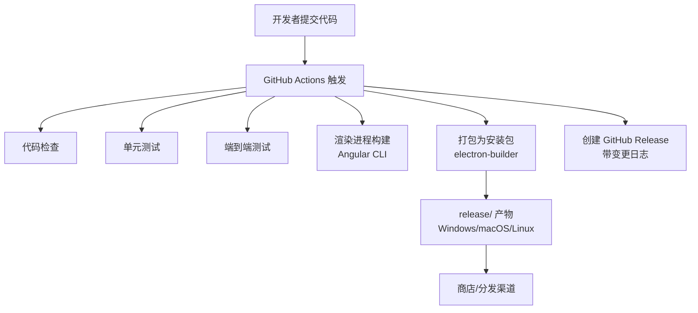
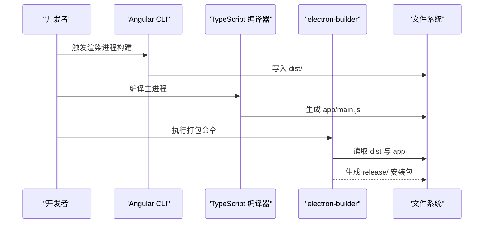
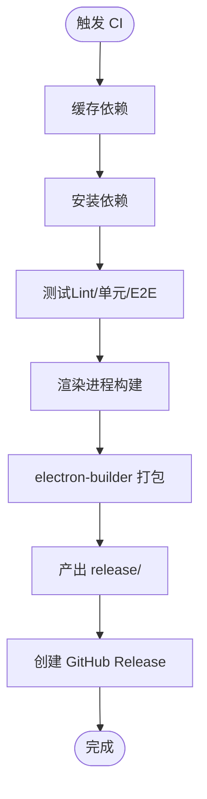
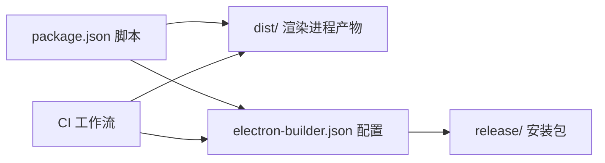

# 部署指南

<cite>
**本文引用的文件**
- [package.json](file://package.json)
- [electron-builder.json](file://electron-builder.json)
- [app/package.json](file://app/package.json)
- [angular.json](file://angular.json)
- [README.md](file://README.md)
- [HOW_TO.md](file://HOW_TO.md)
- [.github/workflows/windows.yml](file://.github/workflows/windows.yml)
- [.github/workflows/macos.yml](file://.github/workflows/macos.yml)
- [.github/workflows/ubuntu.yml](file://.github/workflows/ubuntu.yml)
- [.github/workflows/release.yml](file://.github/workflows/release.yml)
- [app/main.ts](file://app/main.ts)
</cite>

## 目录
1. [简介](#简介)
2. [项目结构](#项目结构)
3. [核心组件](#核心组件)
4. [架构总览](#架构总览)
5. [详细组件分析](#详细组件分析)
6. [依赖关系分析](#依赖关系分析)
7. [性能与可维护性考量](#性能与可维护性考量)
8. [故障排查指南](#故障排查指南)
9. [结论](#结论)
10. [附录](#附录)

## 简介
本指南面向需要在 Windows、macOS 和 Linux 平台分发与部署 Electron 应用的工程团队。基于仓库中的配置，我们将系统讲解以下内容：
- 使用 electron-builder 的多平台打包配置（Windows、macOS、Linux）
- 应用签名、公证与商店发布流程（概念性说明）
- Linux 包格式（Flatpak 与 AppImage）的构建与分发
- 持续集成与自动化部署（GitHub Actions 工作流）
- 版本管理、更新机制与回滚策略
- 生产环境部署最佳实践与安全注意事项

## 项目结构
该项目采用“双 package.json”结构：根目录用于前端构建与打包脚本，app 目录用于 Electron 主进程与最终打包产物。关键目录与职责如下：
- app：Electron 主进程源码与打包后主进程依赖
- src：Electron 渲染进程（Angular 应用）源码
- .github/workflows：跨平台 CI 构建与发布工作流
- electron-builder.json：多平台打包与包格式配置
- angular.json：Angular 构建器与配置

图表来源
- [package.json:1-108](file://package.json#L1-L108)
- [angular.json:1-188](file://angular.json#L1-L188)
- [electron-builder.json:1-61](file://electron-builder.json#L1-L61)

章节来源
- [package.json:1-108](file://package.json#L1-L108)
- [angular.json:1-188](file://angular.json#L1-L188)
- [electron-builder.json:1-61](file://electron-builder.json#L1-L61)

## 核心组件
- 打包与分发工具链
  - electron-builder：统一的多平台打包工具，支持 Windows、macOS、Linux，并生成 AppImage 与 Flatpak
  - Angular CLI：负责渲染进程的构建与优化
  - GitHub Actions：自动化测试与构建，按平台并行执行
- 版本与发布
  - 通过脚本与工作流实现语义化版本升级、打标签与 GitHub Release 创建
- 运行时入口
  - Electron 主进程入口负责加载渲染进程页面或本地 dist 资源

章节来源
- [package.json:27-48](file://package.json#L27-L48)
- [electron-builder.json:1-61](file://electron-builder.json#L1-L61)
- [.github/workflows/windows.yml:1-82](file://.github/workflows/windows.yml#L1-L82)
- [.github/workflows/macos.yml:1-84](file://.github/workflows/macos.yml#L1-L84)
- [.github/workflows/ubuntu.yml:1-90](file://.github/workflows/ubuntu.yml#L1-L90)
- [app/main.ts:1-94](file://app/main.ts#L1-L94)

## 架构总览
下图展示了从开发到多平台分发的整体流程，包括构建、测试、打包与发布。

图表来源
- [.github/workflows/windows.yml:1-82](file://.github/workflows/windows.yml#L1-L82)
- [.github/workflows/macos.yml:1-84](file://.github/workflows/macos.yml#L1-L84)
- [.github/workflows/ubuntu.yml:1-90](file://.github/workflows/ubuntu.yml#L1-L90)
- [.github/workflows/release.yml:1-110](file://.github/workflows/release.yml#L1-L110)
- [electron-builder.json:1-61](file://electron-builder.json#L1-L61)

## 详细组件分析

### electron-builder 多平台打包配置
- 输出目录与文件过滤
  - 输出目录：release/
  - 文件包含规则：排除 TypeScript 源、映射文件、顶层 package.json 等；显式包含 dist 目录
- Windows
  - 图标：使用 dist/browser/assets/icons
  - 目标：便携式（portable），包含启动画面
- macOS
  - 图标：同上
  - 目标：DMG 安装镜像
- Linux
  - 图标：同上
  - 目标：AppImage；同时定义了 Flatpak 配置项
- Flatpak
  - 基座运行时：org.electronjs.Electron2.BaseApp 25.08
  - 运行时与 SDK：org.freedesktop.Platform 25.08 与 org.freedesktop.Sdk 25.08
  - finishArgs：声明 Wayland/X11、音频、网络、通知等权限

章节来源
- [electron-builder.json:1-61](file://electron-builder.json#L1-L61)
- [README.md:115-133](file://README.md#L115-L133)

### 打包流程与产物
- 渲染进程构建：由 Angular CLI 将 src 构建至 dist
- 主进程构建：通过 tsc 生成 app/main.js
- 打包命令：调用 electron-builder，按平台生成对应安装包
- 产物位置：release/

图表来源
- [package.json:32-41](file://package.json#L32-L41)
- [angular.json:24-82](file://angular.json#L24-L82)
- [electron-builder.json:1-61](file://electron-builder.json#L1-L61)

章节来源
- [package.json:32-41](file://package.json#L32-L41)
- [angular.json:24-82](file://angular.json#L24-L82)
- [electron-builder.json:1-61](file://electron-builder.json#L1-L61)

### Linux 包格式：AppImage 与 Flatpak
- AppImage
  - electron-builder 直接生成，便于用户直接下载运行
- Flatpak
  - 需要安装运行时与基座应用（org.freedesktop.Platform、org.freedesktop.Sdk、org.electronjs.Electron2.BaseApp 25.08）
  - 通过 finishArgs 声明所需系统接口与权限
  - README 提供了安装步骤与运行时准备说明

章节来源
- [electron-builder.json:32-59](file://electron-builder.json#L32-L59)
- [README.md:115-133](file://README.md#L115-L133)

### 持续集成与自动化部署
- Windows 工作流
  - 缓存 Node 与 Electron 二进制
  - 安装依赖、代码检查、Playwright 依赖、单元与 E2E 测试
  - 最终执行 electron:build
- macOS 工作流
  - 安装 Homebrew 依赖（gnu-tar、coreutils）
  - 安装额外开发依赖后进行测试与打包
- Ubuntu 工作流
  - 安装 GTK/Webkit/AppIndicator/PNG/Flatpak 等系统依赖
  - 安装 Flatpak 运行时与基座应用
  - 测试与打包
- 发布工作流（Release）
  - 通过交互输入选择语义化版本类型（patch/minor/major）
  - 更新根与 app 的版本、生成变更日志、打标签并创建 GitHub Release

图表来源
- [.github/workflows/windows.yml:1-82](file://.github/workflows/windows.yml#L1-L82)
- [.github/workflows/macos.yml:1-84](file://.github/workflows/macos.yml#L1-L84)
- [.github/workflows/ubuntu.yml:1-90](file://.github/workflows/ubuntu.yml#L1-L90)
- [.github/workflows/release.yml:1-110](file://.github/workflows/release.yml#L1-L110)

章节来源
- [.github/workflows/windows.yml:1-82](file://.github/workflows/windows.yml#L1-L82)
- [.github/workflows/macos.yml:1-84](file://.github/workflows/macos.yml#L1-L84)
- [.github/workflows/ubuntu.yml:1-90](file://.github/workflows/ubuntu.yml#L1-L90)
- [.github/workflows/release.yml:1-110](file://.github/workflows/release.yml#L1-L110)

### 版本管理、更新机制与回滚策略
- 版本管理
  - 语义化版本：通过 Release 工作流选择 bump 类型，自动更新根与 app 的版本
  - 同步更新：postversion 脚本会同步 app/package.json 的版本
- 更新机制
  - 当前配置未启用自动更新（publish=never），因此无内置更新通道
  - 若需启用自动更新，可在 electron-builder 中配置合适的发布源（如 S3、GitHub Releases）
- 回滚策略
  - 建议保留最近 N 个版本的安装包，以便快速回滚
  - 在发布工作流中保留变更日志，便于定位问题版本

章节来源
- [package.json:47](file://package.json#L47)
- [package.json:41](file://package.json#L41)
- [.github/workflows/release.yml:40-110](file://.github/workflows/release.yml#L40-L110)

### 生产环境部署最佳实践与安全考虑
- 安全
  - 仅在开发模式开启调试与不安全内容（serve 条件控制）
  - 关闭上下文隔离与禁用 webSecurity 仅限开发场景
- 性能
  - 生产构建启用 AOT、优化与输出哈希，减少体积
  - 使用缓存策略（Node 模块、Electron 二进制）提升 CI 速度
- 可靠性
  - 对打包命令增加重试机制，避免偶发失败
  - 在 Linux 上预装 Flatpak 运行时，确保 Flatpak 构建稳定

章节来源
- [app/main.ts:27-38](file://app/main.ts#L27-L38)
- [angular.json:62-82](file://angular.json#L62-L82)
- [.github/workflows/ubuntu.yml:54-59](file://.github/workflows/ubuntu.yml#L54-L59)

## 依赖关系分析
- 组件耦合
  - 打包阶段依赖渲染进程构建结果（dist）
  - CI 工作流对各平台系统依赖存在耦合（Linux 额外依赖、macOS Homebrew 依赖）
- 外部依赖
  - electron-builder、Angular CLI、Playwright、Node/TypeScript 版本要求
- 可能的循环依赖
  - 无直接循环依赖；打包配置与构建脚本解耦良好

图表来源
- [package.json:27-48](file://package.json#L27-L48)
- [electron-builder.json:1-61](file://electron-builder.json#L1-L61)
- [.github/workflows/windows.yml:1-82](file://.github/workflows/windows.yml#L1-L82)
- [.github/workflows/macos.yml:1-84](file://.github/workflows/macos.yml#L1-L84)
- [.github/workflows/ubuntu.yml:1-90](file://.github/workflows/ubuntu.yml#L1-L90)

章节来源
- [package.json:27-48](file://package.json#L27-L48)
- [electron-builder.json:1-61](file://electron-builder.json#L1-L61)
- [.github/workflows/windows.yml:1-82](file://.github/workflows/windows.yml#L1-L82)
- [.github/workflows/macos.yml:1-84](file://.github/workflows/macos.yml#L1-L84)
- [.github/workflows/ubuntu.yml:1-90](file://.github/workflows/ubuntu.yml#L1-L90)

## 性能与可维护性考量
- 构建性能
  - 启用 Node 与 Electron 二进制缓存，显著缩短 CI 时间
  - 使用 npm ci 保证依赖一致性
- 产物体积
  - 生产构建关闭 sourceMap，启用 AOT 与输出哈希
- 可维护性
  - 双 package.json 结构清晰分离主进程与渲染进程依赖
  - CI 工作流按平台拆分，便于定位问题

[本节为通用建议，无需特定文件来源]

## 故障排查指南
- 打包失败（Linux）
  - 确认已安装 Flatpak 运行时与基座应用
  - 确认已添加并启用 Flathub 远端
- 打包失败（macOS）
  - 确认已安装 gnu-tar 与 coreutils
  - 确认额外开发依赖已安装
- 打包失败（Windows）
  - 检查缓存路径权限与可用空间
- 版本不同步
  - 确认 postversion 脚本已执行，app/package.json 与根 package.json 版本一致
- 开发调试
  - 开发模式下可启用调试与热重载；生产模式请关闭相关选项

章节来源
- [.github/workflows/ubuntu.yml:54-59](file://.github/workflows/ubuntu.yml#L54-L59)
- [.github/workflows/macos.yml:53-64](file://.github/workflows/macos.yml#L53-L64)
- [.github/workflows/windows.yml:42-51](file://.github/workflows/windows.yml#L42-L51)
- [package.json:47](file://package.json#L47)
- [app/main.ts:27-38](file://app/main.ts#L27-L38)

## 结论
本项目提供了完善的多平台打包与 CI/CD 能力。通过 electron-builder 与 GitHub Actions，可稳定地在 Windows、macOS 与 Linux 上生成安装包，并支持 Flatpak 与 AppImage。结合语义化版本与发布工作流，可实现可追溯的发布流程。建议在生产环境中启用更严格的签名与公证流程，并根据需要引入自动更新机制以提升用户体验。

[本节为总结，无需特定文件来源]

## 附录

### A. 打包与分发清单
- Windows
  - 便携式安装包（portable）
  - 启动画面：electron.bmp
- macOS
  - DMG 安装镜像
- Linux
  - AppImage
  - Flatpak（需安装运行时与基座应用）

章节来源
- [electron-builder.json:17-41](file://electron-builder.json#L17-L41)
- [README.md:115-133](file://README.md#L115-L133)

### B. 版本与发布流程
- 通过 Release 工作流选择补丁/小版本/主版本
- 自动生成变更日志并创建 GitHub Release
- 自动更新 app/package.json 版本

章节来源
- [.github/workflows/release.yml:40-110](file://.github/workflows/release.yml#L40-L110)
- [package.json:47](file://package.json#L47)

### C. 运行时入口与开发模式
- Electron 主进程入口负责窗口创建与页面加载
- 开发模式下加载本地 Angular 服务端口，生产模式加载本地 dist

章节来源
- [app/main.ts:1-94](file://app/main.ts#L1-L94)