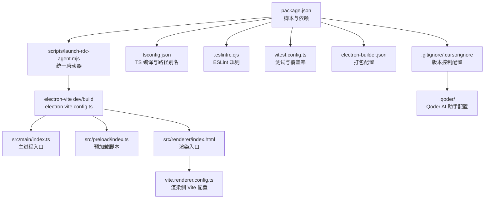
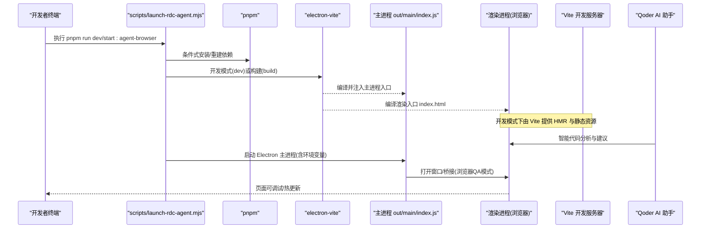
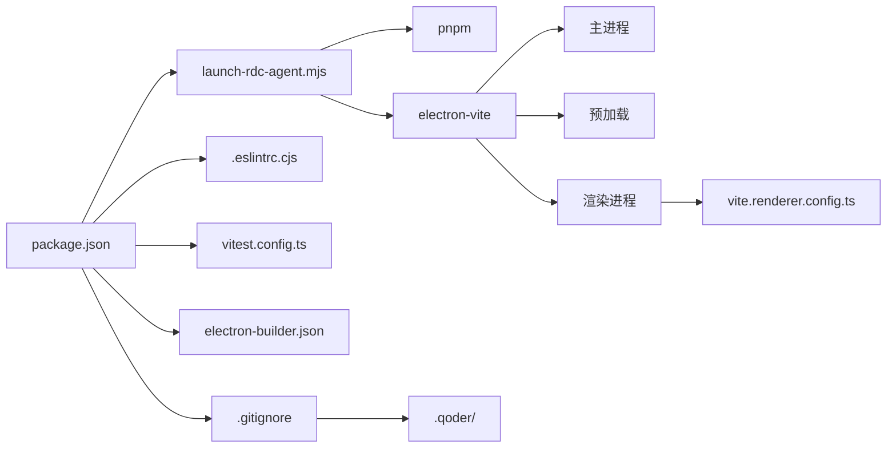

# 开发环境搭建

<cite>
**本文引用的文件**
- [package.json](file://package.json)
- [tsconfig.json](file://tsconfig.json)
- [electron.vite.config.ts](file://electron.vite.config.ts)
- [vite.renderer.config.ts](file://vite.renderer.config.ts)
- [.eslintrc.cjs](file://.eslintrc.cjs)
- [vitest.config.ts](file://vitest.config.ts)
- [scripts/launch-rdc-agent.mjs](file://scripts/launch-rdc-agent.mjs)
- [electron-builder.json](file://electron-builder.json)
- [README.md](file://README.md)
- [.gitignore](file://.gitignore)
- [.cursorignore](file://.cursorignore)
</cite>

## 更新摘要
**所做更改**
- 更新了版本控制配置部分，反映 `.gitignore` 中移除 `.qoder/` 目录忽略规则
- 新增了 Qoder AI 助手工具的集成说明
- 更新了 IDE 配置建议，包含 Qoder 相关配置
- 增强了故障排查指南，涵盖 Qoder 相关文件处理

## 目录
1. [简介](#简介)
2. [项目结构](#项目结构)
3. [核心组件](#核心组件)
4. [架构总览](#架构总览)
5. [详细组件分析](#详细组件分析)
6. [依赖关系分析](#依赖关系分析)
7. [性能注意事项](#性能注意事项)
8. [故障排查指南](#故障排查指南)
9. [结论](#结论)
10. [附录](#附录)

## 简介
本指南面向首次或重新搭建 RDC-Agent 开发环境的开发者，覆盖系统要求、依赖安装、开发服务器启动、TypeScript/Vite/ESLint 配置说明、IDE 调试建议、环境变量与本地工具链配置，以及常见问题定位方法。目标是让你在最短时间内完成"可运行、可调试、可构建"的开发闭环。

**更新** 本项目现已支持 Qoder AI 助手工具，其生成的配置文件和缓存将纳入版本控制管理。

## 项目结构
RDC-Agent 是一个基于 Electron + Vite 的桌面应用：
- src/main：Electron 主进程逻辑、IPC、工作流编排、Provider 与外部能力接入
- src/preload：向渲染进程暴露受控 API
- src/renderer：React 界面、交互与状态投影
- src/shared：跨层类型、常量与契约
- resources：随应用分发的 Agent/Skill/Hook/Prompt 等运行时资源
- scripts：启动器、校验脚本、测试全局设置等
- electron.vite.config.ts / vite.renderer.config.ts：Vite/Electron-Vite 构建与开发服务配置
- tsconfig.json：统一 TypeScript 编译与路径别名
- .eslintrc.cjs：代码质量规则与模块边界约束
- vitest.config.ts：单元测试与覆盖率策略
- package.json：脚本入口、依赖版本、Node 引擎要求
- electron-builder.json：打包产物与平台目标

**图表来源**
- [package.json:19-76](file://package.json#L19-L76)
- [scripts/launch-rdc-agent.mjs:476-527](file://scripts/launch-rdc-agent.mjs#L476-L527)
- [electron.vite.config.ts:8-61](file://electron.vite.config.ts#L8-L61)
- [vite.renderer.config.ts:11-39](file://vite.renderer.config.ts#L11-L39)
- [tsconfig.json:1-27](file://tsconfig.json#L1-L27)
- [.eslintrc.cjs:1-102](file://.eslintrc.cjs#L1-L102)
- [vitest.config.ts:5-81](file://vitest.config.ts#L5-L81)
- [electron-builder.json:1-46](file://electron-builder.json#L1-L46)
- [.gitignore:1-64](file://.gitignore#L1-L64)
- [.cursorignore:29-34](file://.cursorignore#L29-L34)

章节来源
- [README.md:48-81](file://README.md#L48-L81)
- [package.json:1-136](file://package.json#L1-L136)

## 核心组件
- 启动器 scripts/launch-rdc-agent.mjs：负责 Node/pnpm 版本检查、依赖同步、Electron 二进制恢复、构建缓存指纹、按模式启动（桌面/浏览器/开发）
- 构建与开发服务：electron-vite 聚合 main/preload/renderer 三端；renderer 独立 Vite 配置用于浏览器 QA 与热更新
- TypeScript：统一 target/lib/moduleResolution，启用严格模式与路径别名 @main/@renderer/@shared
- ESLint：强制 React Hooks 规则、限制 renderer 各层级导入边界
- 测试：Vitest 覆盖 main/shared，排除 Electron/OS 绑定代码，设定覆盖率阈值
- 打包：electron-builder 输出 release，包含 agent-runtime/hooks 等资源
- **新增** Qoder AI 助手集成：支持智能代码补全、重构建议和上下文感知编程

章节来源
- [scripts/launch-rdc-agent.mjs:74-123](file://scripts/launch-rdc-agent.mjs#L74-L123)
- [scripts/launch-rdc-agent.mjs:299-385](file://scripts/launch-rdc-agent.mjs#L299-L385)
- [electron.vite.config.ts:8-61](file://electron.vite.config.ts#L8-L61)
- [vite.renderer.config.ts:11-39](file://vite.renderer.config.ts#L11-L39)
- [tsconfig.json:1-27](file://tsconfig.json#L1-L27)
- [.eslintrc.cjs:1-102](file://.eslintrc.cjs#L1-L102)
- [vitest.config.ts:5-81](file://vitest.config.ts#L5-L81)
- [electron-builder.json:1-46](file://electron-builder.json#L1-L46)

## 架构总览
下图展示了开发时从命令行到 Electron 应用的调用链，以及渲染端 Vite 服务的角色。

**图表来源**
- [scripts/launch-rdc-agent.mjs:476-527](file://scripts/launch-rdc-agent.mjs#L476-L527)
- [electron.vite.config.ts:8-61](file://electron.vite.config.ts#L8-L61)
- [vite.renderer.config.ts:11-39](file://vite.renderer.config.ts#L11-L39)

## 详细组件分析

### 系统要求与环境准备
- Node.js：>=22.13.0（启动器会进行版本校验）
- pnpm：仓库指定 pnpm@11.7.0（通过 lockfile 与启动器锁定）
- Electron：^42.2.0（由依赖管理，启动器自动恢复二进制）
- 操作系统：Windows/macOS/Linux（打包目标见 electron-builder 配置）
- **新增** Qoder AI 助手：可选的 AI 辅助开发工具，支持智能代码补全和重构

章节来源
- [package.json:16-18](file://package.json#L16-L18)
- [package.json:112-134](file://package.json#L112-L134)
- [scripts/launch-rdc-agent.mjs:23-25](file://scripts/launch-rdc-agent.mjs#L23-L25)
- [scripts/launch-rdc-agent.mjs:74-83](file://scripts/launch-rdc-agent.mjs#L74-L83)
- [electron-builder.json:27-44](file://electron-builder.json#L27-L44)

### 依赖安装步骤
- 使用仓库内 pnpm 版本安装依赖（启动器会自动选择并校验）
- 首次运行会生成用户级 pnpm store（~/.cache/rdc-agent/pnpm-store），避免污染项目根目录
- 若 Electron 二进制缺失，启动器会尝试 rebuild 与下载恢复
- **新增** Qoder 配置：项目根目录下的 `.qoder/` 目录现在会被版本控制跟踪，包含 AI 助手的配置和缓存

章节来源
- [package.json:15](file://package.json#L15)
- [scripts/launch-rdc-agent.mjs:102-123](file://scripts/launch-rdc-agent.mjs#L102-L123)
- [scripts/launch-rdc-agent.mjs:204-224](file://scripts/launch-rdc-agent.mjs#L204-L224)
- [scripts/launch-rdc-agent.mjs:299-343](file://scripts/launch-rdc-agent.mjs#L299-L343)
- [.gitignore:1-64](file://.gitignore#L1-L64)

### 开发服务器启动配置
- 桌面开发模式：pnpm run dev（启动可见 Electron 应用，启用 HMR）
- 浏览器验证模式：pnpm run start:agent-browser（无头 Electron + 真实浏览器会话）
- 仅准备依赖与构建：追加 --prepare-only；强制恢复：追加 --force-prepare
- 渲染侧 Vite 服务：host 127.0.0.1，端口默认 5173（开发时可通过 OS 分配端口）

章节来源
- [package.json:19-24](file://package.json#L19-L24)
- [scripts/launch-rdc-agent.mjs:420-449](file://scripts/launch-rdc-agent.mjs#L420-L449)
- [scripts/launch-rdc-agent.mjs:490-527](file://scripts/launch-rdc-agent.mjs#L490-L527)
- [vite.renderer.config.ts:30-38](file://vite.renderer.config.ts#L30-L38)
- [electron.vite.config.ts:40-60](file://electron.vite.config.ts#L40-L60)

### TypeScript 配置要点
- 目标与库：target ES2022，lib 包含 ES2022/DOM/DOM.Iterable
- 模块解析：moduleResolution bundler，支持 import .ts 扩展名
- JSX：react-jsx
- 严格模式：strict/noUnusedLocals/noUnusedParameters/noFallthroughCasesInSwitch
- 路径别名：@main/@renderer/@shared 指向 src 对应目录

章节来源
- [tsconfig.json:1-27](file://tsconfig.json#L1-L27)

### Vite 构建与开发配置
- electron-vite：聚合 main/preload/renderer 三端构建与开发
  - main 与 preload 使用 externalizeDepsPlugin 将依赖外置
  - renderer 使用 React 插件与自定义 CSP 样式替换插件（browser-dev）
- 渲染侧 Vite：
  - root 指向 src/renderer
  - server host 127.0.0.1，port 5173，HMR 协议 ws
  - 在 serve 阶段对 CSS 引入进行替换以适配 BrowserAppBridge 的 CSP

章节来源
- [electron.vite.config.ts:8-61](file://electron.vite.config.ts#L8-L61)
- [vite.renderer.config.ts:11-39](file://vite.renderer.config.ts#L11-L39)

### ESLint 规则与模块边界
- 基础规则：关闭 no-undef/no-unused-vars，启用 @typescript-eslint 与 react-hooks/recommended
- 未使用变量：忽略以下划线开头的参数/变量/捕获错误
- 模块边界（renderer）：
  - ui 层禁止导入 features/patterns/stores/services/platform/hooks/app/shell
  - patterns 层禁止导入 features/platform/app/shell
  - stores/services/hooks 禁止导入 features/ui/patterns/app/shell
  - lib 层禁止导入 features/ui/patterns/stores/services/platform/app/shell

章节来源
- [.eslintrc.cjs:1-102](file://.eslintrc.cjs#L1-L102)

### 测试与覆盖率
- Vitest 环境：node，全局 globals
- 覆盖范围：src/main 与 src/shared，排除 Electron/OS 绑定与集成测试相关代码
- 覆盖率阈值：lines/functions/statements/branches 分别设定下限
- 全局设置：scripts/vitest-global-setup.ts

章节来源
- [vitest.config.ts:5-81](file://vitest.config.ts#L5-L81)

### IDE 配置建议（VS Code）
- 推荐扩展
  - TypeScript/JavaScript 语言支持（内置）
  - ESLint（配合 .eslintrc.cjs）
  - React 语法与 Snippets（可选）
  - Prettier（可选，需与 ESLint 协同）
  - **新增** Qoder AI 助手（可选）：提供智能代码补全、重构建议和上下文感知编程
- 调试配置（示例思路）
  - 使用 VS Code 的 Node 调试器附加到 launch-rdc-agent.mjs 进程
  - 或使用 Electron 调试器附加到主进程（需要知道主进程 PID）
  - 渲染进程可使用 Chrome DevTools（开发模式自动开启）
- 路径别名
  - 确保 TS 路径别名生效（已在 tsconfig.json 配置）
  - 可在 VS Code settings.json 中启用 "TypeScript > Auto Import" 以识别别名
- **新增** Qoder 配置
  - `.qoder/` 目录现在被版本控制跟踪，包含 AI 助手的配置和缓存
  - 团队成员共享相同的 AI 助手行为和建议
  - 可通过 `.cursorignore` 中的 `.qoder/` 配置控制 Cursor 编辑器中的忽略行为

注意：以上为通用实践建议，具体调试流程可结合启动器输出的进程信息进行操作。

### 环境变量与本地工具链
- 启动器注入的环境变量（根据模式）：
  - NODE_ENV：development 或 production
  - RDC_AGENT_HEADLESS：headless 模式开关
  - RDC_AGENT_BROWSER_QA：浏览器 QA 模式开关
  - RDC_AGENT_TEST_MODE：测试模式开关
  - RDC_AGENT_REBUILD_SETTINGS_ONLY：仅重建设置开关
  - ELECTRON_RENDERER_URL：浏览器开发模式下指向 Vite 地址
- 用户数据目录：
  - 可通过 RDC_AGENT_USER_DATA 指定 userData 目录（不存在则创建）
  - 非标准 Node 安装可通过 RDC_AGENT_NODE 指定绝对路径
- 本地工具链：
  - 应用通过 Settings 中的 RDX CLI 与 shell actions 接入外部工具链（不在此处硬编码）
- **新增** Qoder 环境变量：
  - Qoder 配置文件位于 `.qoder/` 目录，支持团队共享 AI 助手行为

章节来源
- [scripts/launch-rdc-agent.mjs:387-407](file://scripts/launch-rdc-agent.mjs#L387-L407)
- [scripts/launch-rdc-agent.mjs:420-449](file://scripts/launch-rdc-agent.mjs#L420-L449)
- [README.md:48-81](file://README.md#L48-L81)
- [.gitignore:1-64](file://.gitignore#L1-L64)
- [.cursorignore:29-34](file://.cursorignore#L29-L34)

## 依赖关系分析
- 启动器依赖 pnpm 与 Node 版本约束，保证依赖与构建一致性
- electron-vite 作为构建与开发中枢，串联 main/preload/renderer
- 渲染侧 Vite 独立配置，便于浏览器 QA 与 HMR
- ESLint 与 Vitest 分别保障代码质量与测试覆盖率
- electron-builder 负责最终产物打包
- **新增** Qoder AI 助手：通过 `.qoder/` 目录配置，支持智能开发辅助功能

**图表来源**
- [package.json:19-76](file://package.json#L19-L76)
- [scripts/launch-rdc-agent.mjs:476-527](file://scripts/launch-rdc-agent.mjs#L476-L527)
- [electron.vite.config.ts:8-61](file://electron.vite.config.ts#L8-L61)
- [vite.renderer.config.ts:11-39](file://vite.renderer.config.ts#L11-L39)
- [.eslintrc.cjs:1-102](file://.eslintrc.cjs#L1-L102)
- [vitest.config.ts:5-81](file://vitest.config.ts#L5-L81)
- [electron-builder.json:1-46](file://electron-builder.json#L1-L46)
- [.gitignore:1-64](file://.gitignore#L1-L64)

## 性能注意事项
- 依赖安装与构建采用指纹缓存，减少重复安装与构建时间
- 渲染侧 Vite 使用 HMR 提升前端迭代效率
- 测试覆盖率排除大量 Electron/OS 绑定代码，聚焦可测单元
- 生产构建通过 electron-vite 与 electron-builder 优化产物体积
- **新增** Qoder 缓存管理：`.qoder/` 目录包含 AI 助手缓存，已纳入版本控制但保持轻量

[本节为通用指导，无需特定文件引用]

## 故障排查指南
- Node 版本不匹配
  - 现象：启动时报错提示需要特定 Node 版本
  - 处理：升级至 >=22.13.0，或通过 RDC_AGENT_NODE 指定正确路径
- pnpm 版本不一致
  - 现象：依赖安装失败或行为异常
  - 处理：使用仓库指定的 pnpm 版本（lockfile 已固定）
- Electron 二进制缺失
  - 现象：无法启动 Electron
  - 处理：启动器会自动尝试 rebuild 与下载恢复；必要时使用 --force-prepare
- 端口冲突或 Vite 启动失败
  - 现象：渲染服务无法启动或端口占用
  - 处理：确认 5173 端口未被占用；开发模式允许 OS 分配端口
- 模块导入报错（ESLint/TS）
  - 现象：路径别名或模块边界规则报错
  - 处理：检查 tsconfig.json 路径别名与 .eslintrc.cjs 的 restricted-imports 规则
- 测试覆盖率不达标
  - 现象：覆盖率阈值检查失败
  - 处理：调整测试覆盖或阈值；参考 vitest.config.ts 的 include/exclude 策略
- **新增** Qoder 配置问题
  - 现象：AI 助手功能异常或配置不同步
  - 处理：检查 `.qoder/` 目录权限和版本控制状态；确保团队成员使用相同配置
  - 现象：Qoder 相关文件导致版本冲突
  - 处理：检查 `.gitignore` 和 `.cursorignore` 配置，确保正确的忽略规则

章节来源
- [scripts/launch-rdc-agent.mjs:74-83](file://scripts/launch-rdc-agent.mjs#L74-L83)
- [scripts/launch-rdc-agent.mjs:204-224](file://scripts/launch-rdc-agent.mjs#L204-L224)
- [scripts/launch-rdc-agent.mjs:420-449](file://scripts/launch-rdc-agent.mjs#L420-L449)
- [tsconfig.json:17-22](file://tsconfig.json#L17-L22)
- [.eslintrc.cjs:34-99](file://.eslintrc.cjs#L34-L99)
- [vitest.config.ts:12-72](file://vitest.config.ts#L12-L72)
- [.gitignore:1-64](file://.gitignore#L1-L64)
- [.cursorignore:29-34](file://.cursorignore#L29-L34)

## 结论
通过统一的启动器与严格的依赖/构建配置，RDC-Agent 提供了稳定且高效的开发体验。**新增的 Qoder AI 助手集成**进一步增强了开发体验，通过智能代码补全和重构建议提高开发效率。遵循本文的系统要求、安装步骤、配置说明与排查建议，可以快速完成环境搭建并进入开发与调试流程。建议在团队内统一 Node/pnpm 版本，并使用提供的脚本与配置保持一致性。同时，利用 Qoder 的团队协作功能，确保所有成员获得一致的 AI 辅助体验。

## 附录
- 常用命令
  - 开发：pnpm run dev
  - 浏览器验证：pnpm run start:agent-browser
  - 类型检查：pnpm run typecheck
  - 测试：pnpm run test
  - 构建：pnpm run build
  - 打包：pnpm run dist / pack
- 关键配置文件
  - package.json：脚本与依赖
  - tsconfig.json：TS 编译与别名
  - electron.vite.config.ts：主/预加载/渲染构建
  - vite.renderer.config.ts：渲染侧 Vite
  - .eslintrc.cjs：ESLint 规则
  - vitest.config.ts：测试与覆盖率
  - electron-builder.json：打包配置
  - scripts/launch-rdc-agent.mjs：统一启动器
  - **.新增** .gitignore：版本控制忽略规则（已移除 .qoder/ 忽略）
  - **.新增** .cursorignore：Cursor 编辑器忽略规则（包含 .qoder/）
  - **.新增** .qoder/：Qoder AI 助手配置目录（现被版本控制跟踪）

章节来源
- [package.json:19-76](file://package.json#L19-L76)
- [tsconfig.json:1-27](file://tsconfig.json#L1-L27)
- [electron.vite.config.ts:8-61](file://electron.vite.config.ts#L8-L61)
- [vite.renderer.config.ts:11-39](file://vite.renderer.config.ts#L11-L39)
- [.eslintrc.cjs:1-102](file://.eslintrc.cjs#L1-L102)
- [vitest.config.ts:5-81](file://vitest.config.ts#L5-L81)
- [electron-builder.json:1-46](file://electron-builder.json#L1-L46)
- [scripts/launch-rdc-agent.mjs:476-527](file://scripts/launch-rdc-agent.mjs#L476-L527)
- [.gitignore:1-64](file://.gitignore#L1-L64)
- [.cursorignore:29-34](file://.cursorignore#L29-L34)