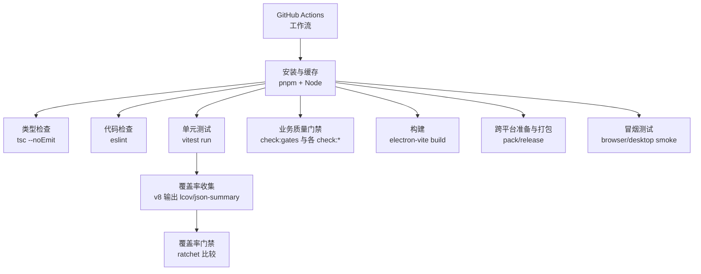
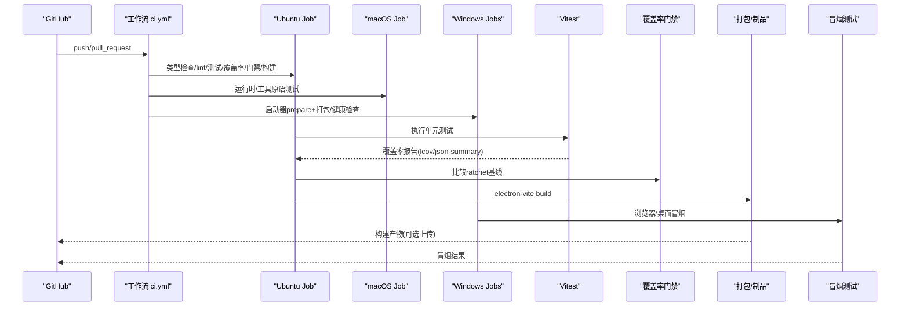
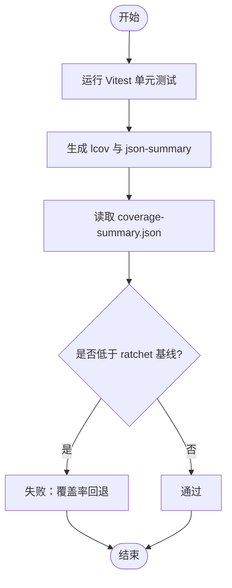
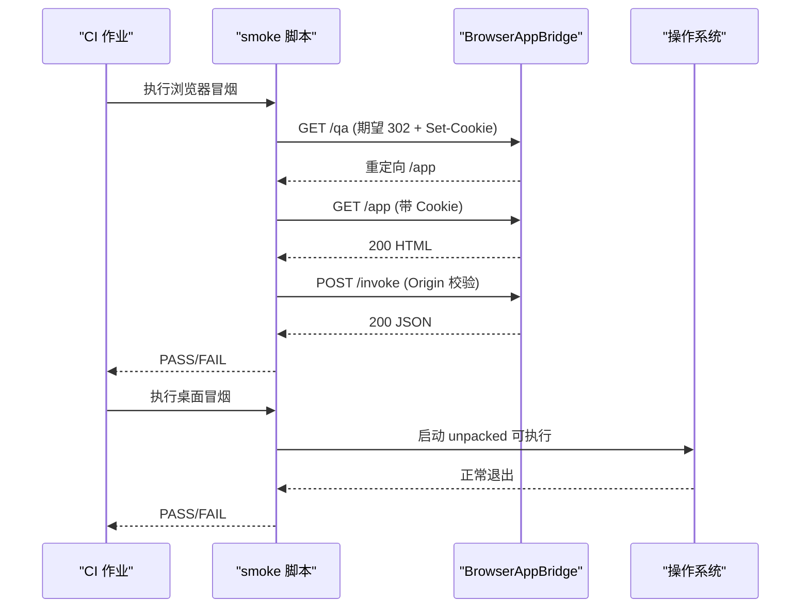
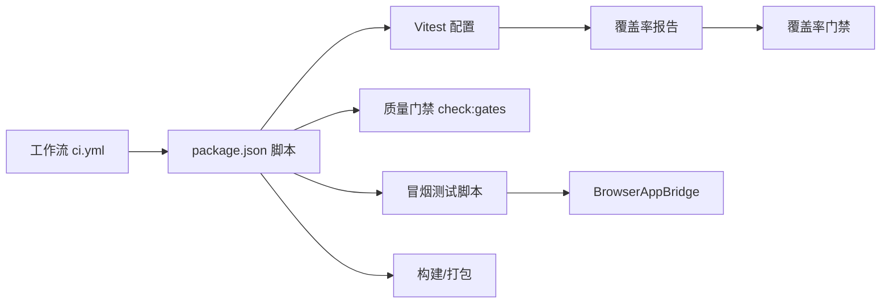

# 持续集成配置

<cite>
**本文引用的文件**
- [ci.yml](file://.github/workflows/ci.yml)
- [package.json](file://package.json)
- [vitest.config.ts](file://vitest.config.ts)
- [.eslintrc.cjs](file://.eslintrc.cjs)
- [check-coverage-ratchet.mjs](file://scripts/check-coverage-ratchet.mjs)
- [smoke-agent-browser-qa.mjs](file://scripts/smoke-agent-browser-qa.mjs)
- [smoke-desktop-health.mjs](file://scripts/smoke-desktop-health.mjs)
- [start-rdc-agent.sh](file://scripts/start-rdc-agent.sh)
- [vitest-global-setup.ts](file://scripts/vitest-global-setup.ts)
</cite>

## 目录
1. [简介](#简介)
2. [项目结构](#项目结构)
3. [核心组件](#核心组件)
4. [架构总览](#架构总览)
5. [详细组件分析](#详细组件分析)
6. [依赖关系分析](#依赖关系分析)
7. [性能与并行优化](#性能与并行优化)
8. [故障排查指南](#故障排查指南)
9. [结论](#结论)
10. [附录](#附录)

## 简介
本文件面向 RDC-Agent 的持续集成（CI）配置，系统化说明 GitHub Actions 工作流、自动化测试流水线、代码质量检查流程，以及覆盖率门禁、静态分析、安全扫描、构建缓存、并行执行、失败重试、通知与报告、制品管理等关键能力。文档同时覆盖单元测试、集成测试、端到端（浏览器/桌面冒烟）测试的执行策略与产物管理。

## 项目结构
RDC-Agent 的 CI 由以下关键部分构成：
- GitHub Actions 工作流：定义触发条件、并发控制、多平台作业编排与步骤顺序。
- 脚本与工具：统一入口脚本、质量门禁脚本、覆盖率门禁脚本、冒烟测试脚本等。
- 测试框架与配置：Vitest 全局初始化、覆盖率阈值、包含/排除范围。
- 代码规范与类型检查：ESLint 规则、TypeScript 类型检查。
- 打包与发布：Electron/Vite 构建、electron-builder 打包、SBOM/校验和生成。

**图表来源**
- [ci.yml:1-182](file://.github/workflows/ci.yml#L1-L182)
- [package.json:19-76](file://package.json#L19-L76)
- [vitest.config.ts:5-72](file://vitest.config.ts#L5-L72)

**章节来源**
- [ci.yml:1-182](file://.github/workflows/ci.yml#L1-L182)
- [package.json:19-76](file://package.json#L19-L76)

## 核心组件
- 工作流触发与并发控制
  - 触发：push 到 main 分支与所有 pull_request。
  - 并发：按 workflow + PR number/ref 分组，取消进行中任务，避免重复运行。
- 作业划分
  - build：在 Ubuntu 上执行类型检查、lint、测试、覆盖率、质量门禁、构建。
  - macos-shell：在 macOS 上验证特定模块（运行时与工具原语）。
  - launcher-fresh-checkout：在 Ubuntu/Windows 矩阵下验证启动器 prepare-only 逻辑与打包产物。
  - browser-smoke：在 Windows 上执行浏览器 QA 冒烟，支持全权限/受限权限矩阵。
  - desktop-smoke：在 Windows 上执行桌面应用健康冒烟，并生成 SBOM/校验和。
- 缓存策略
  - 使用 pnpm cache 加速依赖安装。
  - 启动器脚本将 pnpm store 指向用户缓存目录，确保跨次构建复用。
- 质量门禁
  - 覆盖率门禁：基于 vitest 输出的 json-summary 与 ratchet 基线比较，仅允许上升。
  - 业务门禁：check:gates 串联多项架构/契约/呈现一致性检查。
  - 静态分析：ESLint 规则限制渲染层导入边界，保障分层清晰。
- 测试体系
  - 单元测试：Vitest 在 node 环境运行 src/**/*.test.ts，隔离用户数据目录。
  - 集成测试：macOS 作业针对运行时与工具原语；provider-catalog 相关测试。
  - 端到端冒烟：浏览器 QA 与桌面 unpacked 健康检查。
- 制品与报告
  - 覆盖率报告：lcov、json-summary 输出至 coverage 目录。
  - 发布制品：electron-builder 打包产物；SBOM 与 checksums 生成。

**章节来源**
- [ci.yml:1-182](file://.github/workflows/ci.yml#L1-L182)
- [package.json:19-76](file://package.json#L19-L76)
- [vitest.config.ts:5-72](file://vitest.config.ts#L5-L72)
- [.eslintrc.cjs:1-102](file://.eslintrc.cjs#L1-L102)
- [check-coverage-ratchet.mjs:1-88](file://scripts/check-coverage-ratchet.mjs#L1-L88)
- [smoke-agent-browser-qa.mjs:1-286](file://scripts/smoke-agent-browser-qa.mjs#L1-L286)
- [smoke-desktop-health.mjs:1-167](file://scripts/smoke-desktop-health.mjs#L1-L167)
- [start-rdc-agent.sh:1-5](file://scripts/start-rdc-agent.sh#L1-L5)
- [vitest-global-setup.ts:1-21](file://scripts/vitest-global-setup.ts#L1-L21)

## 架构总览
下图展示 CI 从触发到产出报告与制品的整体流程，包括并行作业与关键阶段。

**图表来源**
- [ci.yml:1-182](file://.github/workflows/ci.yml#L1-L182)
- [vitest.config.ts:5-72](file://vitest.config.ts#L5-L72)
- [check-coverage-ratchet.mjs:1-88](file://scripts/check-coverage-ratchet.mjs#L1-L88)
- [smoke-agent-browser-qa.mjs:1-286](file://scripts/smoke-agent-browser-qa.mjs#L1-L286)
- [smoke-desktop-health.mjs:1-167](file://scripts/smoke-desktop-health.mjs#L1-L167)

## 详细组件分析

### GitHub Actions 工作流（ci.yml）
- 触发与权限
  - 触发：main 分支 push 与所有 pull_request。
  - 权限：仅读取仓库内容。
- 并发控制
  - 以 group 区分不同 PR/分支，cancel-in-progress=true 避免重复队列。
- 作业
  - build：类型检查、lint、测试、覆盖率、覆盖率门禁、各项 check:*、构建。
  - macos-shell：macOS 上的运行时与工具原语测试。
  - launcher-fresh-checkout：跨平台 prepare-only 行为验证与打包产物校验。
  - browser-smoke：浏览器 QA 冒烟，支持 full_access 矩阵。
  - desktop-smoke：桌面 unpacked 健康冒烟，并在打包后生成 SBOM/校验和。
- 环境变量
  - 通过 RDC_SYSTEM_DEBT_BASE_REF、RDC_DIFF_BASE 等注入差异基准，供门禁脚本使用。

**章节来源**
- [ci.yml:1-182](file://.github/workflows/ci.yml#L1-L182)

### 测试与覆盖率（Vitest + v8）
- 测试执行
  - 全局启用 globals，node 环境，匹配 src/**/*.test.ts。
  - 全局前置脚本隔离用户数据目录，避免污染真实 ~/.rdc-agent。
- 覆盖率范围
  - 仅统计 main 与 shared 源码，排除 Electron 进程入口、IPC handlers、worker 线程、媒体/捕获、会话服务、OAuth 等不适合单元覆盖的场景。
- 覆盖率阈值
  - lines/functions/statements ≥ 40%，branches ≥ 30%。
- 覆盖率门禁
  - 读取 coverage/coverage-summary.json，与 scripts/fidelity/coverage-ratchet.json 比较，禁止回退。
  - 支持初始化模式（环境变量开启时写入当前基线）。

**图表来源**
- [vitest.config.ts:5-72](file://vitest.config.ts#L5-L72)
- [check-coverage-ratchet.mjs:1-88](file://scripts/check-coverage-ratchet.mjs#L1-L88)

**章节来源**
- [vitest.config.ts:5-72](file://vitest.config.ts#L5-L72)
- [check-coverage-ratchet.mjs:1-88](file://scripts/check-coverage-ratchet.mjs#L1-L88)
- [vitest-global-setup.ts:1-21](file://scripts/vitest-global-setup.ts#L1-L21)

### 静态分析与代码质量
- ESLint
  - 启用 TypeScript 解析与 React Hooks 插件。
  - 严格限制渲染层各子目录的导入边界，防止循环与越界依赖。
- 类型检查
  - tsc --noEmit 作为独立步骤，保证类型正确性。
- 业务门禁
  - check:gates 串联多项架构/契约/呈现一致性检查，确保系统演进不破坏既有约定。

**章节来源**
- [.eslintrc.cjs:1-102](file://.eslintrc.cjs#L1-L102)
- [package.json:19-76](file://package.json#L19-L76)

### 端到端冒烟测试（浏览器与桌面）
- 浏览器冒烟
  - 自动拉起或连接 BrowserAppBridge，校验 /qa 重定向、Set-Cookie、/app HTML 返回、/invoke 鉴权与 Origin 校验。
  - 支持 RDC_AGENT_SMOKE_START=1 自动启动并等待就绪。
- 桌面冒烟
  - 定位 release 下的 unpacked 目录与可执行文件，短暂启动并退出，验证基本可用性。
  - 支持超时与环境变量自定义。

**图表来源**
- [smoke-agent-browser-qa.mjs:1-286](file://scripts/smoke-agent-browser-qa.mjs#L1-L286)
- [smoke-desktop-health.mjs:1-167](file://scripts/smoke-desktop-health.mjs#L1-L167)

**章节来源**
- [smoke-agent-browser-qa.mjs:1-286](file://scripts/smoke-agent-browser-qa.mjs#L1-L286)
- [smoke-desktop-health.mjs:1-167](file://scripts/smoke-desktop-health.mjs#L1-L167)

### 构建缓存与并行优化
- 缓存
  - actions/setup-node 启用 pnpm 缓存，减少依赖安装时间。
  - 启动器脚本将 pnpm store 指向用户缓存目录，确保跨次构建复用。
- 并行
  - 多作业并行：build、macos-shell、launcher-fresh-checkout、browser-smoke、desktop-smoke 并行执行。
  - 作业内矩阵：launcher-fresh-checkout 与 browser-smoke 使用 matrix 并行不同平台/场景。
- 取消进行中
  - concurrency 组级别 cancel-in-progress=true，避免重复运行浪费资源。

**章节来源**
- [ci.yml:1-182](file://.github/workflows/ci.yml#L1-L182)
- [start-rdc-agent.sh:1-5](file://scripts/start-rdc-agent.sh#L1-L5)

### 失败重试机制
- 当前工作流未显式配置 retry 或 continue-on-error。
- 建议：对网络敏感步骤（如下载依赖、外部服务探测）添加重试；对幂等且易抖动步骤设置有限重试次数。

[本节为通用建议，不直接引用具体文件]

### 通知、报告与制品管理
- 报告
  - 覆盖率报告：lcov、json-summary 输出至 coverage 目录，便于后续归档与分析。
  - 日志：各步骤标准输出/错误输出可直接在 GitHub Actions UI 查看。
- 制品
  - 构建产物：electron-vite build 输出；electron-builder pack 生成 unpacked 包。
  - 发布辅助：release:sbom 生成软件物料清单；release:checksums 生成校验和。
- 通知
  - 可通过 GitHub 通知或第三方集成（如 Slack、邮件）在工作流完成后发送通知（需额外配置）。

**章节来源**
- [vitest.config.ts:12-16](file://vitest.config.ts#L12-L16)
- [ci.yml:121-182](file://.github/workflows/ci.yml#L121-L182)
- [package.json:64-66](file://package.json#L64-L66)

## 依赖关系分析
- 工作流依赖脚本与配置
  - ci.yml 调用 package.json 中定义的脚本（typecheck、lint、test、test:coverage、check:*、build、pack、release:*）。
  - 覆盖率门禁依赖 vitest 生成的 coverage-summary.json 与 ratchet 基线。
  - 冒烟测试依赖 BrowserAppBridge 与 Electron 打包产物。
- 模块耦合
  - 测试与覆盖率：Vitest 配置决定覆盖范围与阈值，影响门禁判定。
  - 质量门禁：check:gates 串联多个子系统检查，任一失败即阻断合并。
  - 冒烟测试：与桥接服务、认证、Origin 校验紧密耦合，需确保环境与端口可用。

**图表来源**
- [ci.yml:1-182](file://.github/workflows/ci.yml#L1-L182)
- [package.json:19-76](file://package.json#L19-L76)
- [vitest.config.ts:5-72](file://vitest.config.ts#L5-L72)
- [check-coverage-ratchet.mjs:1-88](file://scripts/check-coverage-ratchet.mjs#L1-L88)
- [smoke-agent-browser-qa.mjs:1-286](file://scripts/smoke-agent-browser-qa.mjs#L1-L286)

**章节来源**
- [ci.yml:1-182](file://.github/workflows/ci.yml#L1-L182)
- [package.json:19-76](file://package.json#L19-L76)
- [vitest.config.ts:5-72](file://vitest.config.ts#L5-L72)
- [check-coverage-ratchet.mjs:1-88](file://scripts/check-coverage-ratchet.mjs#L1-L88)
- [smoke-agent-browser-qa.mjs:1-286](file://scripts/smoke-agent-browser-qa.mjs#L1-L286)

## 性能与并行优化
- 并行作业
  - 多平台作业并行执行，缩短整体耗时。
  - 矩阵并行：在不同 OS 与权限模式下并行冒烟测试。
- 缓存
  - pnpm 缓存与用户级 store 复用，显著降低依赖安装与构建时间。
- 增量与跳过
  - 启动器 prepare-only 在依赖与构建产物已存在时跳过安装与构建，提升二次运行效率。
- 建议
  - 对长耗时步骤（如构建、冒烟）启用缓存与并行。
  - 对不稳定步骤增加重试与超时保护。

[本节为通用建议，不直接引用具体文件]

## 故障排查指南
- 覆盖率门禁失败
  - 现象：覆盖率低于 ratchet 基线。
  - 处理：补充测试或调整覆盖范围；必要时更新 ratchet 基线（谨慎评估）。
- 冒烟测试失败
  - 浏览器冒烟：检查 Bridge 是否启动、端口可达、Cookie/Origin 校验是否正确。
  - 桌面冒烟：确认 release 目录下存在 unpacked 包与可执行文件。
- 类型检查/Lint 失败
  - 根据错误信息修复类型或代码风格问题；关注渲染层导入边界限制。
- 构建失败
  - 检查 Node/pnpm 版本与缓存状态；清理缓存后重试。

**章节来源**
- [check-coverage-ratchet.mjs:1-88](file://scripts/check-coverage-ratchet.mjs#L1-L88)
- [smoke-agent-browser-qa.mjs:1-286](file://scripts/smoke-agent-browser-qa.mjs#L1-L286)
- [smoke-desktop-health.mjs:1-167](file://scripts/smoke-desktop-health.mjs#L1-L167)
- [.eslintrc.cjs:1-102](file://.eslintrc.cjs#L1-L102)

## 结论
RDC-Agent 的 CI 通过多作业并行、严格的覆盖率门禁、全面的业务质量门禁、以及浏览器/桌面冒烟测试，构建了从代码到制品的全链路质量保障。配合缓存与并行优化，兼顾了速度与稳定性。建议在后续迭代中继续完善失败重试、通知与制品归档策略，进一步提升可观测性与交付效率。

[本节为总结性内容，不直接引用具体文件]

## 附录
- 常用命令参考（来自 package.json）
  - 类型检查：typecheck
  - 代码检查：lint
  - 单元测试：test
  - 覆盖率：test:coverage
  - 覆盖率门禁：check:coverage-ratchet
  - 综合门禁：check:gates
  - 构建：build
  - 打包：pack
  - 发布辅助：release:sbom、release:checksums
- 环境变量要点
  - RDC_SYSTEM_DEBT_BASE_REF、RDC_DIFF_BASE：用于门禁脚本的差异基准。
  - RDC_AGENT_SMOKE_*：控制冒烟测试行为与超时。
  - RDC_AGENT_COVERAGE_RATCHET_INIT：初始化覆盖率基线。

**章节来源**
- [package.json:19-76](file://package.json#L19-L76)
- [ci.yml:36-52](file://.github/workflows/ci.yml#L36-L52)
- [smoke-agent-browser-qa.mjs:1-286](file://scripts/smoke-agent-browser-qa.mjs#L1-L286)
- [check-coverage-ratchet.mjs:1-88](file://scripts/check-coverage-ratchet.mjs#L1-L88)