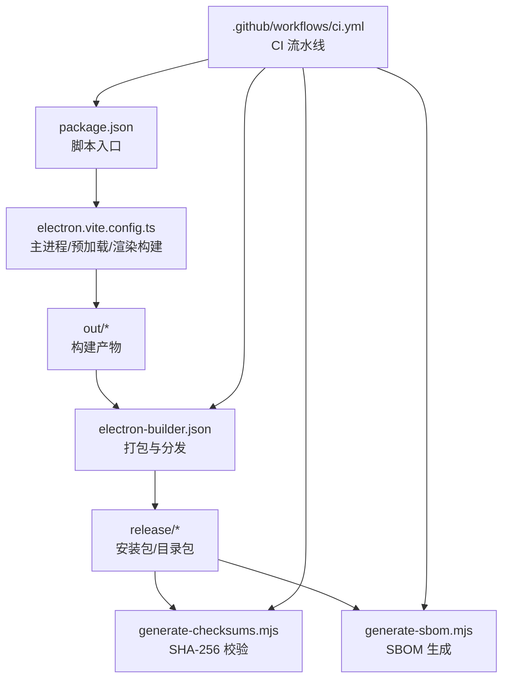
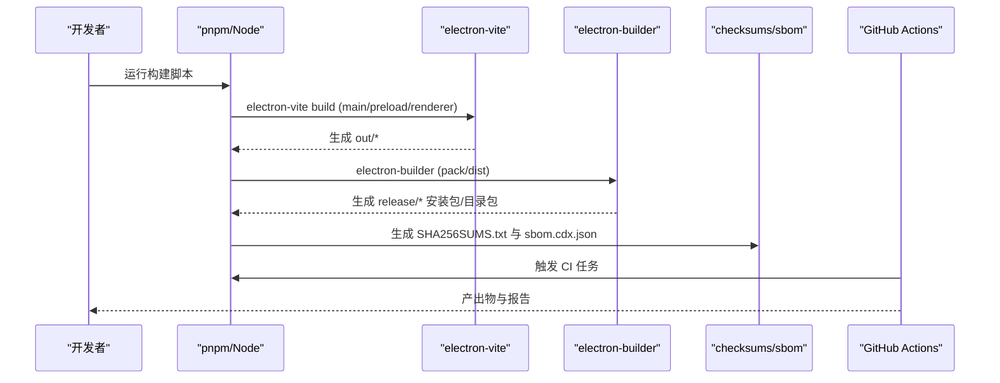
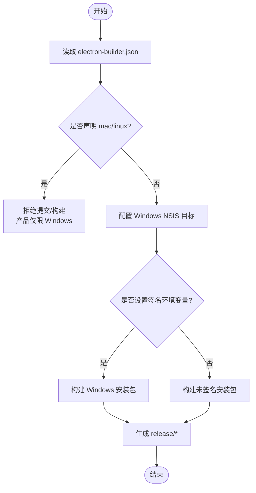
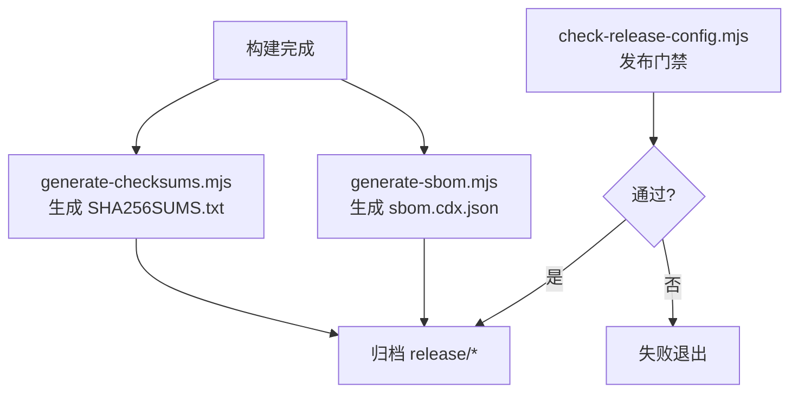
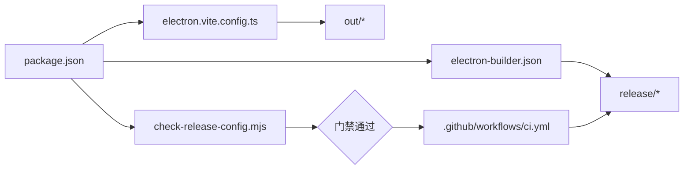

# 生产构建部署

<cite>
**本文引用的文件**
- [package.json](file://package.json)
- [electron-builder.json](file://electron-builder.json)
- [electron.vite.config.ts](file://electron.vite.config.ts)
- [vite.renderer.config.ts](file://vite.renderer.config.ts)
- [scripts/check-release-config.mjs](file://scripts/check-release-config.mjs)
- [scripts/release/generate-checksums.mjs](file://scripts/release/generate-checksums.mjs)
- [scripts/release/generate-sbom.mjs](file://scripts/release/generate-sbom.mjs)
- [.github/workflows/ci.yml](file://.github/workflows/ci.yml)
</cite>

## 目录
1. [简介](#简介)
2. [项目结构](#项目结构)
3. [核心组件](#核心组件)
4. [架构总览](#架构总览)
5. [详细组件分析](#详细组件分析)
6. [依赖关系分析](#依赖关系分析)
7. [性能考虑](#性能考虑)
8. [故障排查指南](#故障排查指南)
9. [结论](#结论)
10. [附录](#附录)

## 简介
本指南面向 RDC-Agent 的生产构建与发布，覆盖 electron-builder 配置、多平台打包流程（Windows、macOS、Linux）、代码签名、自动更新、安装包定制、构建优化策略（代码分割、资源压缩、Tree Shaking）、不同平台的发布渠道配置，以及构建产物验证、完整性检查与安全扫描流程。文档基于仓库中的实际配置文件与脚本进行说明，确保可操作且可追溯。

## 项目结构
RDC-Agent 使用 electron-vite 作为构建工具链，通过 electron-builder 完成应用打包与分发。关键构建相关位置如下：
- 应用元信息与脚本入口：package.json
- 打包目标与产物规则：electron-builder.json
- 主进程/预加载/渲染构建配置：electron.vite.config.ts、vite.renderer.config.ts
- 发布门禁与合规校验：scripts/check-release-config.mjs
- 产物完整性与供应链清单：scripts/release/generate-checksums.mjs、scripts/release/generate-sbom.mjs
- CI 流水线：.github/workflows/ci.yml

图表来源
- [package.json:19-76](file://package.json#L19-L76)
- [electron.vite.config.ts:8-61](file://electron.vite.config.ts#L8-L61)
- [electron-builder.json:1-45](file://electron-builder.json#L1-L45)
- [scripts/release/generate-checksums.mjs:1-82](file://scripts/release/generate-checksums.mjs#L1-L82)
- [scripts/release/generate-sbom.mjs:1-108](file://scripts/release/generate-sbom.mjs#L1-L108)
- [.github/workflows/ci.yml:16-53](file://.github/workflows/ci.yml#L16-L53)

章节来源
- [package.json:19-76](file://package.json#L19-L76)
- [electron-builder.json:1-45](file://electron-builder.json#L1-L45)
- [electron.vite.config.ts:8-61](file://electron.vite.config.ts#L8-L61)
- [vite.renderer.config.ts:1-40](file://vite.renderer.config.ts#L1-L40)
- [scripts/check-release-config.mjs:1-142](file://scripts/check-release-config.mjs#L1-L142)
- [scripts/release/generate-checksums.mjs:1-82](file://scripts/release/generate-checksums.mjs#L1-L82)
- [scripts/release/generate-sbom.mjs:1-108](file://scripts/release/generate-sbom.mjs#L1-L108)
- [.github/workflows/ci.yml:16-53](file://.github/workflows/ci.yml#L16-L53)

## 核心组件
- 构建与打包
  - electron-vite：负责 main、preload、renderer 三端构建与输出到 out/ 目录。
  - electron-builder：读取 electron-builder.json，产出 release/ 下的安装包或 --dir 目录包。
- 发布门禁与合规
  - check-release-config.mjs：校验 electron-builder.json 的 appId/files/platforms、禁止 mac/linux 目标、禁止硬编码密钥、强制 Windows 签名环境变量等。
- 产物完整性与 SBOM
  - generate-checksums.mjs：对 release/ 下安装包与可执行文件计算 SHA-256，生成 SHA256SUMS.txt。
  - generate-sbom.mjs：从 pnpm-lock.yaml 解析完整依赖图，生成 CycloneDX SBOM 及摘要。
- CI 流水线
  - ci.yml：在 Ubuntu/Windows/macOS 上执行类型检查、测试、覆盖率、构建、打包、校验与产物生成。

章节来源
- [electron.vite.config.ts:8-61](file://electron.vite.config.ts#L8-L61)
- [electron-builder.json:1-45](file://electron-builder.json#L1-L45)
- [scripts/check-release-config.mjs:1-142](file://scripts/check-release-config.mjs#L1-L142)
- [scripts/release/generate-checksums.mjs:1-82](file://scripts/release/generate-checksums.mjs#L1-L82)
- [scripts/release/generate-sbom.mjs:1-108](file://scripts/release/generate-sbom.mjs#L1-L108)
- [.github/workflows/ci.yml:16-53](file://.github/workflows/ci.yml#L16-L53)

## 架构总览
下图展示了从源码到最终产物的构建与发布链路，包括构建阶段、打包阶段、校验与发布准备。

图表来源
- [package.json:19-76](file://package.json#L19-L76)
- [electron.vite.config.ts:8-61](file://electron.vite.config.ts#L8-L61)
- [electron-builder.json:1-45](file://electron-builder.json#L1-L45)
- [scripts/release/generate-checksums.mjs:1-82](file://scripts/release/generate-checksums.mjs#L1-L82)
- [scripts/release/generate-sbom.mjs:1-108](file://scripts/release/generate-sbom.mjs#L1-L108)
- [.github/workflows/ci.yml:16-53](file://.github/workflows/ci.yml#L16-L53)

## 详细组件分析

### electron-builder 配置与多平台打包
- 基础配置
  - 应用标识与名称：appId、productName。
  - 输出目录：output 指向 release；构建资源目录 buildResources 指向 resources。
  - 文件白名单：files 包含 out/**/* 与 agent-runtime/knowledge 资源。
  - ASAR 解包：asarUnpack 指定 hooks/*.mjs 不解包以便运行时加载。
  - 额外资源：extraResources 将 hooks/*.mjs 复制到安装目录。
  - Electron 路径：electronDist 指向 node_modules/electron/dist。
- Windows 打包
  - target 为 nsis，仅 x64。
  - 图标、可执行名、产物命名模板已配置。
  - signAndEditExecutable 启用，配合环境变量进行签名。
- NSIS 行为
  - 非一键安装、允许选择安装目录、卸载不删除用户数据。
- macOS/Linux
  - 当前未声明 mac/linux 目标；check-release-config.mjs 会阻止提交含 mac/linux 目标的配置。

图表来源
- [electron-builder.json:1-45](file://electron-builder.json#L1-L45)
- [scripts/check-release-config.mjs:49-87](file://scripts/check-release-config.mjs#L49-L87)

章节来源
- [electron-builder.json:1-45](file://electron-builder.json#L1-L45)
- [scripts/check-release-config.mjs:49-87](file://scripts/check-release-config.mjs#L49-L87)

### 代码签名与自动更新
- 代码签名
  - Windows 签名通过环境变量注入证书与密码（WIN_CSC_LINK/WIN_CSC_KEY_PASSWORD），本地 pack 默认不签名，仅在 release channel 或 tag 时强制要求。
  - forceCodeSigning 默认关闭，signAndEditExecutable 开启以编辑可执行文件签名信息。
- 自动更新
  - 仓库未提供 electron-updater 配置或 latest.yml 生成逻辑；如需启用自动更新，需在 electron-builder.json 中增加 updater 配置并集成 electron-updater。
  - 若需支持 macOS  notarization，需添加相应配置，但当前产品限定为 Windows-only。

章节来源
- [electron-builder.json:25-37](file://electron-builder.json#L25-L37)
- [scripts/check-release-config.mjs:89-102](file://scripts/check-release-config.mjs#L89-L102)

### 安装包定制
- NSIS 选项
  - oneClick 为 false，perMachine 为 false，允许自定义安装目录，卸载不清理用户数据。
- 资源与 ASAR
  - 通过 files 白名单控制打包内容；hooks/*.mjs 通过 asarUnpack 与 extraResources 保证运行时可访问。
- 图标与产物命名
  - 已配置图标与 artifactName 模板，便于识别版本与架构。

章节来源
- [electron-builder.json:6-24](file://electron-builder.json#L6-L24)
- [electron-builder.json:39-44](file://electron-builder.json#L39-L44)

### 构建优化策略（代码分割、资源压缩、Tree Shaking）
- 代码分割与入口
  - electron.vite.config.ts 定义 main、preload、renderer 的 Rollup input，worker 单独打包，利于按需加载与并行执行。
- Tree Shaking
  - 使用 Vite/Rollup 构建，结合 externalizeDepsPlugin 将依赖外置，减少主进程体积。
- 资源压缩
  - 通过 electron-builder 的 asar 打包与 extraResources 控制，避免不必要资源进入包体。
- 渲染层优化
  - vite.renderer.config.ts 针对浏览器开发模式进行 CSP 样式注入与 HMR 配置，不影响生产构建。

章节来源
- [electron.vite.config.ts:8-61](file://electron.vite.config.ts#L8-L61)
- [vite.renderer.config.ts:1-40](file://vite.renderer.config.ts#L1-L40)
- [electron-builder.json:10-24](file://electron-builder.json#L10-L24)

### 不同平台的发布渠道配置
- Windows
  - 通过 NSIS 安装包分发；签名由环境变量注入；CI 中执行 pack 并生成校验与 SBOM。
- macOS/Linux
  - 当前未配置目标；check-release-config.mjs 明确禁止提交 mac/linux 目标。
- 直接下载
  - 可将 release/ 下的安装包上传至对象存储或 CDN，并提供 SHA256SUMS.txt 供客户端校验。
- 应用商店/软件仓库
  - 仓库未内置商店发布脚本；可在 CI 中扩展步骤将产物推送至对应渠道。

章节来源
- [electron-builder.json:27-44](file://electron-builder.json#L27-L44)
- [scripts/check-release-config.mjs:49-56](file://scripts/check-release-config.mjs#L49-L56)
- [.github/workflows/ci.yml:121-130](file://.github/workflows/ci.yml#L121-L130)

### 构建产物验证、完整性检查与安全扫描
- 完整性校验
  - generate-checksums.mjs 遍历 release/ 下的安装包与可执行文件，生成 SHA256SUMS.txt。
- SBOM 生成
  - generate-sbom.mjs 从 pnpm-lock.yaml 解析依赖图，生成 CycloneDX SBOM 及其摘要。
- 发布门禁
  - check-release-config.mjs 校验 electron-builder.json 的必填项、禁止 mac/linux、禁止硬编码密钥、强制签名环境变量等。
- CI 集成
  - ci.yml 在构建后执行 check:release-config、release:sbom、release:checksums，确保产物合规。

图表来源
- [scripts/release/generate-checksums.mjs:1-82](file://scripts/release/generate-checksums.mjs#L1-L82)
- [scripts/release/generate-sbom.mjs:1-108](file://scripts/release/generate-sbom.mjs#L1-L108)
- [scripts/check-release-config.mjs:1-142](file://scripts/check-release-config.mjs#L1-L142)
- [.github/workflows/ci.yml:124-130](file://.github/workflows/ci.yml#L124-L130)

章节来源
- [scripts/release/generate-checksums.mjs:1-82](file://scripts/release/generate-checksums.mjs#L1-L82)
- [scripts/release/generate-sbom.mjs:1-108](file://scripts/release/generate-sbom.mjs#L1-L108)
- [scripts/check-release-config.mjs:1-142](file://scripts/check-release-config.mjs#L1-L142)
- [.github/workflows/ci.yml:124-130](file://.github/workflows/ci.yml#L124-L130)

## 依赖关系分析
- 构建工具链
  - electron-vite 依赖 Vite 与 Rollup，负责多端构建。
  - electron-builder 依赖 Node 环境与平台工具链，负责打包与签名。
- 脚本与配置耦合
  - package.json 脚本驱动 electron-vite 与 electron-builder。
  - check-release-config.mjs 强约束 electron-builder.json 的结构与安全性。
  - CI 串联类型检查、测试、构建、打包与校验。

图表来源
- [package.json:19-76](file://package.json#L19-L76)
- [electron.vite.config.ts:8-61](file://electron.vite.config.ts#L8-L61)
- [electron-builder.json:1-45](file://electron-builder.json#L1-L45)
- [scripts/check-release-config.mjs:1-142](file://scripts/check-release-config.mjs#L1-L142)
- [.github/workflows/ci.yml:16-53](file://.github/workflows/ci.yml#L16-L53)

章节来源
- [package.json:19-76](file://package.json#L19-L76)
- [electron.vite.config.ts:8-61](file://electron.vite.config.ts#L8-L61)
- [electron-builder.json:1-45](file://electron-builder.json#L1-L45)
- [scripts/check-release-config.mjs:1-142](file://scripts/check-release-config.mjs#L1-L142)
- [.github/workflows/ci.yml:16-53](file://.github/workflows/ci.yml#L16-L53)

## 性能考虑
- 构建阶段
  - 使用 externalizeDepsPlugin 将依赖外置，减少主进程体积。
  - 将 worker 独立打包，避免阻塞主线程。
- 打包阶段
  - 通过 files 白名单与 asarUnpack 精确控制资源，减少包体大小。
  - 利用 extraResources 仅复制必要脚本，避免冗余。
- 渲染层
  - 生产构建走 Vite 优化管线，HMR 仅用于开发模式。

[本节为通用指导，无需特定文件引用]

## 故障排查指南
- 构建失败
  - 确认 electron-vite 构建输出存在（out/main/index.js、out/preload/index.js、out/renderer/index.html）。
  - 检查 Node/pnpm 版本与缓存状态。
- 打包失败
  - 检查 electron-builder.json 是否包含必要的 appId/files/platforms。
  - 若启用签名，确保环境变量正确设置；本地 pack 默认不签名。
- 完整性校验失败
  - 重新运行 release:checksums 与 release:sbom，确保 release/ 下有最新产物。
- CI 门禁失败
  - 查看 check-release-config.mjs 的错误提示，修正配置或移除 mac/linux 目标。

章节来源
- [scripts/check-release-config.mjs:1-142](file://scripts/check-release-config.mjs#L1-L142)
- [scripts/release/generate-checksums.mjs:1-82](file://scripts/release/generate-checksums.mjs#L1-L82)
- [scripts/release/generate-sbom.mjs:1-108](file://scripts/release/generate-sbom.mjs#L1-L108)

## 结论
RDC-Agent 的生产构建与发布基于 electron-vite 与 electron-builder，配合严格的发布门禁与完整性校验脚本，确保产物安全与可追溯。当前产品聚焦 Windows 平台，macOS/Linux 目标被显式禁止。通过 CI 集成类型检查、测试、构建、打包与校验，形成完整的交付流水线。如需扩展自动更新或多平台发布，可在现有基础上增量配置。

[本节为总结性内容，无需特定文件引用]

## 附录
- 常用命令
  - 构建：pnpm run build
  - 打包（目录）：pnpm run pack
  - 打包（安装包）：pnpm run dist
  - 完整性校验：pnpm run release:checksums
  - SBOM 生成：pnpm run release:sbom
  - 发布门禁：pnpm run check:release-config
- 环境变量（Windows 签名）
  - WIN_CSC_LINK / CSC_LINK
  - WIN_CSC_KEY_PASSWORD / CSC_KEY_PASSWORD

章节来源
- [package.json:19-76](file://package.json#L19-L76)
- [scripts/check-release-config.mjs:89-102](file://scripts/check-release-config.mjs#L89-L102)