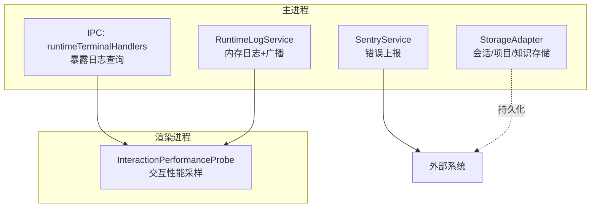
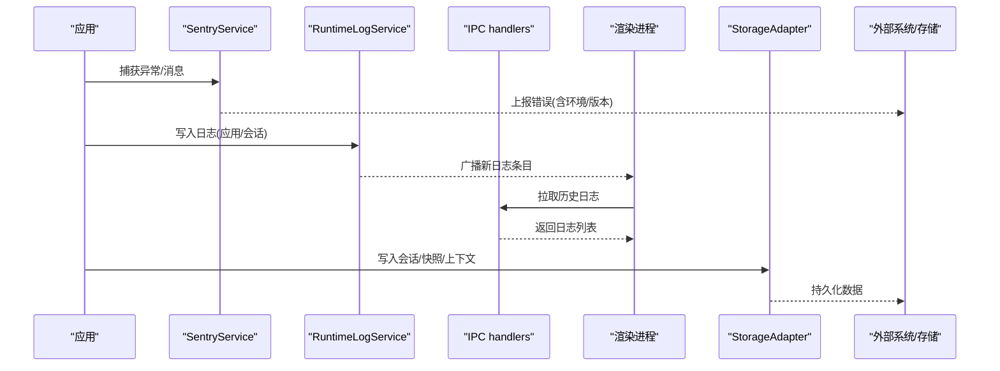
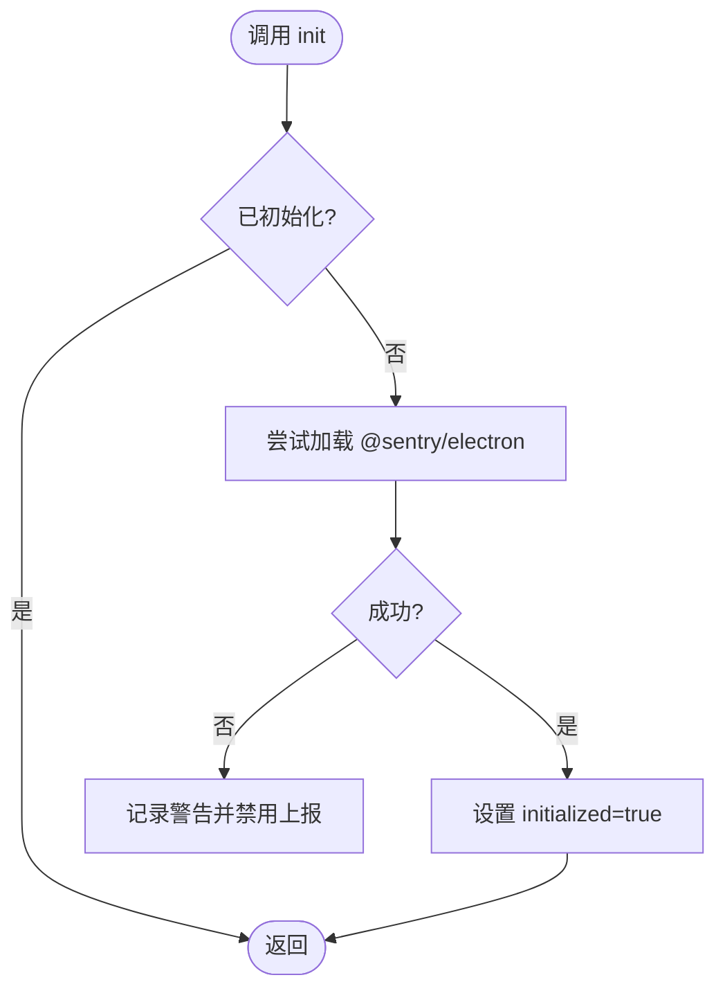
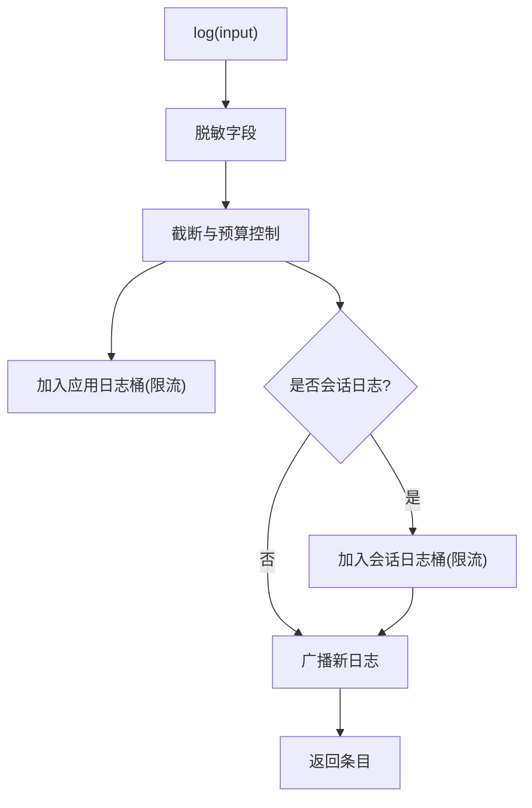
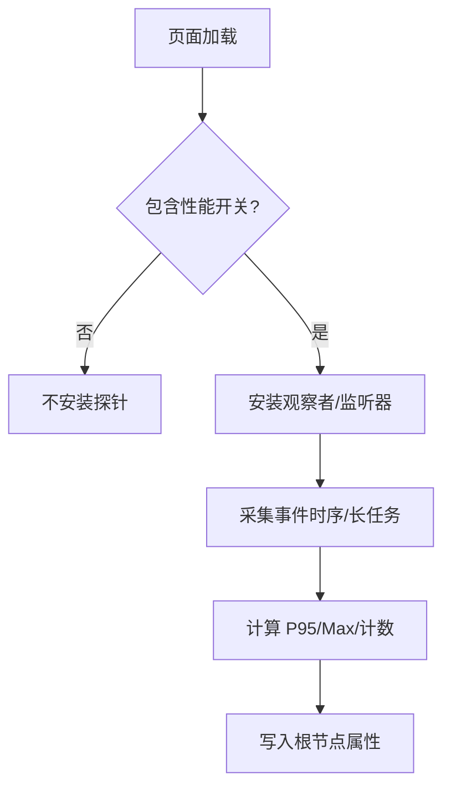
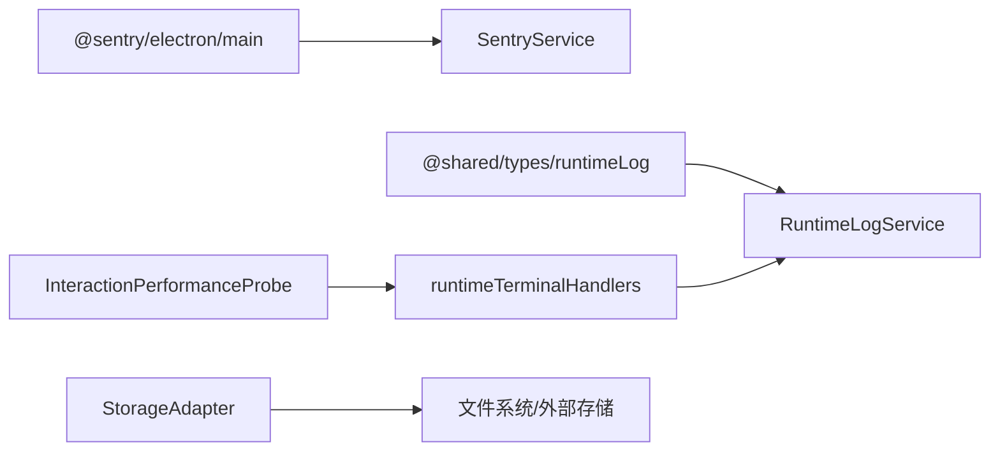

# 监控运维

<cite>
**本文引用的文件**
- [SentryService.ts](file://src/main/telemetry/SentryService.ts)
- [RuntimeLogService.ts](file://src/main/runtime/RuntimeLogService.ts)
- [runtimeTerminalHandlers.ts](file://src/main/ipc/runtimeTerminalHandlers.ts)
- [runtimeLog.ts](file://src/shared/types/runtimeLog.ts)
- [InteractionPerformanceProbe.ts](file://src/renderer/platform/performance/InteractionPerformanceProbe.ts)
- [AgentLoop.ts](file://src/main/agent-runtime/agent/AgentLoop.ts)
- [StorageAdapter.ts](file://src/main/sessions/StorageAdapter.ts)
- [rdx-runtime.md](file://docs/architecture/rdx-runtime.md)
</cite>

## 目录
1. [简介](#简介)
2. [项目结构](#项目结构)
3. [核心组件](#核心组件)
4. [架构总览](#架构总览)
5. [详细组件分析](#详细组件分析)
6. [依赖关系分析](#依赖关系分析)
7. [性能考虑](#性能考虑)
8. [故障诊断指南](#故障诊断指南)
9. [结论](#结论)
10. [附录](#附录)

## 简介
本指南面向 RDC-Agent 的监控与运维，聚焦以下目标：
- 错误追踪（Sentry）配置与使用
- 日志收集策略、查询与导出
- 性能监控指标与采集方式
- 应用健康检查与资源使用监控
- 用户行为分析与可观测性
- 告警配置、事件响应流程与自动化脚本建议
- 备份恢复策略、数据迁移方案与灾难恢复计划

本指南基于仓库中现有实现进行提炼，确保实践与代码一致。

## 项目结构
RDC-Agent 在 Electron 主进程与渲染进程中分别实现了遥测、日志与性能探针能力，并通过 IPC 暴露给前端消费。关键路径如下：
- 主进程错误追踪：SentryService
- 主进程运行期日志：RuntimeLogService + IPC 处理器
- 渲染进程交互性能探针：InteractionPerformanceProbe
- 会话与快照持久化：StorageAdapter、rdx-runtime 文档中的脱敏快照机制
- Agent 循环与恢复：AgentLoop

图表来源
- [SentryService.ts:1-48](file://src/main/telemetry/SentryService.ts#L1-L48)
- [RuntimeLogService.ts:1-156](file://src/main/runtime/RuntimeLogService.ts#L1-L156)
- [runtimeTerminalHandlers.ts:1-17](file://src/main/ipc/runtimeTerminalHandlers.ts#L1-L17)
- [InteractionPerformanceProbe.ts:1-101](file://src/renderer/platform/performance/InteractionPerformanceProbe.ts#L1-L101)
- [StorageAdapter.ts:1-459](file://src/main/sessions/StorageAdapter.ts#L1-L459)

章节来源
- [SentryService.ts:1-48](file://src/main/telemetry/SentryService.ts#L1-L48)
- [RuntimeLogService.ts:1-156](file://src/main/runtime/RuntimeLogService.ts#L1-L156)
- [runtimeTerminalHandlers.ts:1-17](file://src/main/ipc/runtimeTerminalHandlers.ts#L1-L17)
- [InteractionPerformanceProbe.ts:1-101](file://src/renderer/platform/performance/InteractionPerformanceProbe.ts#L1-L101)
- [StorageAdapter.ts:1-459](file://src/main/sessions/StorageAdapter.ts#L1-L459)

## 核心组件
- SentryService：提供崩溃与错误上报能力，支持环境、版本标识，并安全降级。
- RuntimeLogService：维护应用级与会话级日志，字段脱敏与大小限制，实时广播到渲染进程。
- IPC runtimeTerminalHandlers：通过 IPC 暴露日志列表查询接口，供 UI 拉取。
- InteractionPerformanceProbe：在渲染进程按条件启用，采集交互延迟与长任务指标。
- StorageAdapter：统一项目/会话/运行记录与知识等数据的读写，支撑备份与迁移。
- rdx-runtime 文档：定义请求信封快照的落盘规范与脱敏策略，用于调试与审计。

章节来源
- [SentryService.ts:1-48](file://src/main/telemetry/SentryService.ts#L1-L48)
- [RuntimeLogService.ts:1-156](file://src/main/runtime/RuntimeLogService.ts#L1-L156)
- [runtimeTerminalHandlers.ts:1-17](file://src/main/ipc/runtimeTerminalHandlers.ts#L1-L17)
- [InteractionPerformanceProbe.ts:1-101](file://src/renderer/platform/performance/InteractionPerformanceProbe.ts#L1-L101)
- [StorageAdapter.ts:1-459](file://src/main/sessions/StorageAdapter.ts#L1-L459)
- [rdx-runtime.md:50-53](file://docs/architecture/rdx-runtime.md#L50-L53)

## 架构总览
下图展示从错误捕获、日志采集到性能指标上报的整体链路，以及持久化与调试快照的位置。

图表来源
- [SentryService.ts:1-48](file://src/main/telemetry/SentryService.ts#L1-L48)
- [RuntimeLogService.ts:1-156](file://src/main/runtime/RuntimeLogService.ts#L1-L156)
- [runtimeTerminalHandlers.ts:1-17](file://src/main/ipc/runtimeTerminalHandlers.ts#L1-L17)
- [StorageAdapter.ts:1-459](file://src/main/sessions/StorageAdapter.ts#L1-L459)

## 详细组件分析

### 错误追踪（Sentry）最佳实践
- 初始化
  - 仅在未初始化时执行一次，避免重复注册。
  - 设置 dsn、environment、release；当依赖缺失时静默降级，不影响主流程。
- 上报
  - 使用 captureException 附带上下文 extra 便于定位。
  - 使用 captureMessage 记录信息/警告/错误级别事件。
- 配置建议
  - environment 映射开发/测试/生产环境。
  - release 绑定构建版本，便于回溯问题。
  - integrations 保持最小集，减少开销。

图表来源
- [SentryService.ts:10-28](file://src/main/telemetry/SentryService.ts#L10-L28)

章节来源
- [SentryService.ts:1-48](file://src/main/telemetry/SentryService.ts#L1-L48)

### 日志收集策略
- 日志模型
  - 作用域：app/session
  - 命名空间：system/agent/tool/device/capture/context/llm
  - 严重级别：info/success/warning/error
  - 详情级别：summary/verbose/raw
- 入站处理
  - 自动对标题、摘要、详情、原始数据进行敏感信息脱敏。
  - 单条日志大小硬限制，超长内容截断或降级为预览。
  - 应用级与按会话级双桶存储，并设置上限防止内存膨胀。
- 分发与查询
  - 新增日志通过事件总线与窗口消息广播至渲染进程。
  - 通过 IPC 暴露 list 接口，支持按作用域与会话查询。

图表来源
- [RuntimeLogService.ts:31-92](file://src/main/runtime/RuntimeLogService.ts#L31-L92)
- [RuntimeLogService.ts:94-156](file://src/main/runtime/RuntimeLogService.ts#L94-L156)

章节来源
- [RuntimeLogService.ts:1-156](file://src/main/runtime/RuntimeLogService.ts#L1-L156)
- [runtimeTerminalHandlers.ts:1-17](file://src/main/ipc/runtimeTerminalHandlers.ts#L1-L17)
- [runtimeLog.ts:1-26](file://src/shared/types/runtimeLog.ts#L1-L26)

### 性能监控指标
- 指标类型
  - 点击到下一次绘制延迟（P95/最大值）
  - 长任务数量与最大耗时
  - 浏览器 API 支持情况标记
- 采集方式
  - 通过 URL 参数开关启用探针，避免在生产默认开启。
  - 使用 PerformanceObserver 监听 event 与 longtask。
  - 将汇总结果以属性形式挂载到根节点，供上层工具读取。
- 使用场景
  - QA/性能回归验证
  - 交互体验基线对比
  - 结合会话/项目维度关联分析

图表来源
- [InteractionPerformanceProbe.ts:1-101](file://src/renderer/platform/performance/InteractionPerformanceProbe.ts#L1-L101)

章节来源
- [InteractionPerformanceProbe.ts:1-101](file://src/renderer/platform/performance/InteractionPerformanceProbe.ts#L1-L101)

### 应用健康检查与资源使用监控
- 健康检查
  - 可通过 IPC 拉取运行时日志，判断最近是否有 error/warning 突增。
  - 结合 AgentLoop 的恢复策略（重试/熔断/切换模型）评估稳定性。
- 资源使用
  - 日志桶有明确上限，避免内存无限增长。
  - 会话/项目数据由 StorageAdapter 统一管理，便于统计磁盘占用。
- 建议
  - 定期巡检日志桶大小与错误率。
  - 对频繁失败的 LLM 调用触发熔断与降级。

章节来源
- [RuntimeLogService.ts:12-16](file://src/main/runtime/RuntimeLogService.ts#L12-L16)
- [AgentLoop.ts:487-534](file://src/main/agent-runtime/agent/AgentLoop.ts#L487-L534)
- [StorageAdapter.ts:1-459](file://src/main/sessions/StorageAdapter.ts#L1-L459)

### 用户行为分析
- 通过会话与运行记录（StorageAdapter）聚合用户操作链与上下文变更。
- 结合 RequestEnvelopeSnapshot 的脱敏元数据，分析提示词与工具调用分布。
- 注意：快照仅用于调试与审计，不得嵌入默认面板或工作流消息流。

章节来源
- [StorageAdapter.ts:1-459](file://src/main/sessions/StorageAdapter.ts#L1-L459)
- [rdx-runtime.md:50-53](file://docs/architecture/rdx-runtime.md#L50-L53)

## 依赖关系分析
- SentryService 依赖 @sentry/electron/main，采用动态 require 与 try/catch 保证健壮性。
- RuntimeLogService 依赖共享类型与 ID 生成工具，向渲染进程广播日志。
- IPC handlers 依赖校验与 schema，保障跨进程通信安全。
- InteractionPerformanceProbe 依赖浏览器 PerformanceObserver，受 URL 参数控制。
- StorageAdapter 组合多个子存储，提供统一的会话/项目/知识访问入口。

图表来源
- [SentryService.ts:1-48](file://src/main/telemetry/SentryService.ts#L1-L48)
- [RuntimeLogService.ts:1-156](file://src/main/runtime/RuntimeLogService.ts#L1-L156)
- [runtimeTerminalHandlers.ts:1-17](file://src/main/ipc/runtimeTerminalHandlers.ts#L1-L17)
- [InteractionPerformanceProbe.ts:1-101](file://src/renderer/platform/performance/InteractionPerformanceProbe.ts#L1-L101)
- [StorageAdapter.ts:1-459](file://src/main/sessions/StorageAdapter.ts#L1-L459)

章节来源
- [SentryService.ts:1-48](file://src/main/telemetry/SentryService.ts#L1-L48)
- [RuntimeLogService.ts:1-156](file://src/main/runtime/RuntimeLogService.ts#L1-L156)
- [runtimeTerminalHandlers.ts:1-17](file://src/main/ipc/runtimeTerminalHandlers.ts#L1-L17)
- [InteractionPerformanceProbe.ts:1-101](file://src/renderer/platform/performance/InteractionPerformanceProbe.ts#L1-L101)
- [StorageAdapter.ts:1-459](file://src/main/sessions/StorageAdapter.ts#L1-L459)

## 性能考虑
- 日志体积控制
  - 单条日志最大字节限制，超长内容自动截断或降级为预览。
  - 应用级与会话级日志桶均有限制，避免内存泄漏。
- 性能探针开关
  - 默认不安装，需显式开启，降低生产环境开销。
- Agent 恢复策略
  - 针对连续失败启用熔断，避免雪崩。
  - 支持重试、压缩上下文、切换模型等恢复动作。

章节来源
- [RuntimeLogService.ts:12-16](file://src/main/runtime/RuntimeLogService.ts#L12-L16)
- [RuntimeLogService.ts:31-92](file://src/main/runtime/RuntimeLogService.ts#L31-L92)
- [InteractionPerformanceProbe.ts:75-101](file://src/renderer/platform/performance/InteractionPerformanceProbe.ts#L75-L101)
- [AgentLoop.ts:487-534](file://src/main/agent-runtime/agent/AgentLoop.ts#L487-L534)

## 故障诊断指南
- 快速定位
  - 通过 IPC 拉取最近日志，过滤 severity=error 与特定 namespace。
  - 查看 Sentry 事件，结合 environment/release 筛选。
- 典型问题
  - LLM 调用超时/限流：观察诊断信息，配合 AgentLoop 的重试与熔断。
  - 大对象导致日志过大：确认是否触发截断逻辑，必要时调整 raw 字段。
- 调试快照
  - 使用脱敏的请求信封快照进行问题复现与审计，注意不包含敏感载荷。

章节来源
- [runtimeTerminalHandlers.ts:1-17](file://src/main/ipc/runtimeTerminalHandlers.ts#L1-L17)
- [RuntimeLogService.ts:94-156](file://src/main/runtime/RuntimeLogService.ts#L94-L156)
- [SentryService.ts:30-44](file://src/main/telemetry/SentryService.ts#L30-L44)
- [rdx-runtime.md:50-53](file://docs/architecture/rdx-runtime.md#L50-L53)

## 结论
RDC-Agent 提供了完善的错误追踪、运行期日志与交互性能探针能力，并通过 IPC 与渲染进程解耦，便于扩展与治理。结合 StorageAdapter 的统一存储抽象，可实现稳定的备份、迁移与恢复策略。建议在生产环境中：
- 启用 Sentry 并正确配置环境与版本
- 限制日志体积与保留周期
- 按需开启性能探针
- 建立告警与自动化脚本，联动日志与错误事件

## 附录

### 告警配置建议
- 基于日志
  - 错误率阈值：单位时间 error 数量超过阈值触发告警
  - 特定 namespace 错误突增：如 llm、tool、device
- 基于 Sentry
  - 按错误类型分组，设置频率阈值与环境白名单
- 基于性能
  - 交互 P95 超过阈值或长任务峰值异常

### 事件响应流程
- 发现：监控/告警触发
- 分派：根据严重级别路由到对应值班人
- 处置：拉取日志与 Sentry 事件，必要时回滚或降级
- 复盘：归档根因与改进措施

### 运维自动化脚本建议
- 日志导出：定时拉取最近 N 小时日志，归档到对象存储
- 健康检查：周期性调用 IPC 获取日志与状态，输出健康报告
- 清理策略：按会话/项目清理过期日志与快照，释放磁盘

### 备份恢复策略
- 备份范围
  - 项目与工作区、会话记录、运行记录、全局知识
- 备份频率
  - 增量备份（会话/运行）+ 全量备份（项目/知识）
- 恢复步骤
  - 停止服务 -> 恢复数据 -> 校验一致性 -> 启动服务 -> 冒烟测试

### 数据迁移方案
- 版本兼容
  - 读取前校验 schemaVersion，拒绝不支持的高版本
- 迁移流程
  - 旧格式 -> 中间态 -> 新格式，逐步推进并回滚预案

### 灾难恢复计划
- 多副本与异地容灾
- 演练与恢复时间目标（RTO/RPO）
- 回滚与灰度发布策略