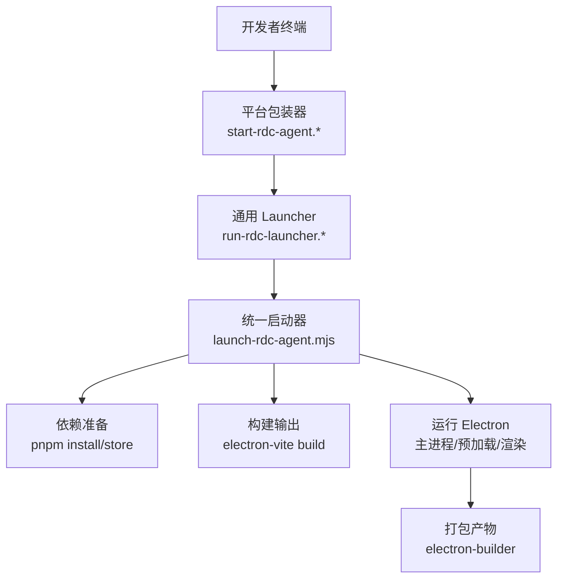
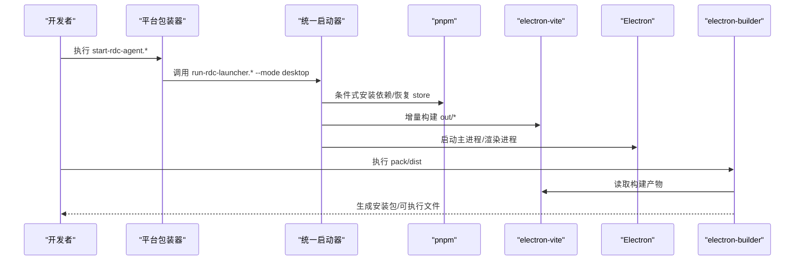
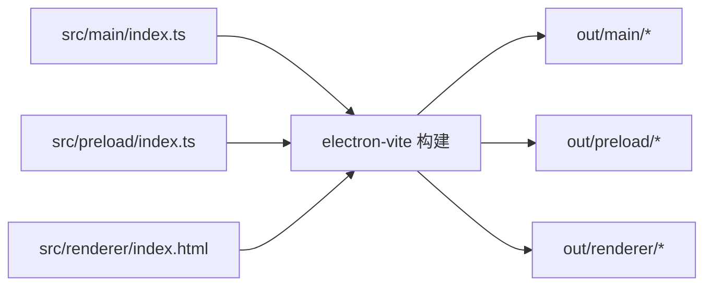
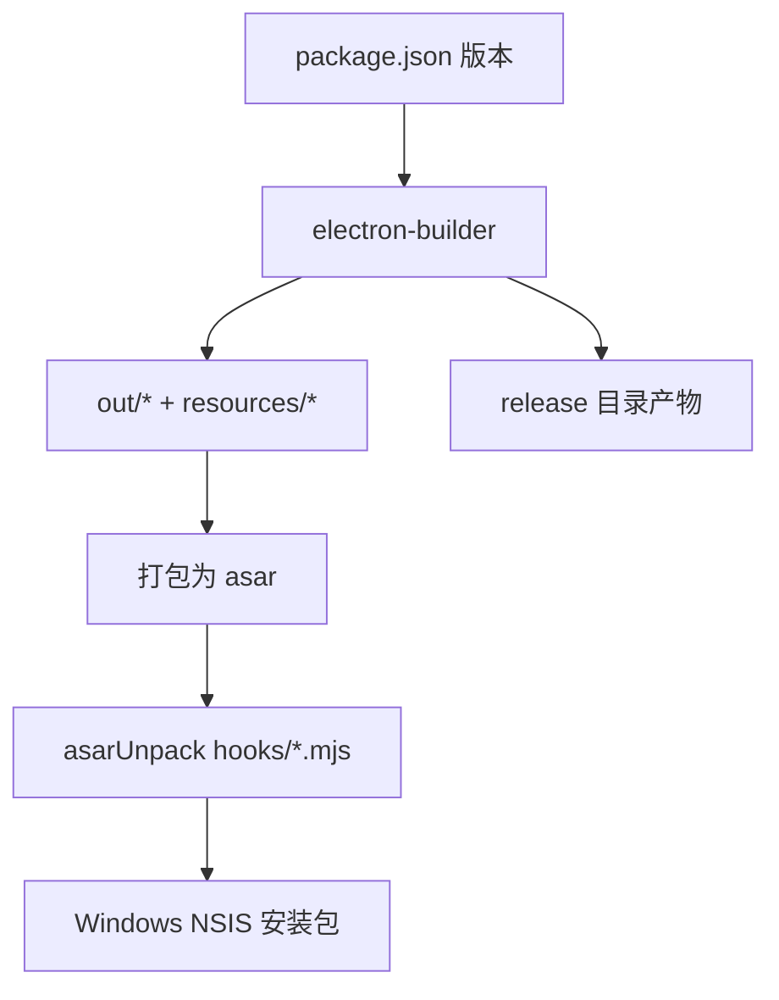
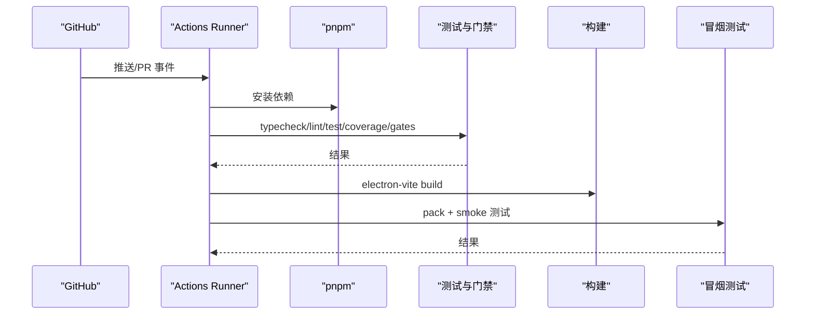
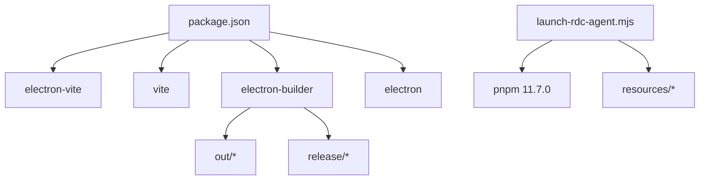

# 部署运维

<cite>
**本文引用的文件**
- [package.json](file://package.json)
- [electron-builder.json](file://electron-builder.json)
- [electron.vite.config.ts](file://electron.vite.config.ts)
- [vite.renderer.config.ts](file://vite.renderer.config.ts)
- [.github/workflows/ci.yml](file://.github/workflows/ci.yml)
- [scripts/launch-rdc-agent.mjs](file://scripts/launch-rdc-agent.mjs)
- [scripts/start-rdc-agent.sh](file://scripts/start-rdc-agent.sh)
- [scripts/start-rdc-agent.cmd](file://scripts/start-rdc-agent.cmd)
- [scripts/run-rdc-launcher.sh](file://scripts/run-rdc-launcher.sh)
- [scripts/run-rdc-launcher.cmd](file://scripts/run-rdc-launcher.cmd)
- [README.md](file://README.md)
</cite>

## 目录
1. [简介](#简介)
2. [项目结构](#项目结构)
3. [核心组件](#核心组件)
4. [架构总览](#架构总览)
5. [详细组件分析](#详细组件分析)
6. [依赖分析](#依赖分析)
7. [性能考虑](#性能考虑)
8. [故障排除指南](#故障排除指南)
9. [结论](#结论)
10. [附录](#附录)

## 简介
本文件面向 RDC-Agent 的部署与运维，覆盖开发环境搭建、生产构建配置、打包发布流程，以及 Windows/macOS/Linux 多平台部署要点；同时给出持续集成（CI）配置说明、自动化测试与版本管理策略，并提供监控、日志收集、错误追踪等运维最佳实践与故障排除建议。

RDC-Agent 是基于 Electron 的桌面应用，使用 pnpm 进行依赖管理，通过 electron-vite 构建主进程、预加载脚本与渲染进程，并使用 electron-builder 生成各平台安装包或可执行文件。启动器具备条件式依赖同步、Electron 运行时恢复、增量构建与多模式运行能力，便于开发与发布。

## 项目结构
- 源码与入口
  - 主进程入口：src/main/index.ts（由构建配置指定）
  - 预加载入口：src/preload/index.ts
  - 渲染入口：src/renderer/index.html
- 构建与打包
  - 构建配置：electron.vite.config.ts、vite.renderer.config.ts
  - 打包配置：electron-builder.json
- 启动与跨平台封装
  - 统一启动器：scripts/launch-rdc-agent.mjs
  - 平台包装器：scripts/start-rdc-agent.sh / scripts/start-rdc-agent.cmd
  - 通用 launcher 封装：scripts/run-rdc-launcher.sh / scripts/run-rdc-launcher.cmd
- CI 与质量门禁
  - GitHub Actions：.github/workflows/ci.yml
- 元信息与脚本命令
  - package.json：版本、脚本、依赖、引擎约束
  - README.md：仓库结构与开发验证说明



图表来源
- [scripts/start-rdc-agent.sh:1-5](file://scripts/start-rdc-agent.sh#L1-L5)
- [scripts/start-rdc-agent.cmd:1-4](file://scripts/start-rdc-agent.cmd#L1-L4)
- [scripts/run-rdc-launcher.sh:1-22](file://scripts/run-rdc-launcher.sh#L1-L22)
- [scripts/run-rdc-launcher.cmd:1-29](file://scripts/run-rdc-launcher.cmd#L1-L29)
- [scripts/launch-rdc-agent.mjs:476-527](file://scripts/launch-rdc-agent.mjs#L476-L527)
- [electron.vite.config.ts:8-23](file://electron.vite.config.ts#L8-L23)
- [electron-builder.json:1-46](file://electron-builder.json#L1-L46)

章节来源
- [package.json:1-77](file://package.json#L1-L77)
- [electron.vite.config.ts:1-63](file://electron.vite.config.ts#L1-L63)
- [vite.renderer.config.ts:1-40](file://vite.renderer.config.ts#L1-L40)
- [electron-builder.json:1-46](file://electron-builder.json#L1-L46)
- [scripts/launch-rdc-agent.mjs:1-531](file://scripts/launch-rdc-agent.mjs#L1-L531)
- [scripts/start-rdc-agent.sh:1-5](file://scripts/start-rdc-agent.sh#L1-L5)
- [scripts/start-rdc-agent.cmd:1-4](file://scripts/start-rdc-agent.cmd#L1-L4)
- [scripts/run-rdc-launcher.sh:1-22](file://scripts/run-rdc-launcher.sh#L1-L22)
- [scripts/run-rdc-launcher.cmd:1-29](file://scripts/run-rdc-launcher.cmd#L1-L29)
- [README.md:48-82](file://README.md#L48-L82)

## 核心组件
- 启动器与模式控制
  - 支持 desktop、desktop-dev、browser、browser-dev、prepare-only 等模式，自动设置环境变量并选择运行路径。
  - 条件式依赖安装与构建缓存，避免重复工作。
  - Electron 二进制缺失时的自动恢复机制。
- 构建系统
  - electron-vite 负责主进程、预加载与渲染的构建与开发服务。
  - Vite 渲染配置提供开发时 CSP 样式注入与 HMR。
- 打包系统
  - electron-builder 定义应用 ID、产品名、资源打包、asar 解包、签名与 NSIS 安装器选项。
- CI 流水线
  - 类型检查、Lint、单元测试、覆盖率门禁、架构与契约校验、构建与打包、浏览器/桌面冒烟测试。

章节来源
- [scripts/launch-rdc-agent.mjs:23-72](file://scripts/launch-rdc-agent.mjs#L23-L72)
- [scripts/launch-rdc-agent.mjs:299-385](file://scripts/launch-rdc-agent.mjs#L299-L385)
- [scripts/launch-rdc-agent.mjs:387-527](file://scripts/launch-rdc-agent.mjs#L387-L527)
- [electron.vite.config.ts:8-63](file://electron.vite.config.ts#L8-L63)
- [vite.renderer.config.ts:7-39](file://vite.renderer.config.ts#L7-L39)
- [electron-builder.json:1-46](file://electron-builder.json#L1-L46)
- [.github/workflows/ci.yml:1-182](file://.github/workflows/ci.yml#L1-L182)

## 架构总览
下图展示从开发者到最终产物的端到端流程，包括依赖准备、构建、运行与打包。



图表来源
- [scripts/start-rdc-agent.sh:1-5](file://scripts/start-rdc-agent.sh#L1-L5)
- [scripts/start-rdc-agent.cmd:1-4](file://scripts/start-rdc-agent.cmd#L1-L4)
- [scripts/run-rdc-launcher.sh:1-22](file://scripts/run-rdc-launcher.sh#L1-L22)
- [scripts/run-rdc-launcher.cmd:1-29](file://scripts/run-rdc-launcher.cmd#L1-L29)
- [scripts/launch-rdc-agent.mjs:299-385](file://scripts/launch-rdc-agent.mjs#L299-L385)
- [scripts/launch-rdc-agent.mjs:476-527](file://scripts/launch-rdc-agent.mjs#L476-L527)
- [electron.vite.config.ts:8-63](file://electron.vite.config.ts#L8-L63)
- [electron-builder.json:1-46](file://electron-builder.json#L1-L46)

## 详细组件分析

### 启动器与运行模式
- 参数解析与模式校验
  - 支持 --mode、--prepare-only、--force-prepare、--rebuild-settings-only。
  - 未识别参数或不支持的 mode 会直接失败退出。
- Node.js 版本与环境
  - 强制要求 Node.js >= 22.13.0，并在启动时打印当前运行时信息。
  - 通过 PATH 注入确保优先使用当前可执行路径下的 Node。
- 依赖准备
  - 基于指纹（包含 lockfile、workspace、pnpm 版本、平台、arch、node ABI、store 路径）判断是否需要重新安装。
  - 若 node_modules/.modules.yaml 中的 store 路径变化，则重建 node_modules。
  - 关键 CLI（electron-vite、vite）存在性校验。
- Electron 运行时恢复
  - 优先从已安装的 electron 包中解析可执行文件。
  - 若缺失，尝试 rebuild；仍缺失则下载对应平台二进制并通过系统 tar 解压恢复。
- 构建缓存
  - 基于输入源与配置文件哈希计算构建指纹，跳过无变更的构建。
  - 产出校验确保 main、preload、renderer 必要文件存在。
- 运行模式
  - desktop-dev：直接启动 electron-vite dev，启用热更新。
  - browser/browser-dev：启动 Vite 渲染开发服务器并通过 headless Electron 进行真实浏览器会话验证。
  - desktop：从构建产物启动 Electron 主进程。
- 环境变量
  - NODE_ENV、RDC_AGENT_HEADLESS、RDC_AGENT_BROWSER_QA、RDC_AGENT_TEST_MODE、RDC_AGENT_REBUILD_SETTINGS_ONLY 等根据模式注入。
  - 可选 RDC_AGENT_USER_DATA 指向用户数据目录。

```mermaid
flowchart TD
Start(["启动"]) --> Parse["解析参数与模式"]
Parse --> CheckNode["校验 Node 版本"]
CheckNode --> Deps{"依赖指纹匹配?"}
Deps --> |否| Install["pnpm install --frozen-lockfile"]
Deps --> |是| SkipInstall["跳过安装"]
Install --> EnsureElectron["确保 Electron 可执行文件"]
SkipInstall --> EnsureElectron
EnsureElectron --> Build{"构建指纹匹配?"}
Build --> |否| RunBuild["electron-vite build"]
Build --> |是| SkipBuild["跳过构建"]
RunBuild --> ValidateOut["校验构建产物"]
SkipBuild --> Mode{"运行模式"}
ValidateOut --> Mode
Mode --> |desktop-dev| DevServer["启动 electron-vite dev"]
Mode --> |browser(-dev)| Headless["启动渲染开发服务器 + headless 主进程"]
Mode --> |desktop| Launch["启动 Electron 主进程"]
DevServer --> End(["结束"])
Headless --> End
Launch --> End
```

图表来源
- [scripts/launch-rdc-agent.mjs:23-72](file://scripts/launch-rdc-agent.mjs#L23-L72)
- [scripts/launch-rdc-agent.mjs:74-83](file://scripts/launch-rdc-agent.mjs#L74-L83)
- [scripts/launch-rdc-agent.mjs:299-385](file://scripts/launch-rdc-agent.mjs#L299-L385)
- [scripts/launch-rdc-agent.mjs:387-527](file://scripts/launch-rdc-agent.mjs#L387-L527)

章节来源
- [scripts/launch-rdc-agent.mjs:1-531](file://scripts/launch-rdc-agent.mjs#L1-L531)

### 构建与渲染配置
- 主进程与预加载
  - 外部化依赖插件减少打包体积。
  - 别名 @shared 指向共享模块。
  - 构建输入：main/index.ts、turnPreparationWorker.ts、preload/index.ts。
- 渲染进程
  - React 插件启用。
  - 开发模式下对 CSS 动态注入进行 CSP 兼容处理。
  - HMR 通过 ws 协议与桥接页面通信。
  - 别名 @renderer、@shared。



图表来源
- [electron.vite.config.ts:8-63](file://electron.vite.config.ts#L8-L63)
- [vite.renderer.config.ts:7-39](file://vite.renderer.config.ts#L7-L39)

章节来源
- [electron.vite.config.ts:1-63](file://electron.vite.config.ts#L1-L63)
- [vite.renderer.config.ts:1-40](file://vite.renderer.config.ts#L1-L40)

### 打包与发布
- 应用标识与产物
  - appId、productName、版权信息。
  - 输出目录 release，构建资源 resources。
- 资源与解包
  - 打包 out/**/*、resources/agent-runtime/**/*、resources/knowledge/**/*。
  - asarUnpack 保留 hooks/*.mjs 以便运行时加载。
  - extraResources 将 hooks/*.mjs 复制到 agent-runtime/hooks。
- Windows 打包
  - NSIS 安装器，非一键安装，允许更改安装目录，卸载不删除 AppData。
  - 图标与产物命名模板。
  - 可配置代码签名开关。



图表来源
- [electron-builder.json:1-46](file://electron-builder.json#L1-L46)
- [package.json:1-10](file://package.json#L1-L10)

章节来源
- [electron-builder.json:1-46](file://electron-builder.json#L1-L46)
- [package.json:1-10](file://package.json#L1-L10)

### 持续集成与自动化测试
- 触发条件
  - push 到 main 分支与所有 pull_request。
- 并发与取消
  - 按 PR 号或分支建立并发组，取消进行中任务。
- 主要作业
  - build：在 Ubuntu 上执行类型检查、Lint、测试、覆盖率门禁、架构与契约检查、构建。
  - macos-shell：在 macOS 上执行特定运行时相关测试。
  - launcher-fresh-checkout：在 Windows 与 Linux 上验证启动器 prepare-only 行为与缓存路径。
  - browser-smoke：在 Windows 上执行浏览器冒烟测试。
  - desktop-smoke：在 Windows 上执行桌面健康冒烟测试与发布配置校验。
- 环境与工具
  - 固定 pnpm 与 Node 版本，冻结依赖锁定文件。
  - 关闭自动签名以避免 CI 签名失败。



图表来源
- [.github/workflows/ci.yml:1-182](file://.github/workflows/ci.yml#L1-L182)
- [package.json:19-77](file://package.json#L19-L77)

章节来源
- [.github/workflows/ci.yml:1-182](file://.github/workflows/ci.yml#L1-L182)
- [package.json:19-77](file://package.json#L19-L77)

### 多平台部署指南
- 通用前置
  - 安装 Node.js >= 22.13.0。
  - 使用 pnpm 11.7.0（仓库通过启动器与 CI 固定）。
  - 首次运行会自动同步依赖与构建输出，后续基于指纹跳过重复工作。
- Windows
  - 开发：双击或命令行执行 scripts/start-rdc-agent.cmd。
  - 构建：pnpm run build。
  - 打包：pnpm run pack（目录产物）、pnpm run dist（安装包）。
  - 启动器会在找不到 Node 时提示安装或设置 RDC_AGENT_NODE。
- macOS
  - 开发：sh scripts/start-rdc-agent.sh。
  - 构建与打包同 Windows。
  - 启动器会尝试系统 node 或 Codex 内置 runtime。
- Linux
  - 开发：sh scripts/start-rdc-agent.sh。
  - 构建与打包同 Windows。
  - 需要系统 tar 用于 Electron 二进制恢复。

章节来源
- [README.md:48-82](file://README.md#L48-L82)
- [scripts/start-rdc-agent.sh:1-5](file://scripts/start-rdc-agent.sh#L1-L5)
- [scripts/start-rdc-agent.cmd:1-4](file://scripts/start-rdc-agent.cmd#L1-L4)
- [scripts/run-rdc-launcher.sh:1-22](file://scripts/run-rdc-launcher.sh#L1-L22)
- [scripts/run-rdc-launcher.cmd:1-29](file://scripts/run-rdc-launcher.cmd#L1-L29)
- [scripts/launch-rdc-agent.mjs:157-224](file://scripts/launch-rdc-agent.mjs#L157-L224)

### 版本管理与发布策略
- 版本号来源
  - package.json 中的 version 字段作为应用版本。
- 产物命名
  - Windows NSIS 产物名称模板包含 productName、version、arch、ext。
- 发布工件
  - release 目录包含打包产物；CI 中执行 check:release-config、release:sbom、release:checksums。
- 分支策略
  - CI 在 push main 与所有 PR 上运行；建议在 main 上进行受控发布。

章节来源
- [package.json:1-10](file://package.json#L1-L10)
- [electron-builder.json:27-44](file://electron-builder.json#L27-L44)
- [.github/workflows/ci.yml:121-182](file://.github/workflows/ci.yml#L121-L182)

## 依赖分析
- 构建与运行依赖
  - 主构建：electron-vite、vite、@vitejs/plugin-react。
  - 打包：electron-builder。
  - 运行时：electron。
- 启动器依赖
  - 通过 pnpm-resolver 定位 pnpm，固定版本与 store 路径。
  - 依赖指纹包含 lockfile、workspace、pnpm 版本、平台、arch、node ABI、store 路径。
- 资源依赖
  - resources/agent-runtime 与 resources/knowledge 随应用分发。
  - hooks/*.mjs 通过 asarUnpack 与 extraResources 保证可执行。



图表来源
- [package.json:78-134](file://package.json#L78-L134)
- [scripts/launch-rdc-agent.mjs:299-385](file://scripts/launch-rdc-agent.mjs#L299-L385)
- [electron-builder.json:10-24](file://electron-builder.json#L10-L24)

章节来源
- [package.json:78-134](file://package.json#L78-L134)
- [scripts/launch-rdc-agent.mjs:299-385](file://scripts/launch-rdc-agent.mjs#L299-L385)
- [electron-builder.json:10-24](file://electron-builder.json#L10-L24)

## 性能考虑
- 依赖与构建缓存
  - 使用 pnpm store 固定路径，避免重复下载与安装。
  - 构建指纹跳过无变更构建，缩短冷启动时间。
- 资源优化
  - asar 打包减少 I/O 开销；仅解包必要的 mjs 钩子。
  - 外部化依赖减少主进程体积。
- 渲染性能
  - 开发模式 HMR 提升迭代效率；生产构建启用 React 插件优化。
- 启动器健壮性
  - Electron 二进制缺失时自动恢复，降低环境差异导致的失败概率。

[本节为通用指导，无需具体文件引用]

## 故障排除指南
- Node 版本不满足
  - 现象：启动时报错要求 Node.js >= 22.13.0。
  - 处理：升级 Node 或通过 RDC_AGENT_NODE 指定可用 Node 路径。
- pnpm 或依赖异常
  - 现象：安装失败或 store 路径不一致。
  - 处理：清理 node_modules 与 .cache/rdc-agent，使用 --force-prepare 重新准备。
- Electron 二进制缺失
  - 现象：无法找到 Electron 可执行文件。
  - 处理：启动器会尝试 rebuild 与下载恢复；如仍失败，检查网络与系统 tar 可用性。
- 构建产物缺失
  - 现象：缺少 out/main/index.js、out/preload/index.js、out/renderer/index.html。
  - 处理：执行 --force-prepare 或手动运行构建命令。
- 端口占用或渲染服务器不可达
  - 现象：Vite 启动后无法访问或端口冲突。
  - 处理：确认端口 5173 未被占用；必要时调整配置或重启。
- Windows 签名问题
  - 现象：打包时报签名失败。
  - 处理：在 CI 中关闭自动签名；本地配置证书或跳过签名。

章节来源
- [scripts/launch-rdc-agent.mjs:74-83](file://scripts/launch-rdc-agent.mjs#L74-L83)
- [scripts/launch-rdc-agent.mjs:157-224](file://scripts/launch-rdc-agent.mjs#L157-L224)
- [scripts/launch-rdc-agent.mjs:363-385](file://scripts/launch-rdc-agent.mjs#L363-L385)
- [vite.renderer.config.ts:30-39](file://vite.renderer.config.ts#L30-L39)
- [electron-builder.json:25-44](file://electron-builder.json#L25-L44)

## 结论
RDC-Agent 提供了完善的开发、构建、打包与发布体系，配合 CI 质量门禁与多平台启动器，能够在不同环境中稳定运行。通过依赖与构建指纹、资源解包策略与 Electron 二进制恢复机制，显著提升了可维护性与鲁棒性。建议在生产环境中结合日志与错误追踪方案，完善监控与告警，保障长期稳定运行。

[本节为总结，无需具体文件引用]

## 附录
- 常用命令
  - 开发：pnpm run dev
  - 构建：pnpm run build
  - 打包：pnpm run pack / pnpm run dist
  - 测试：pnpm test / pnpm run test:coverage
  - 质量门禁：pnpm run check:gates
- 环境变量
  - RDC_AGENT_NODE：指定 Node 可执行路径。
  - RDC_AGENT_USER_DATA：自定义用户数据目录。
  - RDC_AGENT_HEADLESS/RDC_AGENT_BROWSER_QA：控制 headless 与浏览器 QA 模式。
- 资源目录
  - ~/.rdx：用户范围配置与资源。
  - <project-root>/.rdx：项目范围配置与资源。

章节来源
- [README.md:48-82](file://README.md#L48-L82)
- [scripts/launch-rdc-agent.mjs:387-407](file://scripts/launch-rdc-agent.mjs#L387-L407)