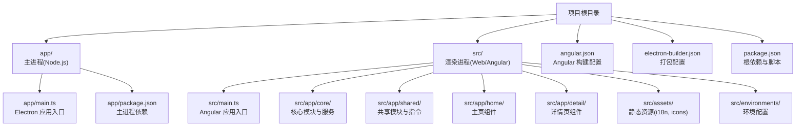
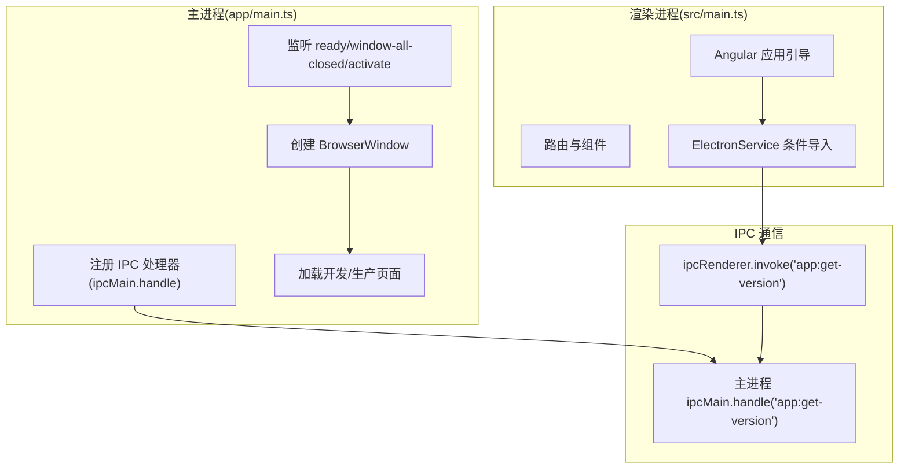
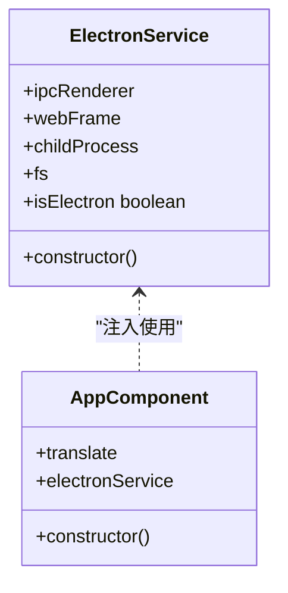
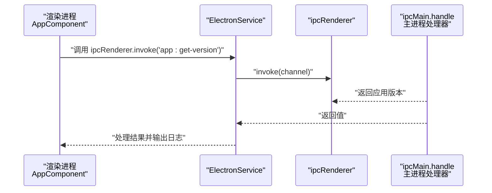
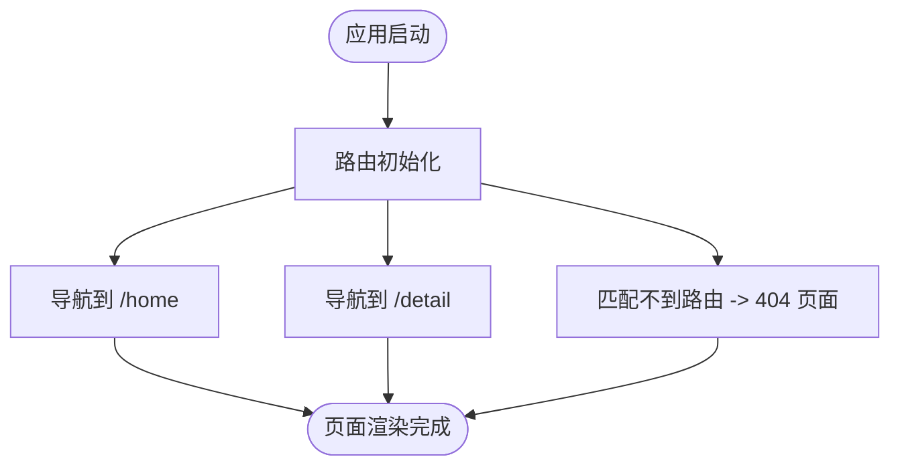
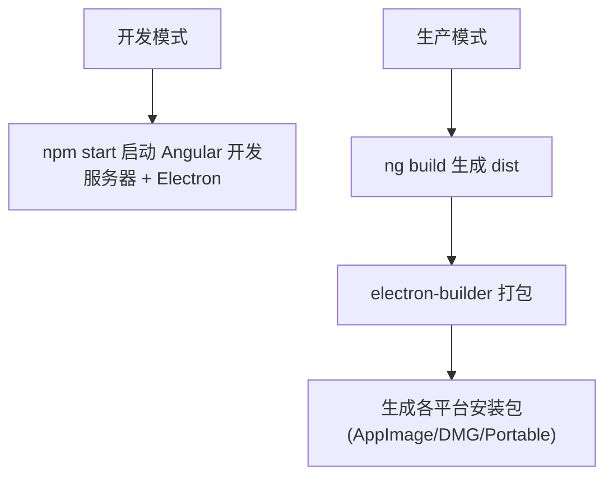
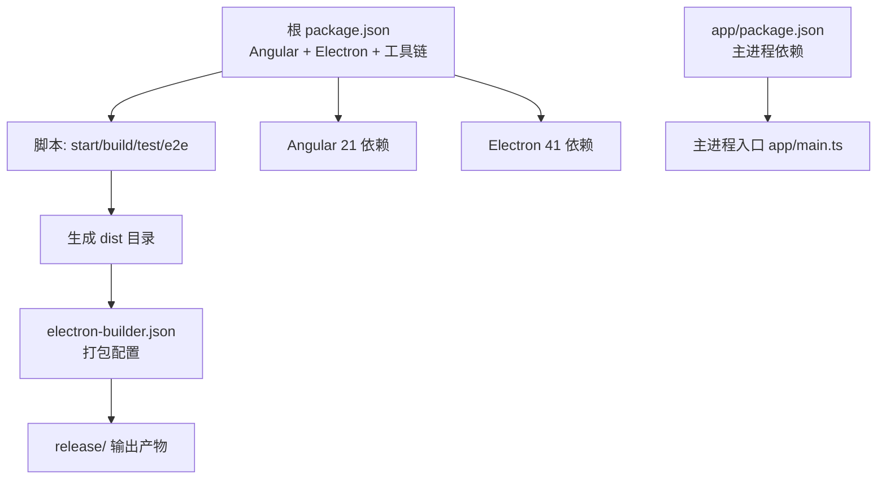

# 项目概述

<cite>
**本文档引用的文件**
- [package.json](file://package.json)
- [app/package.json](file://app/package.json)
- [angular.json](file://angular.json)
- [electron-builder.json](file://electron-builder.json)
- [README.md](file://README.md)
- [HOW_TO.md](file://HOW_TO.md)
- [src/main.ts](file://src/main.ts)
- [app/main.ts](file://app/main.ts)
- [src/app/core/services/electron/electron.service.ts](file://src/app/core/services/electron/electron.service.ts)
- [src/app/core/core.module.ts](file://src/app/core/core.module.ts)
- [src/app/app.component.ts](file://src/app/app.component.ts)
- [src/app/home/home.component.ts](file://src/app/home/home.component.ts)
- [src/app/shared/shared.module.ts](file://src/app/shared/shared.module.ts)
- [src/app/shared/directives/webview/webview.directive.ts](file://src/app/shared/directives/webview/webview.directive.ts)
- [src/environments/environment.ts](file://src/environments/environment.ts)
</cite>

## 目录
1. [引言](#引言)
2. [项目结构](#项目结构)
3. [核心组件](#核心组件)
4. [架构总览](#架构总览)
5. [详细组件分析](#详细组件分析)
6. [依赖关系分析](#依赖关系分析)
7. [性能考虑](#性能考虑)
8. [故障排除指南](#故障排除指南)
9. [结论](#结论)
10. [附录](#附录)

## 引言
本项目是一个基于 Angular 21 与 Electron 41 的跨平台桌面应用开发框架，采用 TypeScript + SASS + 热重载技术栈，旨在为开发者提供一套完整的桌面应用开发解决方案。项目通过双进程架构（主进程/渲染进程）实现桌面应用与 Web 技术栈的深度融合，既能在浏览器中以 Web 模式运行，也能通过 Electron 打包为原生桌面应用。

项目的核心目标是：
- 提供开箱即用的开发环境，支持热重载与多平台打包
- 通过两套 package.json 结构优化最终包体大小，同时保持 Angular CLI 的可用性
- 实现主进程与渲染进程的清晰职责分离，确保安全与性能

适用场景包括但不限于：
- 跨平台桌面工具类应用
- 需要本地系统集成能力的企业级桌面软件
- 原型验证与快速迭代的桌面应用

目标用户群体：
- 前端工程师（熟悉 Angular 生态）
- 桌面应用开发者（需要 Electron 集成）
- 追求高效开发流程的团队

核心价值主张：
- 双进程架构确保安全隔离与系统能力访问
- 两套 package.json 结构兼顾开发体验与产物优化
- 完整的构建与测试工具链（Vitest、Playwright）

## 项目结构
项目采用典型的“双进程 + 双 package.json”结构：
- app/：Electron 主进程目录（Node.js 环境），负责应用生命周期、窗口管理、系统集成等
- src/：Electron 渲染进程目录（Web/Angular 环境），负责用户界面与业务逻辑

图表来源
- [angular.json:10-187](file://angular.json#L10-L187)
- [app/main.ts:1-94](file://app/main.ts#L1-L94)
- [src/main.ts:1-57](file://src/main.ts#L1-L57)

章节来源
- [README.md:75-81](file://README.md#L75-L81)
- [angular.json:10-187](file://angular.json#L10-L187)

## 核心组件
- ElectronService：在渲染进程中提供对 Electron IPC、Node.js 子进程与文件系统的安全访问，通过条件导入避免在浏览器模式下加载不兼容模块
- CoreModule：核心功能模块容器，承载全局服务与基础设施
- SharedModule：共享模块，统一导出国际化、表单等常用功能
- WebviewDirective：占位指令，用于扩展 WebView 能力（可按需实现）
- 环境配置：APP_CONFIG 提供生产/开发环境标识与默认语言设置

章节来源
- [src/app/core/services/electron/electron.service.ts:1-57](file://src/app/core/services/electron/electron.service.ts#L1-L57)
- [src/app/core/core.module.ts:1-11](file://src/app/core/core.module.ts#L1-L11)
- [src/app/shared/shared.module.ts:1-14](file://src/app/shared/shared.module.ts#L1-L14)
- [src/app/shared/directives/webview/webview.directive.ts:1-10](file://src/app/shared/directives/webview/webview.directive.ts#L1-L10)
- [src/environments/environment.ts:1-5](file://src/environments/environment.ts#L1-L5)

## 架构总览
双进程架构通过 Electron 将 Node.js 的系统能力与 Chromium 的渲染能力结合，形成“主进程 + 渲染进程”的协同工作模式。主进程负责应用生命周期与系统集成，渲染进程负责 UI 与业务逻辑。

图表来源
- [app/main.ts:64-94](file://app/main.ts#L64-L94)
- [src/main.ts:21-56](file://src/main.ts#L21-L56)
- [src/app/core/services/electron/electron.service.ts:18-51](file://src/app/core/services/electron/electron.service.ts#L18-L51)

章节来源
- [README.md:17-31](file://README.md#L17-L31)
- [app/main.ts:1-94](file://app/main.ts#L1-L94)
- [src/app/app.component.ts:1-35](file://src/app/app.component.ts#L1-L35)

## 详细组件分析

### ElectronService 组件分析
该服务在渲染进程中通过条件判断决定是否启用 Electron 能力，避免在浏览器模式下出现模块未找到错误。其职责包括：
- 暴露 ipcRenderer、webFrame、childProcess、fs 等对象
- 在 Electron 环境中通过 window.require 动态加载 Node.js 模块
- 提供 isElectron 判断，便于在不同环境中执行差异化逻辑

图表来源
- [src/app/core/services/electron/electron.service.ts:1-57](file://src/app/core/services/electron/electron.service.ts#L1-L57)
- [src/app/app.component.ts:1-35](file://src/app/app.component.ts#L1-L35)

章节来源
- [src/app/core/services/electron/electron.service.ts:1-57](file://src/app/core/services/electron/electron.service.ts#L1-L57)
- [src/app/app.component.ts:1-35](file://src/app/app.component.ts#L1-L35)

### IPC 通信序列分析
渲染进程通过 ipcRenderer.invoke 调用主进程注册的处理器，实现安全的数据交换与系统能力调用。

图表来源
- [src/app/app.component.ts:24-32](file://src/app/app.component.ts#L24-L32)
- [src/app/core/services/electron/electron.service.ts:48-50](file://src/app/core/services/electron/electron.service.ts#L48-L50)
- [app/main.ts:65-71](file://app/main.ts#L65-L71)

章节来源
- [src/app/app.component.ts:24-32](file://src/app/app.component.ts#L24-L32)
- [app/main.ts:65-71](file://app/main.ts#L65-L71)

### 路由与页面组件分析
应用采用 Angular 路由进行页面导航，包含首页与详情页，并提供 404 页面组件作为兜底。

图表来源
- [src/main.ts:32-50](file://src/main.ts#L32-L50)
- [src/app/home/home.component.ts:1-19](file://src/app/home/home.component.ts#L1-L19)

章节来源
- [src/main.ts:32-50](file://src/main.ts#L32-L50)
- [src/app/home/home.component.ts:1-19](file://src/app/home/home.component.ts#L1-L19)

### 概念性概览
以下为概念性流程图，展示从开发到打包的典型工作流：

[此图为概念性说明，无需图表来源]

## 依赖关系分析
项目采用“两套 package.json”结构以平衡开发体验与最终包体大小：
- 根 package.json：包含 Angular 21 与 Electron 41 等开发与运行时依赖，定义构建脚本与测试工具
- app/package.json：仅包含 Electron 主进程所需依赖，避免将渲染进程依赖打入主进程包

图表来源
- [package.json:27-48](file://package.json#L27-L48)
- [app/package.json:1-13](file://app/package.json#L1-L13)
- [electron-builder.json:1-61](file://electron-builder.json#L1-L61)

章节来源
- [package.json:27-48](file://package.json#L27-L48)
- [app/package.json:1-13](file://app/package.json#L1-L13)
- [electron-builder.json:1-61](file://electron-builder.json#L1-L61)

## 性能考虑
- 双进程架构的优势：主进程负责系统级操作，渲染进程专注 UI，降低耦合度，提升稳定性
- 两套 package.json：仅将必要依赖打入最终包，减少体积，提高启动速度
- 热重载策略：仅渲染进程支持热重载，主进程通过重启实现更新，兼顾开发效率与安全性
- 打包优化：electron-builder 使用 asar 压缩、按平台产出安装包，支持 Flatpak 等现代分发格式

[本节为通用指导，无需章节来源]

## 故障排除指南
常见问题与建议：
- 浏览器模式与 Electron 模式的差异：确保在渲染进程中通过 ElectronService 的 isElectron 判断，避免直接使用 Node.js 模块
- 依赖引入方式：Node.js 依赖需同时写入根 package.json 与 app/package.json，以保证主/渲染进程均可访问
- 热重载限制：主进程无法热重载，修改后需重启 Electron；渲染进程由 Angular 开发服务器提供 HMR
- 平台差异：Windows/macOS/Linux 的打包目标与图标路径需按 electron-builder.json 配置准备

章节来源
- [src/app/core/services/electron/electron.service.ts:39-50](file://src/app/core/services/electron/electron.service.ts#L39-L50)
- [README.md:31-31](file://README.md#L31-L31)

## 结论
本项目通过 Angular 21 与 Electron 41 的组合，提供了稳定、高效的跨平台桌面应用开发框架。双进程架构与两套 package.json 结构的设计，既满足了开发阶段的灵活性，又保证了最终产物的性能与安全性。配合完善的构建与测试工具链，开发者可以快速搭建并交付高质量的桌面应用。

[本节为总结性内容，无需章节来源]

## 附录

### 快速开始指南
- 克隆仓库并安装依赖
- 在根目录与 app/ 目录分别安装依赖
- 使用 npm start 启动开发环境（同时运行 Angular 开发服务器与 Electron）
- 使用 npm run electron:build 生成各平台安装包

章节来源
- [README.md:33-74](file://README.md#L33-L74)

### 技术栈与版本信息
- Angular：21.2.4
- Electron：41.0.2
- TypeScript：5.9.3
- RxJS：7.8.2
- Zone.js：0.16.1
- 构建与打包：@angular/build、electron-builder
- 测试：Vitest、Playwright

章节来源
- [package.json:49-95](file://package.json#L49-L95)
- [README.md:19-29](file://README.md#L19-L29)

### 许可证信息
- 项目采用 MIT 许可证

章节来源
- [README.md:166-166](file://README.md#L166-L166)