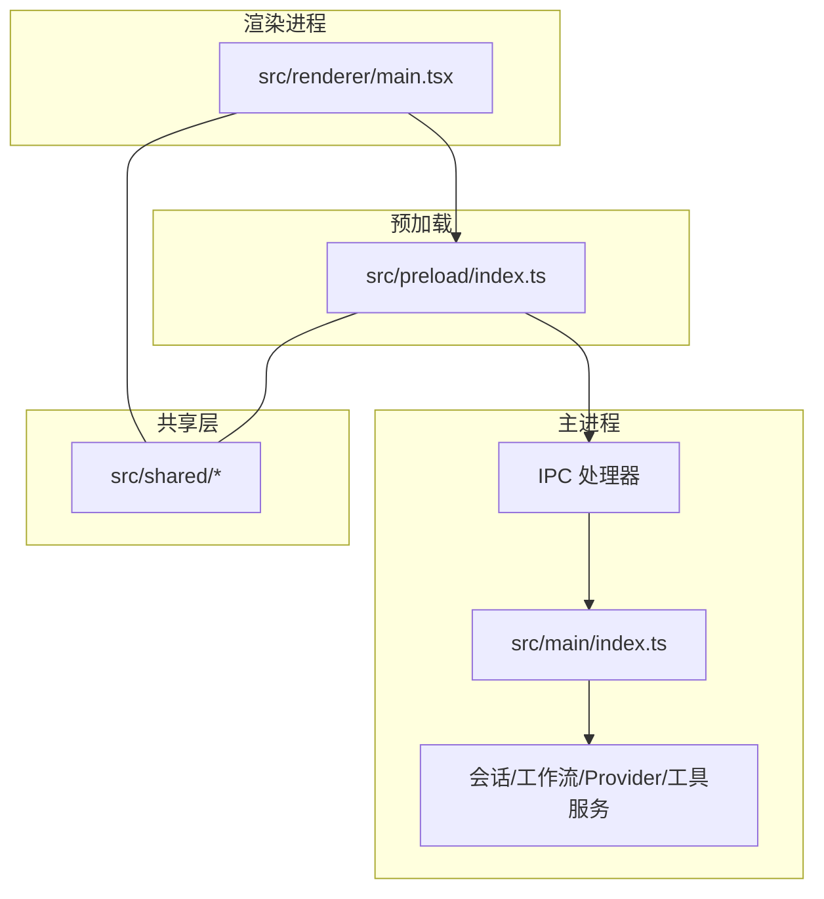
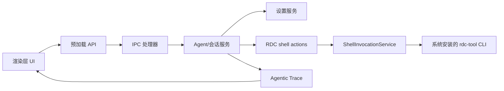
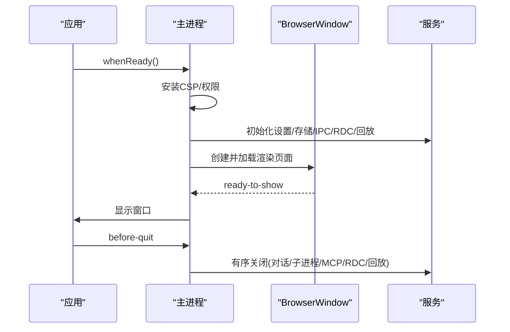
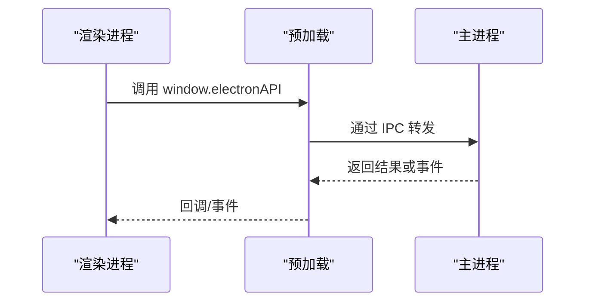
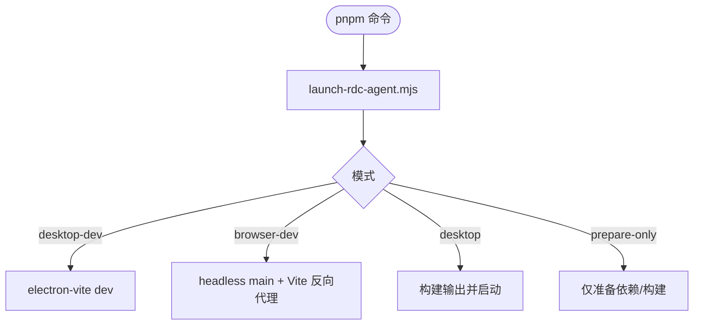
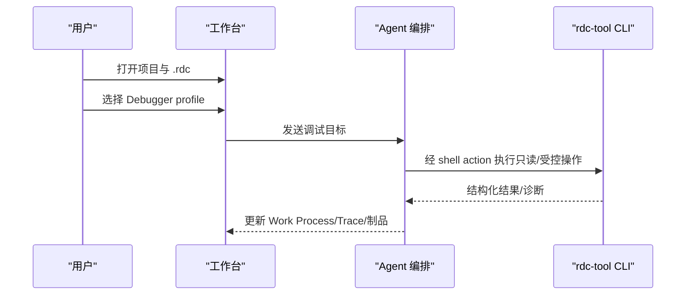
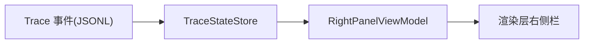
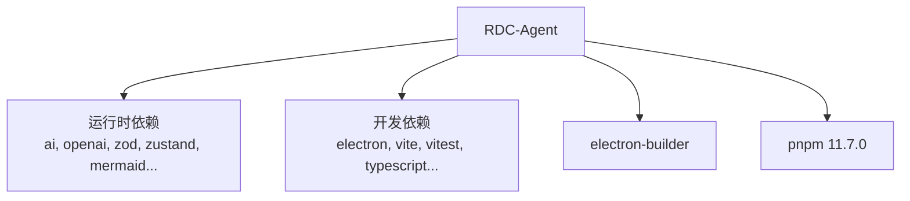

# 项目概述

> 历史资料提示：本页及本目录由历史 RepoWiki 生成，结构、路径、机制和验证描述可能已经过期；当前产品边界与运行时行为以仓库正式 `DESIGN.md`、`docs/` 和当前 catalog/契约为准。本页不构成当前实现或验证状态证明。

<cite>
**本文引用的文件**
- [README.md](file://README.md)
- [DESIGN.md](file://DESIGN.md)
- [package.json](file://package.json)
- [docs/README.md](file://docs/README.md)
- [docs/architecture/overview.md](file://docs/architecture/overview.md)
- [src/main/index.ts](file://src/main/index.ts)
- [src/renderer/main.tsx](file://src/renderer/main.tsx)
- [src/preload/index.ts](file://src/preload/index.ts)
- [scripts/launch-rdc-agent.mjs](file://scripts/launch-rdc-agent.mjs)
- [docs/product/vertical-debugger-overview.md](file://docs/product/vertical-debugger-overview.md)
- [docs/architecture/agentic-trace-protocol.md](file://docs/architecture/agentic-trace-protocol.md)
</cite>

## 目录
1. [简介](#简介)
2. [项目结构](#项目结构)
3. [核心组件](#核心组件)
4. [架构总览](#架构总览)
5. [详细组件分析](#详细组件分析)
6. [依赖关系分析](#依赖关系分析)
7. [性能与可维护性](#性能与可维护性)
8. [故障排查指南](#故障排查指南)
9. [结论](#结论)
10. [附录：快速开始](#附录快速开始)

## 简介
RDC-Agent 是一个面向 RenderDoc .rdc 捕获文件的 Electron 桌面应用。它将通用 Agent 协作入口与可审计的图形调试流程整合在同一工作台中，并通过用户配置的外部 rdc-tool CLI 执行本机 RenderDoc 能力。其目标是让开发者在一个统一的界面里完成 .rdc 管理、AI Agent 协作、Provider 选择与工具生态调用，同时保持严格的权限、安全与审计边界。

该项目的技术栈以 Electron + React + TypeScript 为核心，主进程负责 IPC、会话与工作流编排、Provider 与外部能力接入；渲染层提供交互界面与状态投影；预加载脚本暴露受控 API；共享层定义跨层类型与契约。

**章节来源**
- [README.md:1-13](file://README.md#L1-L13)
- [DESIGN.md:5-16](file://DESIGN.md#L5-L16)
- [docs/architecture/overview.md:3-8](file://docs/architecture/overview.md#L3-L8)

## 项目结构
仓库采用分层组织：
- src/main：Electron 主进程、IPC、工作流编排、Provider、外部能力接入、会话与存储、报告与证据、Trace、设置等。
- src/preload：向渲染进程暴露受控的 window.electronAPI。
- src/renderer：React UI、交互状态、浏览器会话桥接与工作台呈现。
- src/shared：跨层类型、常量与纯辅助函数。
- resources：随应用分发的 Core Prompt 与内置 Agent/Skill 资源。
- docs：稳定产品、架构、工作流与 UI 文档。
- scripts：开发、验证与启动脚本。

**图表来源**
- [src/main/index.ts:560-620](file://src/main/index.ts#L560-L620)
- [src/preload/index.ts:1-25](file://src/preload/index.ts#L1-L25)
- [src/renderer/main.tsx:1-16](file://src/renderer/main.tsx#L1-L16)
- [docs/architecture/overview.md:3-8](file://docs/architecture/overview.md#L3-L8)

**章节来源**
- [README.md:38-46](file://README.md#L38-L46)
- [docs/architecture/overview.md:3-8](file://docs/architecture/overview.md#L3-L8)

## 核心组件
- 工作台与窗口生命周期：主进程创建 BrowserWindow、安装 CSP、注册快捷键与菜单、处理单实例锁与 userData 隔离，并在启动时初始化设置、存储、IPC、rdc-tool CLI 编目、回放设备等服务。
- 会话与对话：会话持久化、分支、上下文日志、消息合并、附件暂存、任务投影与右侧栏投影。
- Provider 系统：声明式目录、发现与覆盖合并为有效目录；模型路由、请求计划与适配器统一管线；认证、配额与能力探测。
- 工具生态：Shell 解析、rdc-tool CLI 调用、MCP 连接、技能与钩子、权限策略与审批策略。
- Trace 与审计：追加式 JSONL 事件、右侧栏投影、任务进度、上下文与捕获信息、调查制品。
- 知识中心与调查：Markdown-first 六 lane 知识体系；垂直调查 schema、事务与完成合同。

**章节来源**
- [src/main/index.ts:124-161](file://src/main/index.ts#L124-L161)
- [src/main/index.ts:560-620](file://src/main/index.ts#L560-L620)
- [docs/architecture/agentic-trace-protocol.md:1-49](file://docs/architecture/agentic-trace-protocol.md#L1-L49)
- [DESIGN.md:19-103](file://DESIGN.md#L19-L103)

## 架构总览
RDC-Agent 的数据流遵循“渲染层 → 预加载 → 主进程 IPC → 运行时服务 → 外部能力（rdc-tool CLI）”的路径，并以 Trace 投影回渲染层展示。

**图表来源**
- [docs/architecture/overview.md:10-25](file://docs/architecture/overview.md#L10-L25)

**章节来源**
- [docs/architecture/overview.md:10-33](file://docs/architecture/overview.md#L10-L33)

## 详细组件分析

### 主进程与窗口生命周期
主进程负责：
- 安装默认拒绝的权限策略与生产 CSP。
- 管理 userData 路径与实例锁，支持 QA 临时 userData。
- 创建主窗口、绑定布局持久化、注册快捷键与菜单。
- 初始化设置、存储、IPC、rdc-tool CLI 编目、回放设备等服务。
- 在退出阶段协调关闭对话、子进程、MCP、RDC 上下文与回放设备。

**图表来源**
- [src/main/index.ts:124-161](file://src/main/index.ts#L124-L161)
- [src/main/index.ts:338-389](file://src/main/index.ts#L338-L389)
- [src/main/index.ts:560-620](file://src/main/index.ts#L560-L620)
- [src/main/index.ts:641-659](file://src/main/index.ts#L641-L659)

**章节来源**
- [src/main/index.ts:124-161](file://src/main/index.ts#L124-L161)
- [src/main/index.ts:338-389](file://src/main/index.ts#L338-L389)
- [src/main/index.ts:560-620](file://src/main/index.ts#L560-L620)
- [src/main/index.ts:641-659](file://src/main/index.ts#L641-L659)

### 预加载与渲染入口
- 预加载通过 contextBridge 暴露受控的 electronAPI 给渲染进程，并注入 rdcDesktop 能力。
- 渲染入口安装浏览器会话桥接与性能探针，挂载 React 根组件。

**图表来源**
- [src/preload/index.ts:1-25](file://src/preload/index.ts#L1-L25)
- [src/renderer/main.tsx:1-16](file://src/renderer/main.tsx#L1-L16)

**章节来源**
- [src/preload/index.ts:1-25](file://src/preload/index.ts#L1-L25)
- [src/renderer/main.tsx:1-16](file://src/renderer/main.tsx#L1-L16)

### 启动器与多模式运行
启动器负责：
- 条件式依赖同步与构建指纹。
- 根据模式启动开发桌面、浏览器 QA、或生产桌面。
- 在 headless 模式下维持 Electron 进程存活用于真实浏览器会话。

**图表来源**
- [scripts/launch-rdc-agent.mjs:483-530](file://scripts/launch-rdc-agent.mjs#L483-L530)

**章节来源**
- [scripts/launch-rdc-agent.mjs:483-530](file://scripts/launch-rdc-agent.mjs#L483-L530)

### 调试器工作流（RDC/RDC 垂直能力）
调试器是 RDC/RDC 导向的可执行 profile，用户打开项目与 .rdc 后选择 Debugger profile，提供目标，审查 Work Process 事件、工具调用、审批与诊断，由已批准的入口通过配置的 RDC shell action / 系统 CLI 执行，最终查看 trace、证据、制品与报告输出。

**图表来源**
- [docs/product/vertical-debugger-overview.md:5-13](file://docs/product/vertical-debugger-overview.md#L5-L13)

**章节来源**
- [docs/product/vertical-debugger-overview.md:5-13](file://docs/product/vertical-debugger-overview.md#L5-L13)

### Agentic Trace 与右侧栏投影
Agentic Trace 是当前的消息流与运行投影契约，使用追加式 JSONL 记录与 session 级右侧栏状态投影。Progress 来自任务注册表映射，Context 包含冻结提示段与成功工具结果的资源引用，Capture 拥有捕获选择、回放设备、打开/预览/刷新/复制/清理与紧凑诊断。

**图表来源**
- [docs/architecture/agentic-trace-protocol.md:1-49](file://docs/architecture/agentic-trace-protocol.md#L1-L49)
- [docs/architecture/agentic-trace-protocol.md:71-74](file://docs/architecture/agentic-trace-protocol.md#L71-L74)

**章节来源**
- [docs/architecture/agentic-trace-protocol.md:1-49](file://docs/architecture/agentic-trace-protocol.md#L1-L49)
- [docs/architecture/agentic-trace-protocol.md:71-74](file://docs/architecture/agentic-trace-protocol.md#L71-L74)

## 依赖关系分析
- 运行时依赖包括 AI SDK、OpenAI/Gemini/Anthropic 兼容提供者、CodeMirror、Mermaid、PDF.js、Zustand、Zod、YAML 等。
- 开发依赖包括 Electron、Vite、TypeScript、Vitest、ESLint 等。
- 构建与发布使用 electron-builder，包管理器固定 pnpm 版本。

**图表来源**
- [package.json:78-134](file://package.json#L78-L134)

**章节来源**
- [package.json:78-134](file://package.json#L78-L134)

## 性能与可维护性
- 安全与性能：生产环境禁用 unsafe-inline，动态样式通过 constructable stylesheet；渲染层禁止直调 window.electronAPI，强制通过 IPC。
- 可维护性：Orchestrator 门面保持精简，职责外提至协作单元；门禁检查涵盖架构、保真度、共享导出、Provider 系统等；测试与覆盖率基线保障回归。
- 扩展性：Provider 目录与发现机制解耦实现；工具与技能通过策略与权限控制；Knowledge 与 Investigation 提供垂直领域扩展点。

[本节为通用指导，不直接分析具体文件]

## 故障排查指南
- 启动失败：检查 Node/Electron 版本与 pnpm store；确认 userData 未被占用；查看主进程日志与服务初始化错误。
- 渲染加载失败：确认开发模式下 Vite 端口可达；生产模式检查打包产物；关注 CSP 限制导致的资源加载问题。
- RDC 调用失败：核对 Settings 中 rdc-tool CLI 路径与 action 配置；确认会话租约与权限；查看 Trace 与诊断行。
- 会话与附件：确认附件暂存目录权限；避免上传 .rdc、可执行与 SVG；检查会话配额与制品大小限制。

**章节来源**
- [src/main/index.ts:124-161](file://src/main/index.ts#L124-L161)
- [src/main/index.ts:560-620](file://src/main/index.ts#L560-L620)
- [docs/architecture/overview.md:27-33](file://docs/architecture/overview.md#L27-L33)

## 结论
RDC-Agent 将通用 Agent 协作与可审计的图形调试流程整合在单一工作台中，围绕 .rdc 捕获提供了从打开、回放、调查到报告输出的完整闭环。其架构强调主进程权威、Scope 固定、Provider 事实分层、失败分类与可取消回收，确保安全性、可审计性与可扩展性。对于初学者，它提供了清晰的工作台与调试流程；对于有经验的开发者，它提供了丰富的 Provider、工具与知识/调查扩展点。

[本节为总结，不直接分析具体文件]

## 附录：快速开始
- 环境要求：Node.js >= 22.13.0；pnpm 11.7.0。
- 安装与启动：
  - 开发模式：pnpm run dev
  - 真实浏览器会话：pnpm run start:agent-browser
  - Windows/macOS/Linux 启动器：scripts/start-rdc-agent.cmd 或 sh scripts/start-rdc-agent.sh
- 基本使用：
  - 打开项目与 .rdc 文件。
  - 选择 Debugger/Analyzer/Optimizer profile 进行调试与分析。
  - 在右侧栏查看 Progress、Artifacts、Outputs、Context、Capture。
  - 通过设置配置 rdc-tool CLI 与 Provider。

**章节来源**
- [README.md:48-81](file://README.md#L48-L81)
- [docs/README.md:13-23](file://docs/README.md#L13-L23)
