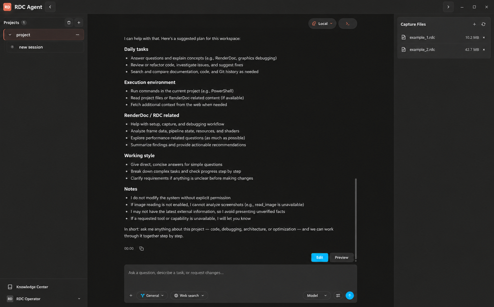

<div align="center">


# RDC-Agent

### 把一帧 GPU 问题，变成一条可追溯的答案链

RenderDoc `.rdc` capture × AI Agent workbench × RDC 原生诊断

[English](./README.en.md) · [设计与架构](./DESIGN.md) · [问题反馈](https://github.com/haolange/RDC-Agent/issues)

</div>

## 不是“会聊天的工具”，而是能把图形问题推进下去的工作台

RDC-Agent 是一个面向 Windows 的 Electron 桌面应用：把日常 Agent 协作、RenderDoc capture 调查和 RDC 原生操作放进同一个可审计的工作区。

你可以从一句“这一帧为什么不对？”开始，逐步完成：

1. 打开项目与 `.rdc` capture，固定当前 capture / replay / context 身份；
2. 让 Agent 读取代码、运行命令、检查 RDC 上下文，并把过程投影成可读的 Work Process；
3. 按需进入 Debugger、Analyzer 或 Optimizer 方法面；
4. 将观察、证据、结论和下一步动作留在同一个 session，而不是散落在终端、截图和聊天记录里。

## RDC-Agent 不等于 LLM + Skill + Tool

当前可见的 RenderDoc Agent 集成，常见形态仍是：把 Replay API 包成 MCP 工具，补一层 Skill，再让 LLM 自己选择 tool call。这解决了“模型能不能调用 RenderDoc”的问题，却没有自动解决“调查是否稳定、证据是否充分、结论是否可信”。

RDC-Agent 的最小产品单元不是一次 tool call，而是一条有状态、有任务、有上下文、有证据约束的调查闭环：

```text
Problem
  ↓
Hypothesis
  ↓
Inspection
  ↓
Experiment
  ↓
Evidence
  ↓
Conclusion
```

这条链由四个系统共同托住：

- **Tasks system** 管的是下一步要验证什么、哪些补证仍未完成、什么条件才能收口；它不是把调查阶段写死成一张流程图。
- **Context in app** 把当前 session 的 capture / replay / context、任务、Artifacts、Outputs、Context 和 Capture 投影到同一工作区，减少“模型记得但系统没有”的漂移。
- **Investigation schema** 把 World State、Evidence、Claim、Experiment、Challenge、Checkpoint 和 Report 变成可引用的 session artifacts；观察、推断、派生结论和未知状态不能随意升格。
- **Knowledge Engine** 以 markdown-first 的六条 retrieval lane 连接 Identity / Path、Scope / Metadata、Lexical、Structural、Relation / Graph、Temporal / Version，让经验与历史案例可以被检索，但不会用一个不可解释的 embedding 分数替代证据。

所以，RDC-Agent 追求的不是“再多几个 GPU 工具”，而是让 Agent 在调查过程中知道：当前对象是谁、已知事实是什么、竞争假设是什么、下一步实验如何回滚、哪条结论仍然只是推断。

这也解释了几个有意的产品边界：MCP 不是 RDC-Agent 的运行时权威；RDC 的可编程 CLI / JSON contract 才是 Agent、脚本、测试和人共同使用的操作面。remote / Android 回放属于显式的 runtime capability，不会因为本地 PNG 成功就静默假装远端成功；工具集合按 catalog 发现、描述和裁剪，而不是把一张无法治理的全量工具表塞给模型。工具少而事实完整、身份明确、失败诚实，比按钮数量更重要。

## 一份调查，服务不同岗位的两种阅读面

最终结果不应只是一段聊天终答。RDC-Agent 的调查结果可以沿同一份事实源生成两种阅读面：

- **Developer Report（Markdown）**：面向图形程序员、TA、引擎和性能工程师，包含目标、输入、环境、计划、任务时间线、Evidence、Claims、Experiments、Challenges、Limitations 和 Artifact Index。
- **Executive Visual Report（generative UI / canvas）**：面向 QA、Artist、策划和需要快速理解影响面的协作者，用图文、Before / After / Diff、区域标注和可信度标记讲清“发生了什么、影响谁、建议做什么”。

视觉报告只是事实的阅读投影，不是第二个结论引擎：每个关键判断仍需回指可解引用的 Claim、Evidence 和 verification 状态。这样同一份调查既能让专业人员深挖，也能让非图形岗位快速理解，而不会为了“好看”牺牲可信度。



> 上图是公开展示版工作台预览：布局来自真实内置 Browser QA 的 `/app` 工作台，项目名、capture 名称、历史对话和模型信息已替换为中性占位内容。它展示产品结构，不把演示文字冒充成运行结果。

## 三个入口，覆盖一次图形调查的主要节奏

| 入口 | 你会得到什么 |
| --- | --- |
| **Debugger** | 从异常现象回到事件、资源、Pipeline 和 Shader，先定位“哪里不对”。 |
| **Analyzer** | 串联跨 capture、跨事件和跨证据的线索，形成可以复查的调查材料。 |
| **Optimizer** | 在真实干预、可回滚的前提下比较代价与收益，排出优化顺序。 |

这三者不是三个孤立的聊天人格：它们共享同一个 Agent loop、项目资源边界、权限模型和 session 证据链。普通工程协作仍然由 General 处理；RenderDoc 专项工作按需交接到对应方法面。

## 事实上的能力边界

- **Capture 工作流**：管理项目内 `.rdc` 输入，打开、切换和诊断 capture；RDC / RenderDoc 能力来自用户配置的外部 RDC-Tool CLI。
- **Agent 工作流**：支持阅读、规划、编辑、搜索、Shell、工具调用、handoff、memory 和 subagent 编排；执行权限由主进程和冻结的运行计划控制。
- **可审计资源**：用户资源位于 `~/.rdc-agent`，项目资源位于 `<project-root>/.rdc-agent`；Agent、Skill、MCP、Hook、Policy、Knowledge 和显式 Memory 有清晰的 scope。
- **真实运行过程**：Work Process 展示实际执行过程和 provider reasoning 语义；不伪造隐藏思维链，也不把模型自报当成证据。
- **设备与回放**：本地回放与 Android 设备路径由 RDC / RenderDoc 环境决定；“已连接”不等于每一种 capture 都能在每一台 GPU 上成功 replay。

当前发布面是 **Windows-only**。RDC-Agent 不捆绑你的 `.rdc` 文件、Provider 密钥或 RenderDoc 安装；你需要自行配置 RDC-Tool CLI、Provider / Model，以及对应的设备环境。

## 为什么它适合严肃的图形调试

- **上下文不漂移**：capture、replay、context 和 session 身份在 turn 开始时冻结，避免调查中途悄悄换对象。
- **权限不靠提示词**：Skill 提供方法知识，不能自行扩大工具权限；Shell、RDC、IPC 和 Secret 边界由主进程控制。
- **失败可解释**：安全拒绝、完整性降级和可恢复错误分开表达，失败不会被空结果或固定成功值掩盖。
- **结果可复查**：调查材料、capture 证据和运行记录都有明确的来源与边界，便于复盘和交接。

## 5 分钟开始

发行包用户：安装 `*-setup.exe`，或完整解压 Windows zip 后运行 `RdcAgent.exe`（保留同目录资源）。不需要 Node.js/pnpm。首次上手指南也可从标题栏问号重开；自行配置 Provider/Model 和项目即可使用 General。

当前源码版本 **0.6.0-rc.3 按未签名预发布通道交付**；可下载版本以 [Releases](https://github.com/haolange/RDC-Agent/releases) 为准。Windows 可能提示未知发布者，受管理电脑可能阻止运行。仅从本仓库 Releases 下载并核对 SHA-256；不要关闭安全防护。稳定正式版仍保留签名要求。

RDC 调查另从 [RDC-Tool Releases](https://github.com/haolange/RDC-Tool/releases) 下载自包含 zip，解压后在 Settings → Tools 检测安装或选择 `rdc-tool` 根目录，再验证并应用；不需要另装 Python。默认安装目录为 `%LOCALAPPDATA%/Programs/rdc-tool`。通用 Code Interpreter 是单独的可选配置。

以下命令只供源码开发：

环境要求：Windows、Node.js `>=22.13.0`、pnpm `11.7.0`，以及已安装并可由 Settings 配置的 RDC-Tool CLI。

```powershell
pnpm install
pnpm run dev
```

真实 Browser QA（用于开发和界面验收）：

```powershell
pnpm run start:agent-browser
```

常用工程验证：

```powershell
pnpm run typecheck
pnpm test
pnpm run check:gates
pnpm run build
```

然后在应用中：

1. 添加一个 Project；
2. 将 `.rdc` 放入 `<project-root>/.rdc-agent/inputs/`，或从 Capture 面板导入；
3. 配置 RDC-Tool CLI 与 Provider / Model；
4. 从 General 开始描述目标，需要图形调查时再进入 Debugger、Analyzer 或 Optimizer。

## 公开仓库说明

这是一个仍在快速收敛中的工程项目。README 展示已经落地的产品边界与真实验证过的工作流；完整平台、Provider、GPU、Android 和发布验收矩阵请查看 [Acceptance Ledger](./docs/product/acceptance-ledger.md)。不具备对应环境的验证，不会在这里被包装成“全平台保证”。

欢迎提交 issue、改进文档或针对具体 capture 的可复现问题。请不要在 issue 中上传私有 `.rdc`、Provider 密钥、用户数据或包含敏感路径的日志。

## 文档入口

- [产品与架构裁决](./DESIGN.md)
- [运行时与权限契约](./docs/contracts/runtime-kernel.md)
- [RDC 运行时](./docs/architecture/rdc-runtime.md)
- [Workbench / Transcript / Composer](./docs/ui/workbench-and-transcript.md)
- [UI Design System](./docs/ui/design-system.md)
- [验收记录](./docs/product/acceptance-ledger.md)

## License

See [LICENSE](./LICENSE).

## RenderDoc runtime baseline

The current assembled and verified baseline is **RenderDoc 1.45**. RDC-Tool does not track every upstream minor release: a newer runtime becomes the baseline only after matching runtime packaging, catalog checks, tests and release gates pass. RenderDoc 1.44 and earlier official GUI releases are not separate assembly targets. Use the replay path matching this bundled runtime. Capture-format compatibility follows upstream RenderDoc.

RDC-Agent **0.6.x** pairs with RDC-Tool **1.0.0** and the current RenderDoc **1.45** runtime. Catalog definitions and fingerprints, not package version numbers, authorize operations. Local PNG export does not prove Android device presentation.

## Reporting safely

Do not upload private captures, provider keys or full logs containing local absolute paths. Redact logs and use the installation or bug-report template.
