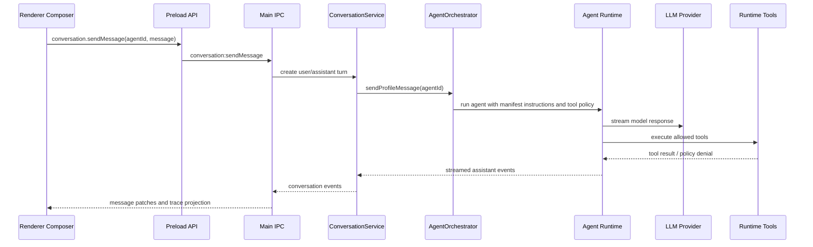
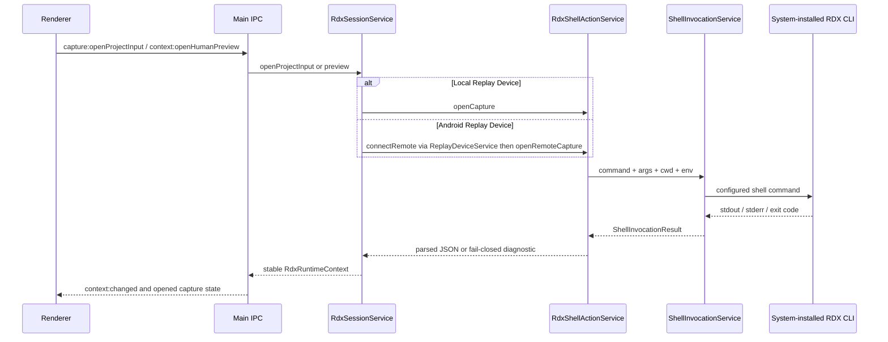
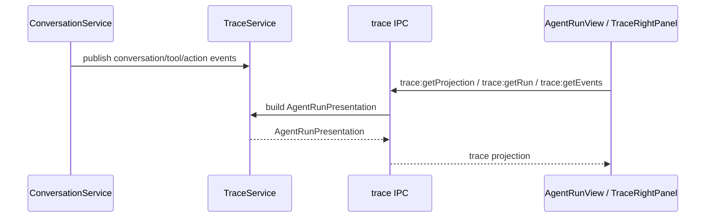

# Data Flow

本文描述当前 project state、agent turn、Agentic Trace projection 和 RDX shell action 的跨层流向。

## Agent Turn

`.agent.md` is the source for instructions, model, tools, agent handoffs, skills, MCP servers, and invocability. `plan.md` is a normal artifact or message output, not a workflow IPC state.

## RDX Shell Actions

RDX command details are Settings data under `settings.tooling.rdxActions` (`openCapture`, `openRemoteCapture`, `connectRemote`, `openPreview`, `closeRuntime`). The repository does not hardcode RDX CLI tool names, command args, cwd, env, or fallback repository paths in renderer/preload/main call sites for these vertical UI actions.

Local Open uses `capture open --file {{capturePath}}`. Remote Open uses the same facade with `--remote-id {{remoteId}}` after `connectRemote` prepares a live handle. Failures must expose structured diagnostics (`message`, optional `classification` / `fix_hint`) rather than truncated CLI stderr alone.

## Trace Projection

`TraceService` builds renderer-facing `AgentRunPresentation` from conversation messages, action events, artifacts, and run summaries.

## Settings Flow

Settings are persisted by `SettingsService`, sanitized before write, and exposed to renderer through settings IPC.

Renderer Settings editors never invent provider/model facts; Effective Catalog and connection state come from main. Secret material stays in main-process opaque storage.
