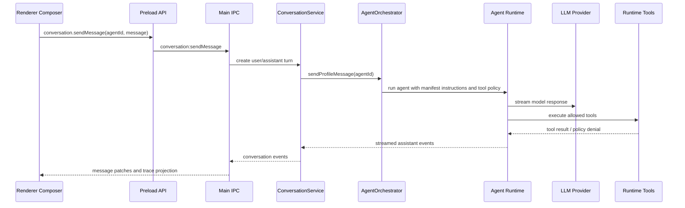
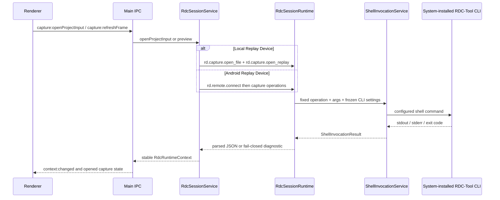
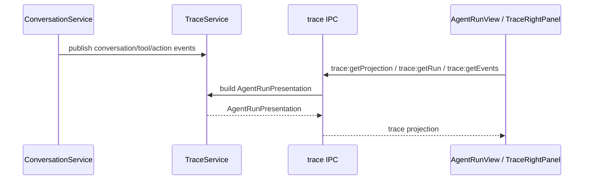

# Data Flow

本文描述当前 project state、agent turn、Agentic Trace projection 和 RDC shell action 的跨层流向。

## Agent Turn

`.agent.md` is the source for instructions, model, tools, agent handoffs, skills, MCP servers, and invocability. `plan_artifact` is a human-in-the-loop pause with a live session plan and a frozen approved copy; it is not a Right Rail output.

## RDC Shell Actions

RDC installation details remain under `settings.tooling.rdcCli`. The main session boundary constructs the fixed native operation names and arguments, and freezes CLI settings for each turn; renderer and preload never construct lifecycle commands.

Local Open invokes `rd.capture.open_file` followed by `rd.capture.open_replay`. Remote Open first invokes `rd.remote.connect`, then passes its returned `remote_id` to the replay operation. Failures expose structured diagnostics (`message`, optional `classification` / `fix_hint`) rather than truncated CLI stderr alone.

## Trace Projection

`TraceService` builds renderer-facing `AgentRunPresentation` from conversation messages, action events, artifacts, and run summaries.

## Settings Flow

Settings are persisted by `SettingsService`, sanitized before write, and exposed to renderer through settings IPC.

Renderer Settings editors never invent provider/model facts; Effective Catalog and connection state come from main. Secret material stays in main-process opaque storage.
