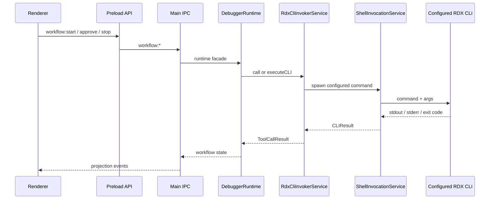
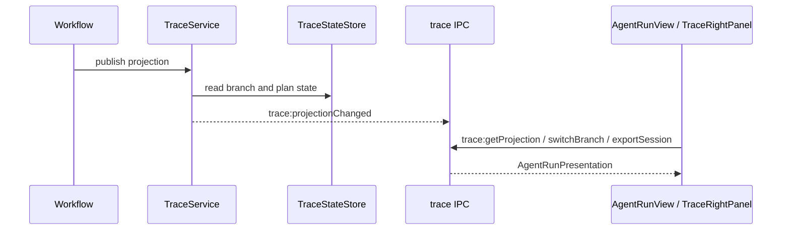

# Data Flow

This document describes the current cross-layer flow for project state, Debugger execution, Agentic Trace projection, and RDX CLI invocation.

## Debugger Execution

The invoker is fail-closed. If Settings do not enable and configure the command, calls return an explicit error rather than falling back to any repository path.

## Trace Projection

`TraceService` builds the renderer-facing `AgentRunPresentation`. Right-panel records use `traceLaneId` and live in `src/shared/types/trace.ts`.

## Settings Flow

Settings are persisted by `SettingsService`, sanitized before write, and exposed to renderer through the existing settings IPC. RDX CLI settings live under `settings.tooling.rdxCli`.

The stored fields are:

- `enabled`
- `command`
- `argsPrefix`
- `workingDirectory`
- `env`
- `timeoutMs`
- `catalogPath`
- `jsonMode`

## Renderer Boundary

Renderer code can:

- read `tool:getCatalog`
- read `tool:getRuntimeSummary`
- subscribe to trace/workflow/conversation events

Renderer code cannot execute arbitrary RDX tools. Execution is owned by the main-process workflow/runtime path.
