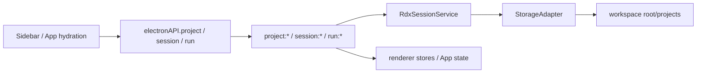
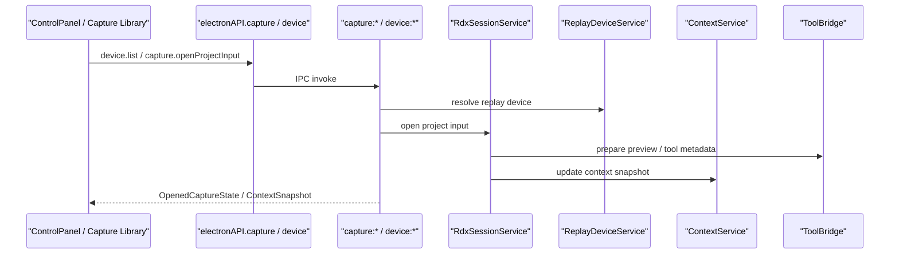
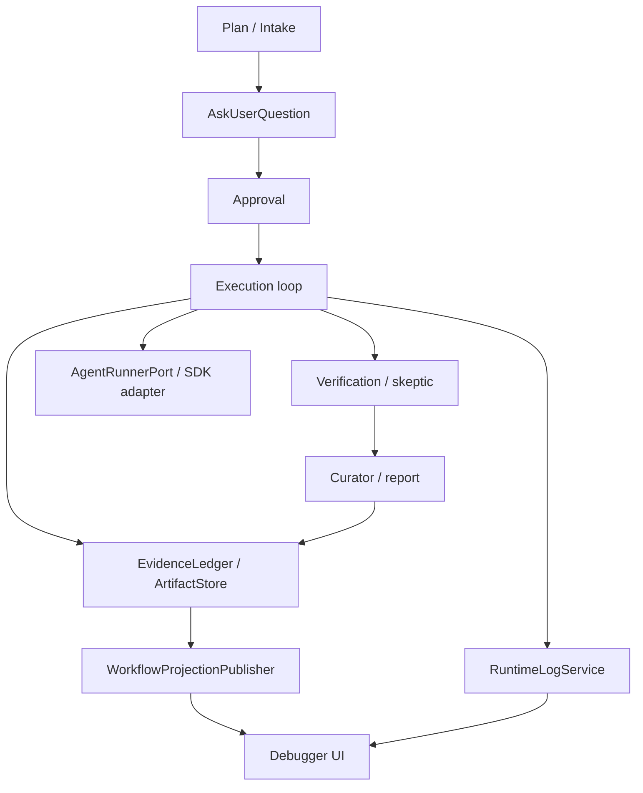
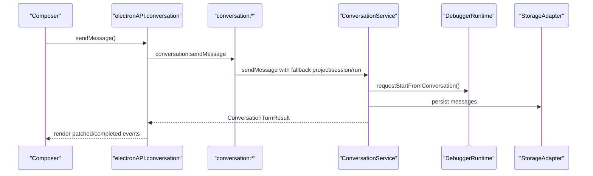
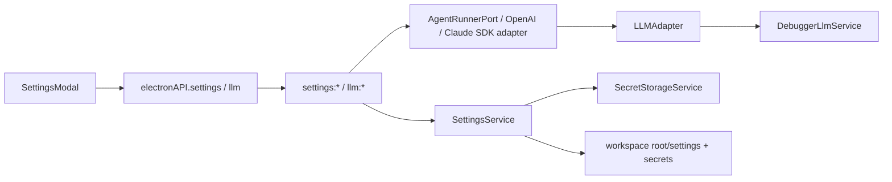
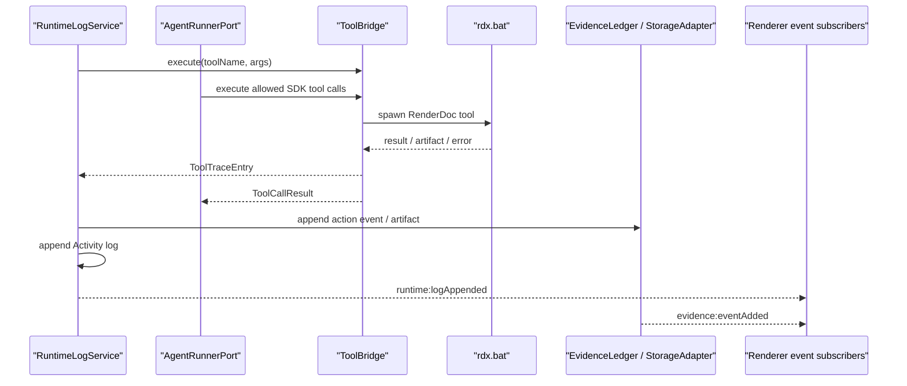

# 数据流

本文记录当前 `RDC-Agent` 的端到端数据流。目标是让后续改动能先判断自己触碰哪条链，再决定需要同步更新哪些层。

## Project / Session / Run

关键触点：

- 共享类型：`ProjectRecord`、`SessionRecord`、`RunSummary`、`SessionOutputRecord`。
- 主进程入口：`src/main/ipc/handlers.ts`、`RdxSessionService`、`StorageAdapter`。
- 渲染入口：`src/renderer/App.tsx`、`Sidebar`、`sessionStore`。
- 测试入口：`session-lifecycle.spec.ts`。

## Capture / Replay Device

关键触点：

- 工具链边界保持为 `ToolBridge -> resources/tools/rdx.bat`。
- capture preview 依赖 `OpenedCaptureState`，不要只改 UI 展示而不改共享类型。
- 关键回归包括 opened capture preview、capture library、device selector。

## Debugger Workflow

关键触点：

- 唯一顶层入口：`src/main/workflow/debugger/DebuggerRuntime.ts`。
- `DebugWorkflowService` 是 Runtime 内部执行服务，不再作为 IPC、conversation 或公开 workflow barrel 的入口。
- `WorkflowProjectionPublisher` 统一广播 `workflow:*`、`evidence:eventAdded`、`conversation:event` 等投影事件；Runtime 和 agent runner 不直接持有窗口引用。
- OpenAI / Claude Agent SDK 通过 `AgentRunnerPort` 运行，工具能力由 Runtime policy 生成 allowlist，再经 `AgentToolPort -> ToolBridge` 执行。
- 不新增阶段，不改变 Debugger harness 状态机，不把 Analyzer / Optimizer 并入该主链。

## Conversation

关键触点：

- 流事件：`conversation:event`。
- 类型：`ConversationMessage`、`ConversationTurnResult`、`ConversationStreamEvent`。
- UI 入口：`AgentChat`、composer glue、`App.tsx`。

## Settings / Provider / Model Route

凭据来源固定为 Settings provider secret。SDK adapter 内部可以向 SDK 注入 key 或 client，但不能把裸 `OPENAI_API_KEY` / `ANTHROPIC_API_KEY` 作为 RDC-Agent 的配置来源。

## ToolBridge / Evidence / Runtime Log

关键触点：

- IPC：`tool:*`、`evidence:*`、`runtimeLog:*`。
- 类型：`ToolTraceEntry`、`ToolRuntimeSummary`、`ActionEvent`、`RuntimeLogEntry`。
- 不绕开 `ToolBridge` 直接在 renderer 调工具。
