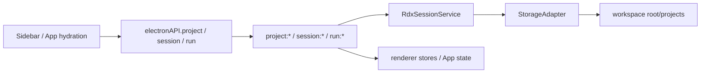
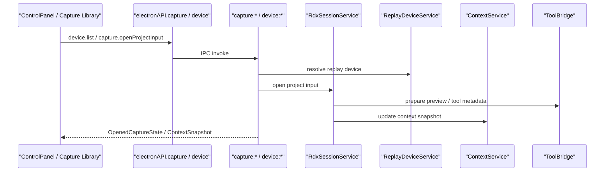
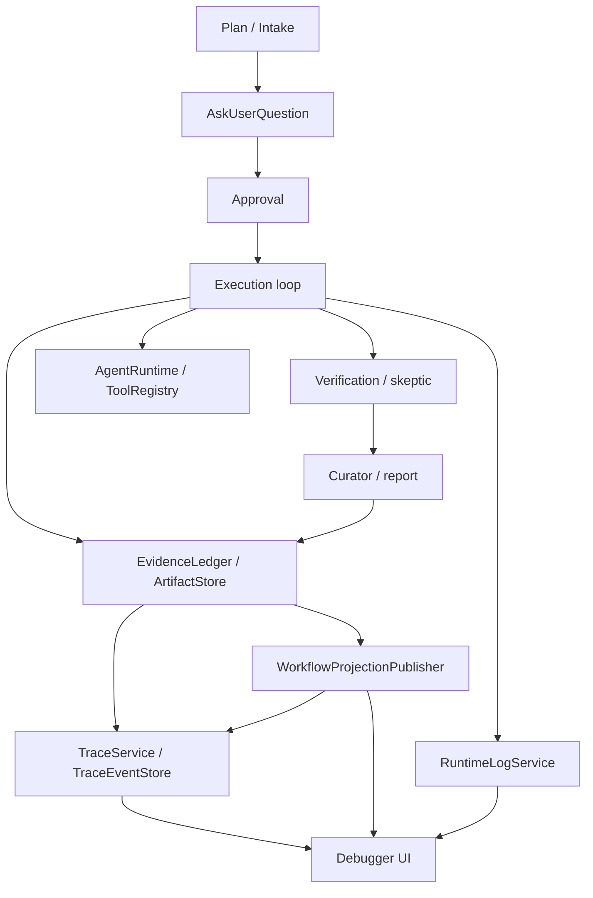
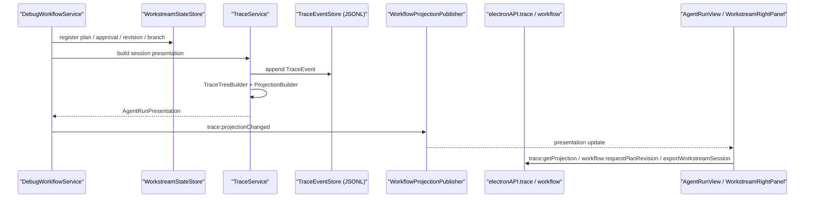
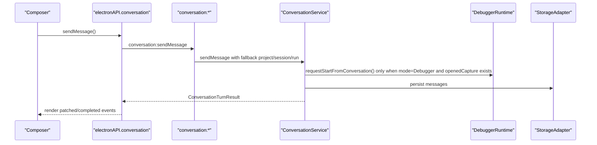
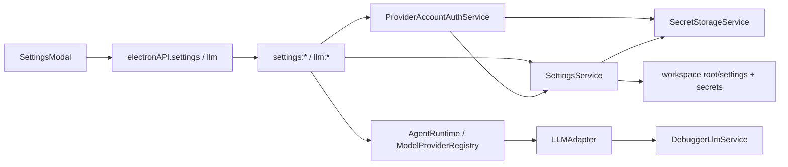
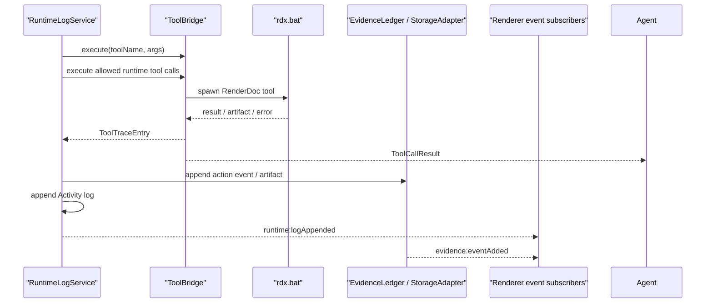

# 数据流

本文记录当前 `RDC-Agent` 的端到端数据流。目标是让后续改动能先判断自己触碰哪条链，再决定需要同步更新哪些层。

## Project / Session / Run

关键触点：

- 共享类型：`ProjectRecord`、`SessionRecord`、`RunSummary`、`SessionOutputRecord`。
- 主进程入口：`src/main/ipc/handlers.ts`、`RdxSessionService`、`StorageAdapter`。
- 渲染入口：`src/renderer/App.tsx`、`Sidebar`、`sessionStore`。
- 测试入口：`session-lifecycle.spec.ts`。

## Capture / Replay Device

关键触点：

- 工具链边界保持为 `ToolBridge -> resources/tools/rdx.bat`。
- capture preview 依赖 `OpenedCaptureState`，不要只改 UI 展示而不改共享类型。
- 关键回归包括 opened capture preview、capture library、device selector。

## Debugger Workflow

关键触点：

- 唯一顶层入口：`src/main/workflow/debugger/DebuggerRuntime.ts`。
- `DebugWorkflowService` 是 Runtime 内部执行服务，不再作为 IPC、conversation 或公开 workflow barrel 的入口。
- `WorkflowProjectionPublisher` 统一广播 `workflow:*`、`evidence:eventAdded`、`conversation:event` 等投影事件；Runtime 和 agent runner 不直接持有窗口引用。
- Agent turn 通过 `AgentRuntime` 运行，工具能力由 runtime policy 生成 allowlist，再经 `ToolRegistry -> ToolBridge` 执行。
- `TraceService` 负责把 conversation、action events、plan snapshot、task board、artifact/context store 投影为 `AgentRunPresentation`；renderer 通过 `TimelineProjection` 与 Renderer Registry 渲染，不再从 raw trace 猜消息节点。
- `DebugPlan.presentation` 只作为 Plan Result Block 的源数据，主执行/修改入口迁移到 composer 上方的 `ComposerApprovalOverlay`。
- `AskUserQuestion` 是 plan/intake 阶段可用的用户交互 primitive：renderer 通过 composer 上方 overlay 提交到 `workflow.submitQuestions(runId, answers)`，同时 workflow 写入 `ui.ask_user_question` tool trace，让问题请求和用户回答保留在消息流中。
- 不新增阶段，不改变 Debugger harness 状态机，不把 Analyzer / Optimizer 并入该主链。

## Agentic Trace Projection

关键触点：

- 轨迹类型：`src/shared/types/agenticTrace/`；右栏与会话索引类型：`src/shared/types/workstream.ts`（`ProgressTask`、`WorkstreamArtifactRecord`、`WorkstreamContextRecord`、`PlanStatus`、branch、export/raw audit）。
- `trace:projectionChanged` 是 renderer 增量刷新入口；`workflow:getWorkstreamSession` 返回 `{ presentation: AgentRunPresentation }`。
- 持久化：`workspace/.rdc-agent/trace/runs/*.json` + `events/*.jsonl`（append-only JSONL，非 SQLite）。
- 浏览器真实会话通过 localhost bridge 使用真实 `tracePresentation` / runtime event，不再通过渲染层本地样本注入。
- 详见 `docs/architecture/agentic-trace-protocol.md`。

## Conversation

关键触点：

- 流事件：`conversation:event`。
- 类型：`ConversationMessage`、`ConversationTurnResult`、`ConversationStreamEvent`。
- `ConversationMessage.diagnostic` 是跨层模型链路诊断：Cowork / Debugger 回复可以用它传递 route 缺失、provider 不可用或请求失败，renderer 只做轻量提示，Activity 通过 `RuntimeLogService` 保留同一条脱敏诊断。
- 默认 UI mode 是 `Ask`，它只产生对话消息，不创建 `RunRecord`。`DebugSessionStartRequest.mode` 和 `RunRecord.mode` 只接受执行类 mode。
- `Ask` 消息走非执行 `ask_agent` profile；该 profile 不暴露 RenderDoc 工具、shell 或 ToolBridge 执行能力。`Debugger` Cowork 与正式 workflow planner 使用独立 prompt，不复用 Ask 身份。
- 含明确执行意图的 Debugger 输入只有在应用内 `openedCapture` 属于当前 project 且状态为 `open` 时，才会由 `ConversationService` 投影为本次 `DebugSessionStartRequest.captures`。prompt 或任务文件里的 `.rdc` 路径只能触发 Open capture 提示，不能绕过 UI 状态。
- UI 入口：`AgentChat`、composer glue、`App.tsx`、`PlanIntakePanel`。

## Settings / Provider / Model Route

凭据来源由 provider auth mode 决定。API Key provider 存储 provider-scoped key；账号登录 provider 通过 `ProviderAccountAuthService` 自研 OAuth/device-flow 获取 token bundle，`settings.json` 只保存账号摘要、状态和模型列表；Bedrock/Vertex 这类 environment provider 不保存密钥，只把运行环境凭据交给 provider client 使用。provider client 不能把裸 `OPENAI_API_KEY` / `ANTHROPIC_API_KEY` 作为 RDC-Agent 的通用配置来源。

模型列表也属于 settings 边界。标准 Provider 通过真实 `/models` 或等价接口发现模型；没有标准模型列表的 Anthropic-compatible / Azure endpoint 只能保存逐候选轻量请求验证成功的模型；Claude/ChatGPT Account 使用账号模型目录，其中 ChatGPT Account 运行时走 ChatGPT Codex endpoint；GitHub Copilot 使用账号模型目录并用 Copilot `/models` 补充，`/models` 不可用时仍可保存账号目录，但 OAuth/device-flow/token 获取失败仍保持未配置并向 UI 返回错误。GitHub Copilot 的模型目录不是等价的 chat completions 可执行集；`ExecutionProfileService` 和 `DebuggerLlmService` 在运行时会把已知不支持 chat completions 的 specialist route 收敛到同 provider 下可用的 Debugger 模型，并在 LLM activity raw payload 中保留原始 `requestedModelId` 与 `remapReason`。renderer 二次打开 API Key detail 时只接收 `hasStoredSecret` 状态并显示固定星号占位，不能读取已存明文密钥。

## ToolBridge / Evidence / Runtime Log

关键触点：

- IPC：`tool:*`、`evidence:*`、`runtimeLog:*`。
- 类型：`ToolTraceEntry`、`ToolRuntimeSummary`、`ActionEvent`、`RuntimeLogEntry`。
- 不绕开 `ToolBridge` 直接在 renderer 调工具。
