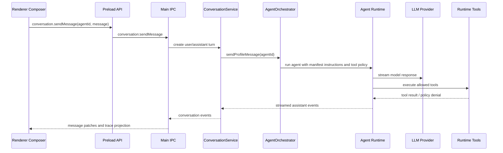
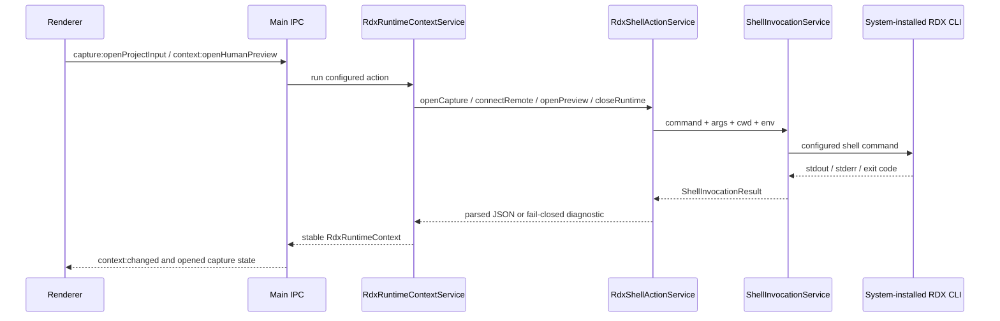
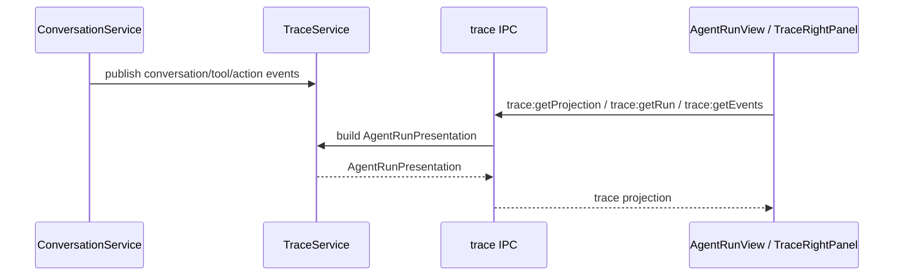

# Data Flow

本文描述当前 project state、agent turn、Agentic Trace projection 和 RDX shell action 的跨层流向。

## Agent Turn

`.agent.md` is the source for instructions, model, tools, agent handoffs, skills, MCP servers, and invocability. `plan.md` is a normal artifact or message output, not a workflow IPC state.

## RDX Shell Actions

RDX command details are Settings data under `settings.tooling.rdxActions`. The repository does not hardcode RDX CLI tool names, command args, cwd, env, or fallback repository paths in renderer/preload call sites.

## Trace Projection

`TraceService` builds renderer-facing `AgentRunPresentation` from conversation messages, action events, artifacts, and run summaries.

## Settings Flow

Settings are persisted by `SettingsService`, sanitized before write, and exposed to renderer through settings IPC.

Relevant settings groups:

- `settings.agents.definitions`: loaded from baseline `.agent.md` profiles such as Ask, Plan, Edit, Debugger, Analyzer, and Optimizer.
- `settings.llm.agentRoutes`: provider/model route for each top-level agent.
- `settings.tooling.rdxActions`: configured shell actions for RDX runtime context.
- `settings.tooling.rdxCli`: optional catalog/runtime summary configuration.

Renderer code can read settings, catalog, runtime summary, trace, and context projections. Actual shell execution is owned by main process services.
