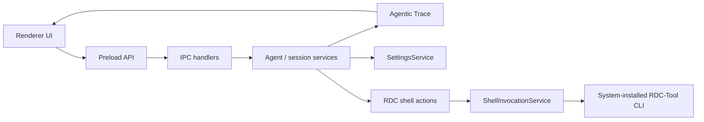

# Architecture Overview

RDC-Agent is an Electron desktop workbench for RenderDoc `.rdc` captures. The application is split into four code layers:

- `src/main`: Electron shell, IPC handlers, workflow orchestration, settings, workspace storage, reports, evidence, trace, and external capability invocation.
- `src/preload`: the controlled `window.electronAPI` bridge exposed to renderer code.
- `src/renderer`: React UI, interaction state, browser-session bridge, and workbench presentation.
- `src/shared`: cross-layer types, constants, and pure helpers.

## Main Data Flow

RDC-Tool is independently distributed. Settings accepts its root directory; main derives bundled Python, the sole CLI entry argument and working directory. Environment and timeout remain local settings. The configured CLI supplies the complete catalog; there is no catalog-path setting or lifecycle command template.

## Public Boundaries

- Renderer/preload can read catalog and runtime status through IPC.
- Renderer/preload do not expose arbitrary tool execution.
- RDC lifecycle entries use the fixed native boundary and owning session lease. General executes structured `shell.rdc` against the prepared catalog; Mission profiles plan and assess with controlled probes.
- Agentic Trace exposes projection APIs under `trace:*`.
- Debugger workflow actions remain under `workflow:*`.

## Verification

Use `pnpm run typecheck` for static validation. For renderer or IPC changes, also run `pnpm run check:architecture`, `pnpm run check:fidelity`, and `pnpm run check:shared-exports`. For shell/window/local invocation boundaries, build first and then run the relevant smoke test.

Source development uses pnpm `11.7.0` with a per-user store under `~/.cache/rdc-agent`; every human/browser and production/development source entry reaches the shared launcher. Dependency and build fingerprints avoid repeated preparation while preserving a `--force-prepare` recovery path. Packaged applications contain compiled runtime inputs only and never depend on the source package manager or launcher.

Directory packaging uses electron-builder 26.16.1 or later in the 26.x line: earlier pnpm collectors can omit deduplicated transitive dependencies and leave a live process that failed to initialize. The desktop smoke isolates both resource and application-data roots and requires the packaged main services to initialize; process survival alone is not a pass. Visual rendering remains a separate acceptance check.
