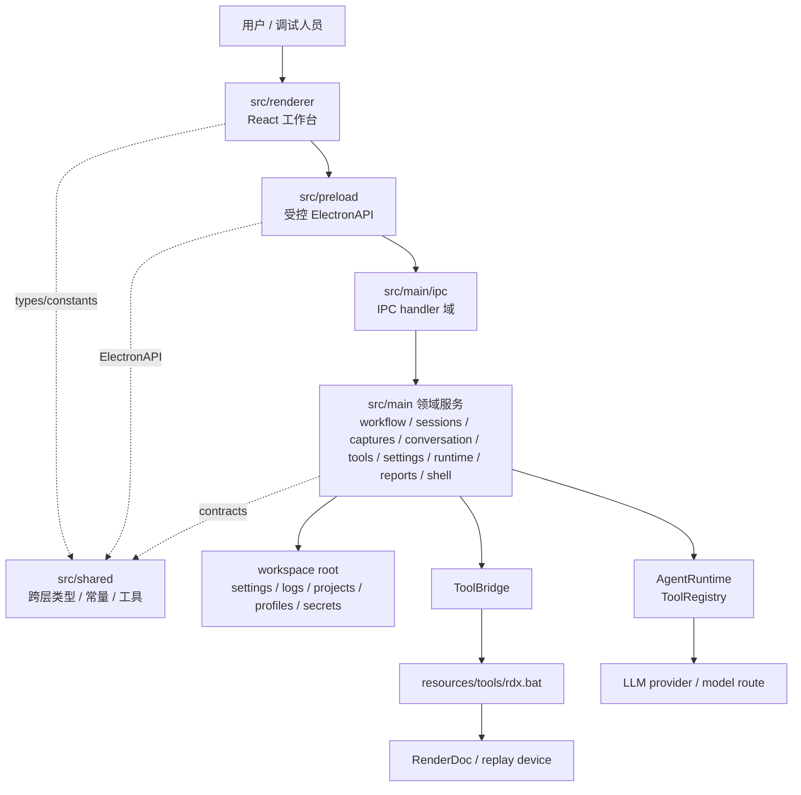
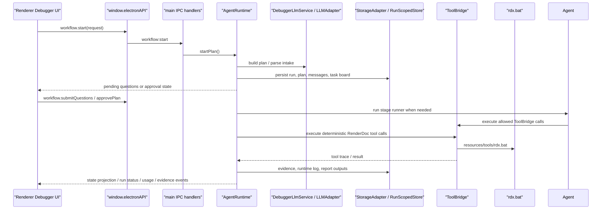

# 架构总览

`RDC-Agent` 是一个面向 `RenderDoc` `.rdc` capture 的 Electron 桌面应用。当前技术栈保持为 `Electron + React + TypeScript + electron-vite`，核心目标是把自然语言协作入口、Debugger 主链、RenderDoc 工具调用、证据链和报告输出放在一个可审计的工作台中。

## 总体分层

## 层职责

| 层 | 当前入口 | 稳定职责 |
| --- | --- | --- |
| Electron shell | `src/main/index.ts`、`src/main/shell/` | 窗口、菜单、生命周期、系统能力入口 |
| IPC/API | `src/main/ipc/` | 注册主进程 handler，维护 renderer 与 main 的调用边界 |
| Preload | `src/preload/` | 通过 `contextBridge` 暴露 `window.electronAPI`，屏蔽主进程实现细节 |
| Workflow | `src/main/workflow/debugger/` | Debugger plan/intake、approval、execution lifecycle、阶段推进的唯一顶层权威 |
| Sessions | `src/main/sessions/` | project/session/run 元数据、workspace layout 和持久化 |
| Captures | `src/main/captures/` | ReplayDevice、capture opened state、context preview |
| Conversation | `src/main/conversation/` | 对话持久化、stream/event bridge、conversation-to-workflow glue |
| Tools | `src/main/tools/` | RenderDoc 垂直工具目录、调用、trace、runtime metadata |
| Settings | `src/main/settings/` | provider、model route、profile、workspace path、secret 配置 |
| Runtime | `src/main/runtime/` | Activity、terminal、运行期日志和状态广播 |
| Reports | `src/main/reports/` | 证据、报告、中间产物和输出索引 |
| Renderer shell | `src/renderer/shell/`、`App.tsx` | 应用布局、窗口事件、hydration、composer glue |
| Renderer features | `src/renderer/features/*`、`pages/Debugger` | Debugger、settings、projects、captures、terminal 业务视图和工作台交互 |
| Renderer UI/patterns | `src/renderer/ui/`、`src/renderer/patterns/` | 纯控件与无副作用展示模式 |
| Shared contracts | `src/shared/`、`src/shared/types/electron/*` | ElectronAPI、workflow、session、tool、runtime log、harness 等跨层契约 |

## 现役主链

当前可执行主链是 Debugger：

Analyzer 和 Optimizer 仍是产品模式占位，不在本次结构升级中扩大执行范围。

## 结构升级原则

- 保持公开行为兼容：`window.electronAPI` 的正式 workflow 入口收敛为 `start/getPlan/submitQuestions/approvePlan/restartRun/stop`，不保留旧的阶段推进旁路。
- 优先拆边界，不做目录搬家式重构。
- 不改变 UI/UX：DOM 层级、CSS 类、测试定位符和交互路径默认保持。
- 保持 RenderDoc 垂直工具边界：`renderer -> preload -> IPC -> ToolBridge -> rdx.bat`。
- 所有 agent turn 只能通过 `AgentRuntime` 运行，不能绕过 Debugger 顶层阶段、gate 或 final status。
- 新增文档必须指向当前代码和当前能力，不堆设想文件。
