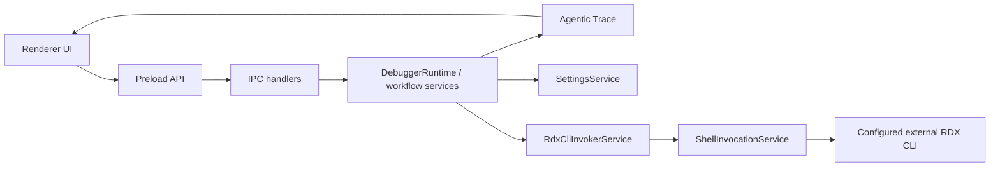

# Architecture Overview

RDC-Agent is an Electron desktop workbench for RenderDoc `.rdc` captures. The application is split into four code layers:

- `src/main`: Electron shell, IPC handlers, workflow orchestration, settings, workspace storage, reports, evidence, trace, and external capability invocation.
- `src/preload`: the controlled `window.electronAPI` bridge exposed to renderer code.
- `src/renderer`: React UI, interaction state, browser-session bridge, and workbench presentation.
- `src/shared`: cross-layer types, constants, and pure helpers.

## Main Data Flow

The RDX CLI command is not hardcoded. It is configured in Settings together with default arguments, working directory, environment variables, timeout, and catalog path.

## Public Boundaries

- Renderer/preload can read catalog and runtime status through IPC.
- Renderer/preload do not expose arbitrary tool execution.
- Workflow execution calls `RdxCliInvokerService`, which calls the configured CLI through `ShellInvocationService`.
- Agentic Trace exposes projection APIs under `trace:*`.
- Debugger workflow actions remain under `workflow:*`.

## Verification

Use `npm run typecheck` for static validation. For renderer or IPC changes, also run `npm run check:architecture`, `npm run check:fidelity`, and `npm run check:shared-exports`. For shell/window/local invocation boundaries, build first and then run the relevant smoke test.
