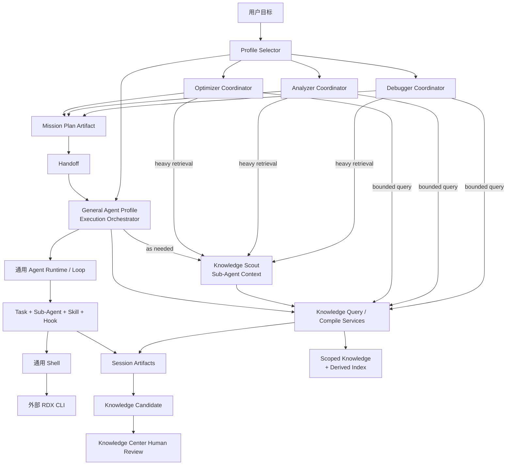
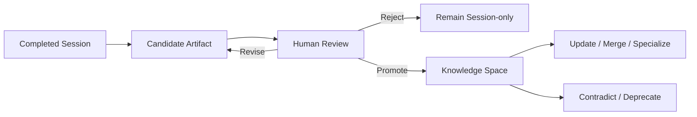
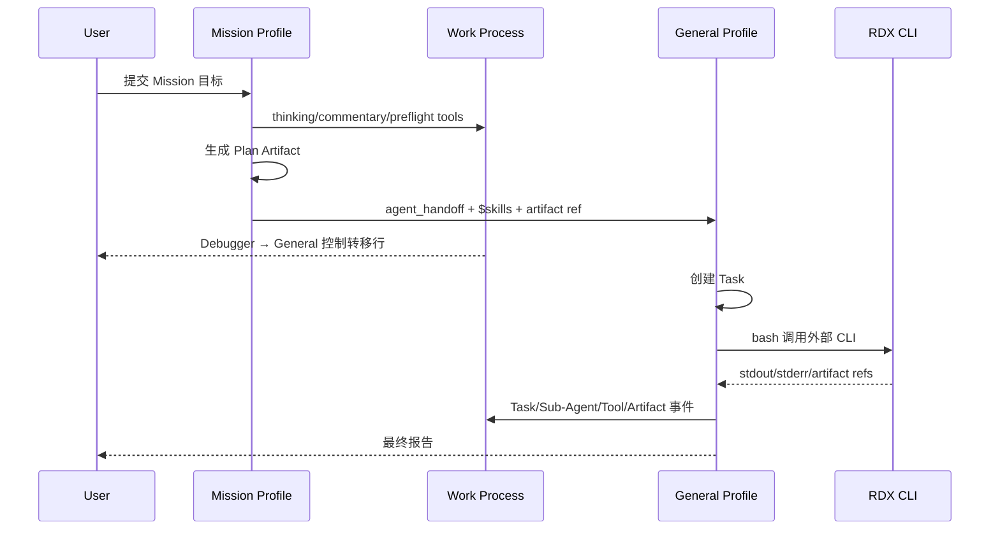

# RenderDoc Agent 完整设计方案书

> 状态：目标设计基线（draft），尚未代表当前运行时已经全部实现；**不得**作为第二产品权威。
> 适用仓库：`RDC-Agent`。
> 当前产品与验证权威仍为根目录 `DESIGN.md`（含 Capture Open × Replay Device 矩阵与 RDX shell action SSOT）；进入更大 Wave 实现时，必须先将已确认边界同步回 `DESIGN.md`，再按同一变更更新代码、测试与分主题文档。
> 本文不是对外部《RenderDoc Agent Complete Design Book》的直接移植，而是基于本仓库真实源码、现有通用 Agent Runtime、Profile、Skill、Hook、Task、Handoff、RDX CLI 与 UI 契约所做的实现映射。

---

## 1. 执行摘要

本库的目标不是把一个通用 Agent 改造成只能调试 RenderDoc 的专用应用，也不是在通用 Agent 内核中硬编码一套 RenderDoc 工作流。目标是：

1. 保留现有通用 Agent Runtime、通用 Agent Loop、通用工具执行、权限、上下文、Task、Sub-Agent 与 Handoff 能力。
2. 将设计书中的 `General Agent = Execution Orchestrator` 具像化为一个真实的 `general.agent.md` Profile，而不是把它等同于裸 Agent Loop。
3. 将 `Debugger`、`Analyzer`、`Optimizer` 具像化为三个顶层 `Planning Orchestrator` Profile；每个 Profile 通过自己的 Coordinator Skill、辅助 Skill、Hook、计划 Artifact 与 Handoff 形成自己的流程和分工体系。
4. 由 Mission Profile 负责“理解目标、澄清、有限探测、编排与计划”，由 General Profile 负责“Task 分解、Shell 执行、Sub-Agent 调度、验证、报告与知识候选产物”。
5. RDX 始终是外部 CLI。Agent 像人类一样通过通用 `bash`/Shell 调用它，通过定向 `--help` 发现用法；绝不把约 194 个 RDX 命令注册为 194 个 Agent Tool、MCP Tool 或 Primitive。
6. 通用 Task 保持通用；RenderDoc 的证据、假设、实验、世界模型等只存在于垂直 Artifact 内容与垂直投影中，不进入 `TaskRecord`、Agent Profile 或平台级统一 Investigation Graph。
7. Team Agent 继续采用单进程、多 Context、直接事件与函数返回；不引入多进程 Mailbox、Blackboard、SharedMemory 或 MessageBus 体系。
8. Knowledge 是本库通用 Agent Runtime 的一等扩展能力：Agent 通过一组紧凑、deferred 的 `knowledge_*` Tool 显式浏览、检索、精读、编译临时 Pack 和创建 Session Candidate；Knowledge Center、TUI 与 Agent 共用同一主进程服务，不自动抽取 Memory、不自动写入知识库，也不把全量知识索引自动塞进 Prompt。
9. Planning Orchestrator 保留小规模 Knowledge 查询的直接能力，但默认把大范围检索、冲突综合、Similar Case 消歧和历史演化分析委托给独立 Context 中的 Knowledge Scout Sub-Agent；Scout 返回有来源、有预算的 Brief/Pack Artifact，由 Orchestrator 负责最终推理与决策。

最终产品形态是“一套通用工作台、四个顶层 Agent Profile、三个垂直 Mission Coordinator、一个通用 Execution Orchestrator、一条外部 RDX CLI Shell 路径，以及显式可审阅的 Artifact/Knowledge 闭环”。

---

## 2. 已确认的设计结论

### 2.1 接受并保留的设计书思想

- `Debugger`、`Analyzer`、`Optimizer` 是三个不同目标函数的 Mission Agent。
- 三个 Mission 共享 RenderDoc 领域语义、Artifact 约定、Skeptic、报告与知识沉淀方法，而不是各自复制三套完全独立的基础设施。
- 调查过程以 Artifact 为主，不把长输出和全部工具结果长期堆积在主 Context。
- Live、Offline、External Research 是任务执行形态，不是新的权限模式。
- Live Capture 上的状态相关操作默认串行；可并行的是独立 Context 中的推理与离线 Artifact 分析。
- 结论必须区分 Observed、Derived、Inferred、Unknown，并能追溯来源。
- Skeptic Review 是正式流程，不是报告末尾一句“可能有误”。
- Knowledge 具有 Fact、Constraint、Pattern、Procedure、Case、Model 等内容类型。
- 普通、确定性的 Knowledge Retrieval 由 Tool/Knowledge Engine 完成；只有需要独立 Context 和持续综合推理的检索任务才委托 Knowledge Scout Sub-Agent。
- 优化必须包含基线、噪声、机制、实验、回归与回滚。

### 2.2 对原设计书的仓库化修正

| 原始抽象 | 本仓库中的正确映射 |
| --- | --- |
| General Agent | `general.agent.md`，即 Execution Orchestrator Profile |
| Agent Runtime / Loop | Profile 下方的通用执行引擎，不等同于 General Agent |
| Planning Orchestrator | `debugger` / `analyzer` / `optimizer` Profile + 各自 Coordinator Skill |
| Coordinator | Profile instructions + 预加载根 Skill + 按需 Skill + Hook + Task + Artifact + Handoff 的组合，不新增通用 Coordinator 字段 |
| rdc-cli Tool Surface | Agent 通过 `bash` 调用的外部 CLI Surface，不是 Provider Tool Schema |
| Investigation Kernel | 垂直领域语义、Artifact 模板和评审规则，不是平台级 Graph Service |
| Investigation Graph | 仅在 Analyzer 等具体 Artifact 中按需形成的领域图，不是所有 Agent 共用的状态数据库 |
| Task / WorkItem | 现有 `TaskCreate/TaskUpdate/TaskGet/TaskList/TaskStop`；不恢复 `TodoWrite`，不新增第二套 Store |
| Team Agent | 单进程多 Context；父子直接返回并上抛事件 |
| Knowledge Patch | 会话中的候选 Artifact；只有显式人类动作才能写入用户或项目 Knowledge Space |
| Knowledge Retrieval | 通用 `knowledge_browse/search/read/compile` Tool 调用主进程 Knowledge Services；不是 Prompt 自动注入 |
| Knowledge Scout | 调用者 Profile + `$knowledge-scout` Skill 派生的独立 Sub-Agent Context；不是第五个顶层 Profile，也不新建通信基础设施 |

### 2.3 明确排除

- 不把 `plan` 做成 Permission Mode。
- 不恢复 Claude Code 式 `EnterPlanMode` / `ExitPlanMode` 二元硬编码。
- 不把 `Default / Auto / FullAccess / Custom` 与 Agent Profile 混为一谈。
- 不把 RDX 包装成 MCP。
- 不把 RDX 每个命令包装成内置 Tool。
- 不为 RDX 向通用 `TaskRecord` 增加 command、capture、event、evidence 等字段。
- 不在通用 Agent Runtime 中加入 RenderDoc 专用状态机。
- 不创建统一平台级 Evidence/Investigation Graph。
- 不为单进程协作引入多进程通信基础设施。
- 不用固定的十步舞台、假进度或预制演示数据表现 Agent 工作。
- 不自动写 Memory、自动写 Knowledge 或自动注入整个知识库。
- 不让 Debugger、Analyzer、Optimizer 直接吞并完整执行生命周期，从而再次复制 General。

---

## 3. 当前实现基线与主要差距

### 3.1 已经具备、应直接复用的能力

| 能力 | 当前实现 | 目标用途 |
| --- | --- | --- |
| 通用 Agent Loop | `AgentOrchestrator`、Provider Tool Loop、事件流 | 四个 Profile 的共同执行内核 |
| Agent Profile | `.agent.md`、`AgentManifestService` | General 与三个 Mission 的具像化 |
| Prompt 编译 | `PromptPlan -> RequestEnvelope -> provider adapter` | 注入 Profile、预加载 Skill、短 Skill 索引与运行时事实 |
| Progressive Skill | builtin/user/project Skill，`skills`/`skill_read` | Coordinator 和 RDX 方法按需加载 |
| Scoped Hook | `.hook.yml`、`HookEngine`、信任模型 | 确定性前置检查、审计、交接与产物验证 |
| Permission | Default/Auto/FullAccess/Custom | 对所有 Profile 的工具调用统一裁决 |
| Task | TaskCreate/Update/Get/List/Stop | Coordinator 和 General 的通用工作分解 |
| Sub-Agent | 独立 Context、串行完成、事件上抛 | 独立推理、Skeptic、长上下文分析 |
| Handoff | `agent_handoff`、`HandoffController`、Conversation 应用 | Mission 到 General 的控制权转移 |
| Session Artifact | Plan、Trace Artifact、报告与路径引用 | 调查计划、证据包、模型、报告、知识候选 |
| RDX Shell | `ShellInvocationService`、Settings action、外部 CLI | UI 确定性入口与 Agent Shell 调用 |
| Knowledge Browse | user/project Markdown、只读 IPC/UI | Knowledge Engine 的 canonical 读侧与路径安全基础 |
| Work Process | 真实 thinking/commentary/tool/task/subagent 投影 | Coordinator 与执行过程的唯一主时间线 |
| Right Rail | Progress / Artifacts / Context | 调查任务、产物和上下文的紧凑投影 |

### 3.2 必须收敛的差距

1. 当前顶层 Profile 仍硬编码为 `Ask / Plan / Edit / Debugger / Analyzer / Optimizer`，尚无 General。
2. 当前 `AgentCategory` 和描述把三类 Mission 当作 General executable agent，语义与目标相反。
3. Debugger/Analyzer/Optimizer 的 seed `skills` 为空，尚未形成各自 Coordinator。
4. 当前 Plan 只 handoff 到 Edit；目标应为三个 Mission handoff 到 General。
5. 当前 General 能力散落在 Edit 和 Agent Loop 中，没有可配置的 General Profile 身份。
6. Sub-Agent 默认目标仍是 Ask；Ask 退出目标拓扑后必须改为显式 Profile 或调用者 Profile。
7. 右侧 Classic Session Panel 仍包含 `harnessTasks`、Session Capabilities 等旧 Debugger harness 投影。
8. 旧 Debugger 文档仍描述固定 stage mainchain，容易诱导继续维护硬编码垂直状态机。
9. 存在 `AgentHooks` 与实际 Scoped `HookEngine` 两个钩子概念；应收敛到运行中真正生效的 Scoped Hook 路径。
10. Knowledge Center 只有读取能力；Agent builtin tool catalog 中也没有 Knowledge Tool，尚未形成 Browse/Search/Read/Compile/Candidate、派生索引、Knowledge Scout、候选审阅、显式提升和版本比较的共同能力面。
11. Agent Settings 已能编辑 tools/agents/skills/MCP，但没有完整可视化 Handoff 编辑器。
12. RDX Catalog 当前可以被主进程读取；必须严格限制为 UI 运行时诊断和确定性应用动作，不得向模型展开为全量工具 Schema。

---

## 4. 产品定位与成功标准

### 4.1 产品定位

RDC-Agent 仍然是通用 Agent Workbench。RenderDoc 垂直能力是一组建立在通用 Profile/Skill/Hook/Task/Sub-Agent/Shell/Handoff 之上的内置能力包。

用户既可以：

- 直接选择 General 处理普通代码、文件、研究和自动化任务；
- 选择 Debugger 诊断视觉/状态/崩溃问题；
- 选择 Analyzer 重建 capture 的结构、语义和可追溯模型；
- 选择 Optimizer 定位瓶颈、设计实验并验证收益；
- 在任意 Profile 中使用通用权限模式、模型、Effort、Skills、MCP 和 Shell；
- 通过 Handoff 在同一会话中看到控制权由 Mission 转到 General。

### 4.2 产品成功标准

一次垂直任务完成时，至少应满足：

1. 用户目标、capture 与运行时前置条件被明确。
2. Mission Coordinator 产出可审阅的计划 Artifact。
3. General 按计划创建通用 Task，并在真实 Work Process 中执行。
4. 所有 RDX 行为来自配置的外部 CLI，经 Shell 调用并留下 Trace。
5. 关键结论具有来源和认识论状态。
6. 至少经过一次独立 Skeptic 检查或明确说明为何无需。
7. 最终回答包含结果、证据、局限、失败项与下一步，而不是工具日志堆积。
8. 相关 Artifact 可在右侧面板访问。
9. 知识候选只作为会话 Artifact 生成；未经用户明确操作不进入 Knowledge Space。
10. General 在没有 RenderDoc Context 的普通任务上仍保持完整通用能力和通用表达。

### 4.3 非目标

- 在首个实现 Wave 中实现所有 194 个 RDX 命令的专门 UI。
- 在应用内重写 RDX CLI 的调度、锁、事务或帮助系统。
- 让三个 Mission 同时成为三个全功能执行 Agent。
- 用一个庞大的领域 Schema 约束所有未来调查类型。
- 以“图数据库”作为 Knowledge Engine 或 Evidence 系统的前置条件。
- 为尚未证明的并行收益重写现有单进程 Agent Runtime。

---

## 5. 总体架构



### 5.1 分层

#### 第一层：通用 Runtime

负责 Provider、Context、Prompt、Tool Loop、Permission、Task、Sub-Agent、Handoff、事件、取消、重试与压缩。该层不理解 RenderDoc Mission、Evidence Claim 或优化实验。

#### 第二层：Agent Profile

负责 Agent 身份、说明、模型、工具上限、预加载 Skills、可委托 Profile 与 Handoff 路由。General、Debugger、Analyzer、Optimizer 都是这一层的实例。

#### 第三层：Coordinator 能力包

由三个 Mission 的根 Skill、辅助 Skill、Hook、计划模板、报告模板和 UI 文案组成。它们描述“如何组织调查”，但不改造 Runtime。

#### 第四层：Execution Orchestrator

General Profile 使用通用 Runtime 完成 Task 分解、Shell/RDX 执行、独立 Context 调度、验证、Skeptic、报告和候选知识产物。

#### 第五层：通用 Knowledge Engine

提供领域中立的 scoped Markdown、Browse/Search/Read/Compile/Candidate Tool、派生索引、Knowledge Scout 输入输出和人工写入治理。它不理解固定 RenderDoc Mission；垂直语义来自 Knowledge metadata 与被武装的 Skill。

#### 第六层：垂直 Artifact 语义

包含 Capture Facts、Evidence Bundle、Hypothesis、Experiment、Architecture Model、Optimization Result 等领域内容格式。它们位于会话 Artifact 或知识卡内容中，不进入通用 Task/Profile Schema。

#### 第七层：投影与治理

Workbench、Work Process、Right Rail、Knowledge Center、Settings、权限审批、Hook 信任和评估门禁。

### 5.2 双 Orchestrator 的职责边界

| 责任 | Mission Planning Orchestrator | General Execution Orchestrator |
| --- | --- | --- |
| 理解 Mission 目标 | 主责 | 读取并执行 |
| 澄清问题 | 主责 | 执行中发现阻塞时可补充 |
| 轻量 RDX 探测 | 可执行，只为建立计划 | 可执行 |
| 选择调查方法 | 主责 | 按计划选择具体 Skill |
| 形成 Task DAG | 提供计划结构 | 创建真实 Task |
| Shell/RDX 批量执行 | 不承担完整生命周期 | 主责 |
| Sub-Agent 分工 | 计划期研究；重 Knowledge Retrieval 默认委托 Scout | 执行期分析/Skeptic；必要时委托 Scout |
| Knowledge 查询 | 小型、确定性查询可直接调用；复杂综合由 Scout 返回 Brief/Pack 后决策 | 按执行需要直接查询或委托 Scout，不读取全库 |
| Artifact 生产 | Plan、Knowledge Brief/Pack 与预检 Artifact | Evidence/Model/Report/Candidate |
| 结果验证 | 定义验收条件 | 执行并记录 |
| 最终报告 | 定义报告目标 | 主责 |
| Knowledge 候选 | 定义沉淀范围 | 生成候选 Artifact |
| Knowledge 写入 | 无权自动写入 | 无权自动写入 |

---

## 6. 四个顶层 Agent Profile

### 6.1 顶层拓扑

目标内置、用户可选的垂直主界面只有：

1. `general`
2. `debugger`
3. `analyzer`
4. `optimizer`

`Ask / Plan / Edit` 不再是本方案依赖的垂直拓扑：

- `ask_user` 继续是通用工具。
- 计划继续是一种 Profile 能力和 Artifact，不是权限。
- 文件修改继续由 General 的通用 write/edit/bash/git 能力承担。
- 用户自定义 Agent Profile 继续存在。
- 实现迁移时不得静默删除用户可能修改过的旧 `.agent.md` 文件；应停止新安装 seed，并提供一次明确的导出/保留/移除选择。该迁移是数据安全边界，不用兼容 shim 掩盖。

### 6.2 不新增 Profile 领域字段

不增加以下字段：

- `mission`
- `orchestratorType`
- `rdxTools`
- `investigationMode`
- `evidenceSchema`
- `coordinator`

Profile 的角色由现有字段和内容共同表达：

- `id/name/description/instructions`：身份和目标；
- `tools`：能力上限；
- `skills`：固定预加载方法；
- `agents`：允许委托的 Profile；
- `handoffs`：可发生的控制转移；
- `userInvocable`：是否出现在顶层选择器；
- `icon/accent`：产品呈现。

`Planning Orchestrator` 与 `Execution Orchestrator` 是产品语义，不应被塞入一个新的通用枚举。当前模糊的 `AgentCategory` 若没有不可替代的运行时职责，应在收敛 Wave 中移除；不能让它成为第二套 Profile 系统。

### 6.3 General Profile

#### 身份

General 是通用执行 Agent 的真实 Profile。它不是 Edit 改名，也不是 RenderDoc 专用 Agent。

#### 基础能力

- read/search/web
- bash
- write/edit/file-manage
- git
- ask_user
- task
- memory 与显式 memory-write
- skills/skill_read
- tool_search
- deferred `knowledge` 工具族
- subagent
- agent_handoff
- 通用 MCP
- 只读 `rdx_context`

RDX 执行仍走 `bash`，`rdx_context` 只提供当前应用持有的 project/session/capture/runtime 摘要。

#### 保持通用性的关键设计

General 的静态 Profile 不预加载大段 RenderDoc 方法。它只预加载很短的通用 `execution-orchestrator` Skill。

当 Debugger/Analyzer/Optimizer Handoff 到 General 时，Handoff Prompt 使用 `$skill-id` 显式武装本次垂直执行，例如：

```text
Continue as General.
Use $renderdoc-execution, $rdx-cli-shell, $artifact-provenance and
$debugger-execution.
Plan artifact: session://plans/debugger-plan.md
```

现有 Prompt 路径会在首次请求前只预加载这些被显式引用的 Skill。这样：

- 普通 General 任务不承受 RenderDoc Token 成本；
- 垂直任务获得完整方法；
- 不需要增加 General Profile 领域字段；
- 不需要另造 Vertical Runtime。

### 6.4 Debugger Profile

Debugger 是故障调查的 Planning Orchestrator，目标是把模糊症状收敛为可执行的证据计划。

核心职责：

- 症状与可复现条件澄清；
- Capture/环境/能力 Preflight；
- 问题分类：视觉、状态、资源、Shader、同步、崩溃、性能误判等；
- 建立候选假设与判别实验；
- 寻找 First Bad Event 或最小错误范围；
- 定义反事实与负路径；
- 生成 Debugger Plan Artifact；
- Handoff 到 General。

它可以用 `bash` 做有限、只为规划服务的 RDX 查询，但不应自行完成全部调查、修复和报告。

### 6.5 Analyzer Profile

Analyzer 是语义重建与架构分析的 Planning Orchestrator，目标是从 capture 事实重建结构和可追溯模型。

核心职责：

- 确定分析对象、粒度与可信度要求；
- 规划 Actions、Pass、Resource Version、Shader/IR、Timing 的事实采集；
- 定义 Traceability Provenance；
- 规划 Hierarchical Pass Graph、Shader Artifact Graph、Resource Version Graph；
- 规划跨 Capture 对齐；
- 区分 Observed、Derived、Inferred、Unknown；
- 生成 Analyzer Plan Artifact；
- Handoff 到 General。

Analyzer 的“Graph”是其产出的领域 Artifact，不是通用平台 Graph。

### 6.6 Optimizer Profile

Optimizer 是性能优化的 Planning Orchestrator，目标是把“慢”转化为可证伪、可回滚、可量化的优化实验。

核心职责：

- 基线资格检查：稳定性、能力、噪声下限；
- Frame Breakdown、Critical Path、Pareto；
- Cost Location 与 Limiter/Mechanism 分离；
- 设计 Ablation、Equivalent Patch、Quality Trade-off；
- 定义事务性替换、回放、编译统计、视觉与数值回归；
- 定义收益阈值、风险和回滚；
- 生成 Optimizer Plan Artifact；
- Handoff 到 General。

### 6.7 Profile 概念示例

以下只是目标内容轮廓，字段均来自当前 manifest，不引入新字段：

```yaml
---
name: General
description: General execution orchestrator for research, coding, automation, and planned RenderDoc work.
target: rdc-agent
user-invocable: true
tools: [read, search, web, bash, write, edit, git, file-manage, askUser, handoff, task, memory, memory-write, knowledge, skill, mcp, subagent, tool_search, rdxContext]
skills: [execution-orchestrator]
agents: [debugger, analyzer, optimizer]
handoffs:
  - label: Replan with Debugger
    agent: debugger
    prompt: Replan the blocked debugging investigation from the attached execution evidence.
---

You are the General Agent Profile...
```

```yaml
---
name: Debugger
description: Planning orchestrator for evidence-driven RenderDoc debugging.
target: rdc-agent
user-invocable: true
tools: [read, search, web, bash, askUser, handoff, task, memory, knowledge, planArtifact, skill, subagent, tool_search, rdxContext]
skills: [debugger-coordinator]
agents: [debugger, general]
handoffs:
  - label: Execute Debug Plan
    agent: general
    prompt: Execute the saved debugger plan with the explicitly referenced skills and acceptance gates.
    send: true
---

You are the Debugger Planning Orchestrator...
```

Analyzer 与 Optimizer 使用相同结构，各自替换 Coordinator Skill、instructions、accent、icon 与 Handoff Prompt。

---

## 7. Coordinator 的实现模型

### 7.1 Coordinator 不是新 Runtime

每个 Coordinator 由以下已有能力组合而成：

```text
.agent.md instructions
  + one preloaded root coordinator Skill
  + progressive supporting Skills
  + scoped Hooks
  + generic Task APIs
  + deferred Knowledge Tools
  + on-demand Knowledge Scout Sub-Agent
  + Plan / Knowledge Pack Artifact
  + Handoff
```

不新增 `CoordinatorService` 状态机，不新增通用 stage enum，不新增 Coordinator Profile 字段。

如果后续出现多个 Coordinator 重复的纯确定性逻辑，可以在垂直模块中抽取 helper；它不能反向污染通用 Agent Runtime。

### 7.2 Coordinator 的通用生命周期

设计书中的十步 Investigation Lifecycle 是思考检查表，不是 UI 固定舞台。实际运行按以下可循环语义组织：

1. Intake：目标、范围、成功标准、风险。
2. Preflight：capture、CLI、上下文、能力和缺失输入。
3. Knowledge Compile：先做小型确定性查询；预计超出主 Context 预算、需要多条冲突知识综合、Similar Case 消歧或历史演化分析时，派发 Knowledge Scout Sub-Agent，在独立 Context 中完成检索并只返回 Brief/Pack Artifact。
4. Plan：任务、依赖、模式、证据、停止条件、验收。
5. Handoff：Mission 到 General。
6. Execute：General 创建 Task 并执行。
7. Merge：General 汇总 Artifact 与来源。
8. Skeptic：独立 Context 挑战结论。
9. Supplement：条件不足时补充任务或回到 Mission 重规划。
10. Report/Candidate：最终报告和可选知识候选。

这十项可以合并、跳过或循环。UI 只展示真实产生的 Task、事件与 Artifact，不预先画出十个永远存在的阶段。

### 7.3 Debugger Coordinator

推荐计划结构：

1. `Problem statement`
2. `Observed symptoms`
3. `Reproduction and capture prerequisites`
4. `Issue taxonomy`
5. `Initial hypotheses`
6. `Discriminating evidence`
7. `First-bad-event strategy`
8. `Counterfactual checks`
9. `Execution tasks and dependencies`
10. `Acceptance and stop conditions`
11. `Skills to arm during handoff`

分工原则：

- Live capture 查询由主执行 Context 串行完成。
- Shader、资源、Pass、像素等长分析可以派生独立 Context。
- 独立 Context 只读取固定 Artifact，不争用可变 Replay Context。
- Skeptic 不读取主 Agent 的“结论语气”，优先读取事实包和 Claim 列表。

### 7.4 Analyzer Coordinator

推荐计划结构：

1. 分析范围和目标粒度；
2. Capture Facts 清单；
3. Event/Queue、Shader、Resource Version 三类事实采集；
4. Traceability Provenance；
5. Hierarchical Pass Model；
6. 语义假设及其依据；
7. 跨 Capture 对齐策略；
8. Versioned Architecture Model 输出格式；
9. Unknown 与补证条件；
10. 报告和可视化要求。

分工原则：

- 原始事实采集串行并可重放。
- 图构建和语义推理基于不可变 Artifact，可由独立 Context 分解。
- 任何推断必须保留反向到 Capture Fact 的路径。
- 模型版本差异以 Artifact 比较呈现，不写入通用 Trace Schema。

### 7.5 Optimizer Coordinator

推荐计划结构：

1. Baseline qualification；
2. Measurement protocol 与 Noise Floor；
3. Frame Breakdown；
4. Cost Location；
5. Limiter 与 Mechanism 假设；
6. 候选实验及优先级；
7. 事务性变更和回滚；
8. Replay/Benchmark/Compile Statistics；
9. Visual/Numerical Regression；
10. Skeptic 挑战；
11. 收益、风险、适用范围与停止条件。

分工原则：

- 所有会改变 Replay/Shader/资源状态的实验串行。
- 不同实验结果的统计分析可以使用独立 Context。
- 没有合格基线时不得给出“提升百分比”。
- 不把相关性表述为机制，不把单次测量表述为稳定收益。

### 7.6 General Execution Coordinator

General 收到 Handoff 后：

1. 读取 Plan Artifact 和 Handoff Prompt。
2. 校验目标、范围、Skill 引用和验收门禁。
3. 使用通用 Task API 创建真实任务与依赖。
4. 区分 Live / Offline / External Research 执行形态。
5. 按需调用 `$rdx-cli-shell` 等 Skill。
6. 通过 `bash` 定向查询 RDX help 并执行命令。
7. 将长输出保存为 Artifact，只把摘要和引用留在主 Context。
8. 需要独立推理时派生 Sub-Agent。
9. 合并结果并调用 Skeptic。
10. 补证、失败关闭或请求 Mission 重规划。
11. 产出最终报告和可选 Knowledge Candidate Artifact。

---

## 8. Skill 体系

### 8.1 Skill 的职责

Skill 表达可复用的方法、Checklist、实验协议、帮助发现策略和报告模板。它不负责持久化运行状态，也不把 RDX 命令转换成 Tool Schema。

### 8.2 建议的 Skill 目录

#### 通用、小型、可预加载

| Skill | 预加载方 | 作用 |
| --- | --- | --- |
| `execution-orchestrator` | General | 通用 Task、验证、失败关闭、报告纪律 |
| `debugger-coordinator` | Debugger | Debugger 规划流程 |
| `analyzer-coordinator` | Analyzer | Analyzer 规划流程 |
| `optimizer-coordinator` | Optimizer | Optimizer 规划流程 |

#### 通用、按需武装

| Skill | 作用 |
| --- | --- |
| `knowledge-scout` | 在独立 Sub-Agent Context 中执行大范围检索、冲突综合、Similar Case 消歧和历史演化分析，只返回 Knowledge Brief/Pack Artifact |
| `knowledge-candidate` | 从已完成 Artifact 生成 Session Candidate，不直接写 Knowledge Space |

#### 垂直、按 Handoff 或 `$skill` 加载

| Skill | 作用 |
| --- | --- |
| `renderdoc-execution` | 解释 Mission Plan，区分 live/offline/external，组织垂直执行 |
| `rdx-cli-shell` | CLI availability、定向 help、上下文参数、输出与失败处理 |
| `capture-preflight` | capture、backend、device、remote、session 前置检查 |
| `artifact-provenance` | Artifact 摘要、hash、source ref、认识论状态 |
| `capture-facts` | Actions、Pipeline、Resource、Shader、Timing 事实采集 |
| `pass-graph-analysis` | Pass/事件/依赖分析 |
| `shader-ir-analysis` | Shader、反编译、IR、数据流与编译统计 |
| `pixel-forensics` | Pixel history、资源值与视觉差异 |
| `resource-versioning` | Subresource、write version、alias 与生命周期 |
| `cross-capture-alignment` | 多 Capture 对齐与差异 |
| `optimization-experiment` | 基线、A/B、消融、质量权衡和回滚 |
| `skeptic-review` | 独立证据挑战 |
| `report-composition` | Debug/Analyze/Optimize 报告模板 |

### 8.3 Token 预算

1. Prompt 固定部分只包含通用合同、当前 Profile、被预加载 Skill 和短 Skill 索引。
2. 三个 Mission 只预加载自己的根 Coordinator Skill。
3. General 默认不预加载 RenderDoc Skill。
4. Handoff Prompt 显式引用本次必需的 `$skill`。
5. 其余 Skill 通过 `skills` / `skill_read` 渐进加载。
6. RDX 全量 Catalog 不进入 Prompt。
7. RDX help 只查询当前命令组，结果过长时保存为会话 Artifact。
8. Knowledge Tool 全部为 `extended/deferred`；只有 `tool_search` 命中、模型直接调用或 Coordinator/Scout 明确武装后才注入 schema。
9. Knowledge Search/Browse 默认只返回 bounded summaries、stable refs、match reason 和 provenance；正文必须显式 Read。
10. Knowledge Scout 的父级返回只包含短 Brief、Pack Artifact ref、引用和未决冲突，不复制子 Context 的全文与原始检索结果。
11. Skill 索引描述保持短句，不在 description 中复制完整流程。

### 8.4 `allowed-tools` 注意事项

当前运行时会在预加载 Skill 或 `skill_read` 激活后收窄本轮工具面。因此：

- 根 Coordinator Skill 应不声明 `allowed-tools`，或声明完成该 Coordinator 所需的完整集合；
- 只在非常窄的、确定性方法 Skill 中使用工具收窄；
- 不能因一个只读方法 Skill 意外阻断后续 Handoff、Task 或 Shell；
- Skill 收窄是 Profile 工具上限之下的进一步限制，不能扩大 Profile 能力。

---

## 9. Hook 体系

### 9.1 Canonical 路径

以当前真实执行的 Scoped `HookEngine` 为唯一 Hook 体系：

- user：`~/.rdx/hooks/*.hook.yml`
- project：`<project-root>/.rdx/hooks/*.hook.yml`
- project Hook 继续按内容 Hash 显式信任
- 事件继续使用 `session.*`、`turn.*`、`tool.*`、`context.*`、`agent.*`、`permission.denied`

`src/main/agent-runtime/agent/AgentHooks.ts` 若无真实调用，应在实现 Wave 中删除，而不是继续发展第二套 Hook API。

### 9.2 Hook 的适用边界

Hook 只做确定性工作：

- 前置条件检查；
- Handoff 必需 Artifact 检查；
- 命令审计和脱敏；
- Artifact 完整性检查；
- 报告结构验证；
- 失败时 block 或 warn。

Hook 不做：

- LLM 推理；
- 复杂 Mission 编排；
- 复刻 RDX 的 194 个命令语义；
- 绕过 Permission；
- 自动写 Knowledge；
- 自动判断“根因已经成立”。

### 9.3 建议 Hook

| Hook | 事件 | Matcher | 行为 |
| --- | --- | --- | --- |
| `mission-plan-handoff-check` | `agent.before-handoff` | debugger/analyzer/optimizer | 确认目标为 General 时存在可读 Plan Artifact 引用 |
| `rdx-shell-audit` | `tool.before-call` / `tool.after-call` | General + bash | 仅当命令确实是配置的 RDX CLI 时记录脱敏摘要；普通 Shell 直接 skip |
| `artifact-integrity` | `turn.after-end` | General | 对本轮声明 ready 的垂直 Artifact 检查路径、hash、来源与空文件 |
| `report-contract` | `session.after-end` | 四个 Profile | 验证报告是否包含结论、证据、局限和失败项；缺失时 warn |

首版可以先提供 Hook 模板而非强制全部启用。安全边界仍由 Permission、Shell 和 RDX CLI 自身负责，Hook 不是安全沙箱。

### 9.4 Builtin Hook 的实现选择

当前 HookEngine 只解析 user/project Hook，而 builtin Skill 已有 `resources/agent-runtime` 路径。目标实现可选择：

1. 将受版本控制的 Hook 模板放入 `resources/agent-runtime/hooks`，扩展解析顺序为 builtin < user < project；或
2. 首次运行时让用户显式安装到 user scope。

推荐第一种，因为它与 builtin Skill 结构一致，且不会偷偷改写用户文件。Builtin Hook 只读、默认受信；同 ID 的 user/project 变体按 scoped resolver 规则覆盖。该扩展是通用 Hook 分发能力，不携带 RenderDoc 字段。

---

## 10. RDX CLI 集成

### 10.1 唯一心智模型

```text
Agent
  -> bash
  -> ShellInvocationService
  -> system-installed/configured RDX CLI
  -> stdout/stderr/artifact paths
  -> Work Process + Session Artifact
```

对于 Open Capture、Remote Connect、Preview、Close Runtime 等确定性 UI 动作：

```text
Renderer
  -> preload/browser bridge
  -> main IPC handler
  -> Settings-configured RDX shell action
  -> ShellInvocationService
  -> external CLI
```

两条路径共享外部 CLI 和 Shell 边界，但用途不同：

- Agent 路径是人类式 Shell 使用；
- UI 路径是已配置的确定性应用动作；
- Renderer/Preload 不获得任意 execute 接口；
- Provider 不获得 RDX 全量 Tool Schema。

### 10.2 Help Discovery

General 或 Mission 在不知道命令时按以下顺序：

1. 检查 `rdx_context` 的 CLI availability 与当前 context。
2. 运行顶层 `rdx --help`，只读取命令组。
3. 运行目标组 `rdx <group> --help`。
4. 必要时读取单命令帮助。
5. 执行最小只读探针。
6. 确认参数、输出形状和失败语义后再批量执行。

禁止：

- 一次递归展开所有命令帮助；
- 将 Catalog JSON 整体注入 Prompt；
- 在 Profile 中列出 194 个命令；
- 由应用代码猜测命令名、参数或仓库路径作为 fallback。

### 10.3 Catalog 的保留用途

Catalog 可以用于：

- Settings 显示 CLI 是否可用、版本和命令数量；
- 人类查看 namespace 统计；
- 确定性 UI action 的启动诊断；
- 开发时验证外部 CLI 契约。

Catalog 不用于：

- 注册模型工具；
- renderer 任意调用；
- Profile 工具白名单；
- 自动生成 194 个 Skill；
- 根据推荐 specialist 列表自动创建 Agent。

### 10.4 Context 与串行纪律

- 当前 project/session/capture/context id 由应用运行时持有并通过 `rdx_context` 摘要暴露。
- General 在执行前读取一次；上下文变化后重新读取。
- Live Replay 的状态相关命令串行执行。
- 可变上下文的锁、事务、daemon 所有权由 RDX CLI 负责。
- 应用不为它再造 Mailbox、Blackboard 或分布式锁。
- Sub-Agent 默认处理不可变 Artifact；若必须使用 Live Context，由父 Agent 串行安排。

### 10.5 输出治理

- 小输出直接进入 Tool Result。
- 长 JSON/文本写入 Session Artifact，Tool Result 只返回计数、关键字段、路径和 hash。
- stderr、exit code、命令组和 duration 进入 Trace。
- Secret、token、credential、用户直接联系方式等不得进入 UI Artifact。
- Fail-closed：命令不存在、输出无法解析、context 不匹配或前置条件不满足时，明确报错，不生成假结果。

---

## 11. Task、Sub-Agent 与 Handoff

### 11.1 Task 保持通用

继续使用：

- `task_create`
- `task_update`
- `task_get`
- `task_list`
- `task_stop`

顶层 Agent 使用文件 Store；Sub-Agent 使用 `MemoryTaskStore`。不恢复 `TodoWrite`，不新建 `InvestigationTaskStore`。

Mission 的 live/offline、证据目标、capture event 等写进 Plan Artifact 和 Task 的自然语言描述，不进入通用 Task 字段，也不约定 Task `metadata` 中的隐式垂直 Schema。

### 11.2 Task 在 UI 中的意义

- Right Rail 的 Progress 是 Task 的投影。
- Work Process 中 Task 逐条出现并可定位。
- Task 标题使用动作语言，例如“定位首个异常 Drawcall”，而不是“Stage 5”。
- Blocked 状态必须展示阻塞原因。
- Task 完成不等于结论成立；结论由 Artifact 和验证支持。

### 11.3 Sub-Agent

保持：

- 单进程；
- 独立 Context；
- 父 Agent 等待；
- 子事件桥接到父 Trace；
- 结果作为函数/Tool Result 返回；
- Sub-Agent Task 只在内存中存在。

目标调整：

- 移除默认 Ask Profile。
- `profile` 未提供时默认使用调用者 Profile，或要求显式提供；推荐默认调用者 Profile。
- 不为每个 RDX 命令创建 Sub-Agent。
- Skeptic 可由 General Profile 的独立 Context 配合 `$skeptic-review` Skill 完成，无需新增顶层 Agent。
- Knowledge Scout 默认由调用者 Profile 的独立 Context 配合 `$knowledge-scout` Skill 完成；父 Agent 只接收 Brief/Pack Artifact，不接收完整子对话。
- 小型确定性 Knowledge lookup 不创建 Sub-Agent；大范围、冲突、消歧和历史演化任务默认创建 Scout，避免无意义 LLM 跳数与主 Context 膨胀。
- 只有当独立模型、工具天花板或持久身份有真实需求时，才增加 `userInvocable:false` 的内部 Profile。

#### 11.3.1 Knowledge Scout 调度合同

父 Orchestrator 负责判断是否委托、冻结 scope/context refs/budget 和评价 Scout 输出；Scout 负责在独立 Context 内调用同一 deferred Knowledge Tool。Scout 不获得额外权限、不直接写正式 Knowledge、不争用 Live Capture，子 Task 仍退化到 `MemoryTaskStore`。父 Agent 对引用采用与最终结论负责，不能把“Scout 返回”当作证据等级。

### 11.4 串行执行、独立推理

当前 Sub-Agent 是串行的，因此 UI 和报告不得声称并行。

未来若通用 Runtime 增加同进程逻辑并发：

- 只允许不共享可变 Live Context 的子任务并发；
- 仍通过父 Context 聚合；
- 不改变 Task Store 与 Handoff 协议；
- 不因为垂直需求引入多进程通信。

### 11.5 Handoff

Handoff 是 Profile 控制权转移，不是“新模式”。

Mission Handoff 到 General 时，Prompt 必须至少包含：

- Mission 名称；
- 用户目标；
- Plan Artifact 引用；
- 已确认的前置事实；
- 约束和禁止项；
- 验收门禁；
- 停止/回滚条件；
- 本次要武装的 `$skill`；
- 缺失输入。

现有 `AgentHandoffDefinition` 已足够，不需要新字段。

### 11.6 Handoff UI

`agent_handoff` 在 Trace 中保留真实 Tool 事件，但 Work Process 将其投影为扁平的控制转移行：

```text
Debugger  →  General
已移交调试计划 · debugger-plan.md
```

交互规则：

- Profile pill 切换为 General，使用 General accent。
- 自动 Handoff 仅使用 manifest 已声明且 `send:true` 的路由。
- 若执行前需要人类确认，Mission 必须先调用 `ask_user`，不能把权限语义塞给 Handoff。
- Handoff 失败显示目标不存在、未启用或未声明，不静默回退。
- 不在普通最终答案后生成虚假的“下一步”按钮。

---

## 12. 垂直 Artifact 与证据语义

### 12.1 不建立平台级 Investigation Graph

本方案中的共享 Investigation Kernel 仅包含：

- 认识论状态词汇；
- Artifact 命名与目录约定；
- 来源引用约定；
- Skeptic 输入/输出模板；
- 报告模板；
- Knowledge Candidate 模板；
- 三个 Mission 共用的领域方法。

它不包含：

- 全局 Graph DB；
- 通用 Node/Edge 状态机；
- 所有 Agent 必须填写的 Claim/Hypothesis 字段；
- 对 Task/Profile/Event Schema 的领域侵入。

### 12.2 Artifact 存储

默认位置是应用管理的 Session Artifact Store。逻辑结构：

```text
session-artifacts/
  plans/
    debugger-plan.md
  investigation/
    capture-facts/
    evidence/
    models/
    experiments/
    skeptic/
    reports/
    knowledge-candidates/
```

这是逻辑目录，不应在代码中硬编码外部绝对路径。UI 和 Agent 使用 Session Artifact 引用或受控路径。

只有用户显式导出时，Artifact 才复制到项目约定位置；不能默认把运行产物写进源码目录。

### 12.3 Artifact 最小垂直信封

如果 UI 需要结构化显示，可在垂直模块定义独立类型，例如 `src/shared/types/renderdocInvestigation.ts`。它不是 `TaskRecord` 扩展。

```ts
interface InvestigationArtifactManifest {
  schemaVersion: 1;
  mission: 'debugger' | 'analyzer' | 'optimizer' | 'shared';
  kind: string;
  title: string;
  status: 'draft' | 'ready' | 'failed' | 'superseded';
  summary: string;
  contentRef: string;
  sourceRefs: string[];
  contentHash: string;
  createdAt: string;
}
```

约束：

- `kind` 是垂直开放词汇，不上升为通用 Agent 枚举。
- Trace 继续只持有通用 `TraceArtifactRecord` 和 path/uri/rawRef。
- UI 需要领域详情时，按 Artifact 引用读取垂直 manifest。
- Artifact 没有来源或 hash 时不能标记为 ready。

### 12.4 认识论状态

报告与模型中的陈述使用：

| 状态 | 含义 |
| --- | --- |
| Observed | 直接来自 capture、CLI、文件、日志或测量 |
| Derived | 通过确定性变换从 Observed 数据得到 |
| Inferred | 基于多项证据的可解释推断 |
| Unknown | 当前证据不足 |

状态只属于垂直内容和 UI badge，不进入通用 Agent Message Schema。

### 12.5 Mission Artifact

#### Debugger

- Problem Statement
- Reproduction Record
- First Bad Event
- Hypothesis Matrix
- Counterfactual Check
- Root Cause Report
- Fix/Verification Result

#### Analyzer

- Capture Facts
- Event & Queue Model
- Shader Artifact Model
- Resource Version Model
- Traceability Provenance
- Pass Hierarchy
- Cross-Capture Alignment
- Versioned Architecture Model

#### Optimizer

- Baseline Qualification
- Frame Breakdown
- Cost Location
- Limiter/Mechanism Matrix
- Experiment Definition
- Benchmark Result
- Visual/Numerical Regression
- Optimization Result

这些 Artifact 可以是 Markdown、JSON、CSV、图片或组合包。格式由具体 Skill 和 UI 消费需求决定，不强制一种万能 JSON。

### 12.6 Skeptic

Skeptic 输入：

- 事实 Artifact；
- Claim 列表；
- 来源引用；
- Unknown；
- 实验或反事实结果。

Skeptic 输出：

- 支持充分；
- 条件成立；
- 证据不足；
- 因果缺口；
- 范围过大；
- 混淆变量；
- 需要补充的最小调查。

Skeptic 不直接改写原结论，只生成独立 Artifact；General 决定补证、降级结论或失败关闭。

---

## 13. Knowledge Engine

### 13.1 产品定位与三个平面

Knowledge Engine 是本库通用 Agent Runtime 的 scoped Knowledge 扩展，不是 RenderDoc 专属 Agent 字段，也不是 Memory 的别名。它在 User/Project Markdown 事实源之上提供确定性 Query、派生索引、临时 Compile、Session Candidate 与人工治理能力。

#### Evidence Plane

会话级、原始或近原始：

- Capture；
- CLI 输出；
- Screenshot；
- Shader；
- Timing；
- 外部来源；
- Experiment Result。

Evidence 不是正式 Knowledge；它是 Knowledge Candidate 和既有 Knowledge 的来源依据。

#### Knowledge Plane

用户或项目作用域下经过人类确认的 canonical Markdown：

- Fact
- Constraint
- Pattern
- Procedure
- Case
- Model

#### Compiled Context

某次目标显式请求、按 scope 和预算编译出的临时 Knowledge Pack。它只属于当前计划/执行，保存在 Session Artifact 中，不自动写回 Knowledge，不自动成为 `PromptPlan` segment，也不自动常驻后续 Prompt。

### 13.2 通用能力边界

Knowledge 的正确关系是：

```text
Knowledge：系统知道什么
Skill：Agent 应在什么时机、用什么方法查询和使用知识
Agent：围绕目标选择查询、综合结果并作出决策
Tool：执行确定性的浏览、检索、读取、编译和候选创建
Sub-Agent：在独立 Context 中完成超预算或需要持续推理的知识综合
```

因此：

- 不把 Knowledge Card 类型、索引类型或三个 Mission 展开成几十个 Tool；
- 不要求 Agent 通过 Shell 读取 `.rdx/knowledge`，以免绕过 scope、precedence、provenance、预算和 Trace；
- 不把 Knowledge 全索引或全部正文注入 Prompt；
- 不把 Knowledge Retrieval 实现成每次都必须经过 Sub-Agent 的固定工作流；
- 不在 Agent Profile、Task 或通用 Runtime Schema 中增加 RenderDoc Knowledge 字段。

### 13.3 Agent Tool Contract

Manifest 增加一个 canonical token：

```text
knowledge
  -> knowledge_browse
  -> knowledge_search
  -> knowledge_read
  -> knowledge_compile
  -> knowledge_candidate_create
```

五个 Tool 都属于 `extended/deferred`，保留在经过 Profile allowlist、Runtime Policy 和 Permission 过滤后的执行器 `toolMap` 中，但不常驻 Provider tools。它们只能通过 `tool_search` 命中、模型直接调用，或 Coordinator/Knowledge Scout 明确武装后激活。

| Tool | 主要输入 | 有界结果 | 副作用与审批 |
| --- | --- | --- | --- |
| `knowledge_browse` | scope selector、space/project、path prefix、metadata filter、cursor、limit | 目录/卡片摘要、stable ref、effective/overridden provenance、next cursor | 只读；无需写审批 |
| `knowledge_search` | query、scope selector、metadata/structural filters、retrieval lanes、cursor、limit | ranked summaries、match reasons、lane scores、source/hash/status、next cursor | 只读；若 semantic lane 需要外部网络，仍受网络与数据边界裁决 |
| `knowledge_read` | 一个或多个 stable ref、section/cursor、token budget | canonical 内容片段、frontmatter、provenance、version/conflict、truncated/next cursor | 只读；正文不会越过 server hard cap |
| `knowledge_compile` | goal、scope selector、context Artifact refs、filters、token budget、contradiction policy | 短 Brief、Pack Artifact ref、使用/排除的 Knowledge refs、冲突与诊断 | 只读正式 Knowledge；只创建可回收的 Session Artifact，无持久 Knowledge 写入 |
| `knowledge_candidate_create` | source Artifact refs、claims、适用/排除范围、建议 target scope/path、rationale | Candidate Artifact ref、diff basis、source hashes、冲突预检 | 只创建 Session Candidate；不等于 Promote，不要求持久写审批 |

Tool Schema 保持领域中立：`goal`、`contextRefs`、`filters`、`scope`、`tokenBudget` 是通用字段；Debugger/Analyzer/Optimizer 的 Mission、GPU、API、Pipeline、Fingerprint 等只作为 Knowledge metadata/filter 值或 Skill 方法出现，不进入 Tool 顶层类型。

每个 Query 结果至少携带：

```text
requestId
indexRevision
stableKnowledgeRef
scope + projectId?
title + type + status
sourcePath + sourceHash
precedence + effectiveStatus + overriddenSource?
matchReasons + retrievalLanes
preview/content + truncated + nextCursor?
diagnostics
```

绝对路径、敏感正文和外部来源是否进入 Provider Context，继续由现有 Prompt/Tool 结果脱敏和 Permission 边界裁决；Renderer 只获得受控 projection，不获得任意 Knowledge Tool execute 入口。

### 13.4 Profile、Coordinator 与 Sub-Agent 可用性

四个 builtin 顶层 Profile 的现有 `tools[]` 都包含 canonical `knowledge`：

- Debugger/Analyzer/Optimizer 在计划阶段查询和编译 Knowledge；
- General 在普通任务或垂直执行中按需查询，不因此预加载 RenderDoc 内容；
- 自定义 Profile 只有显式声明 `knowledge` 才拥有该能力；
- Sub-Agent 使用其实际 Profile 的 capability ceiling，Skill 只能进一步收窄，不能扩权。

Planning Orchestrator 是知识使用的决策者，不是检索全文的容器：

- 小型、确定性 lookup 可以直接调用 `knowledge_browse/search/read/compile`；
- 大范围检索、预计结果超出主 Context 预算、多条冲突知识综合、Similar Case 消歧、Project Model 历史演化，默认委托 Knowledge Scout；
- General 在执行期遵循同一规则；
- 最终采用、拒绝或降权某条 Knowledge 的责任始终属于父 Orchestrator。

### 13.5 Knowledge Scout Sub-Agent

Knowledge Scout 是可复用的 Sub-Agent 角色，而不是第五个顶层 Agent Profile。基础实现使用调用者 Profile 派生独立 Context，并通过 `$knowledge-scout` Skill 规定输入、工具使用和输出合同；只有将来确有独立模型、独立 tool ceiling 或长期身份需求时，才允许增加 `userInvocable:false` 的内部 Profile。

父 Agent 提交给 Scout 的输入必须有界：

- 用户目标和查询问题；
- 当前 Mission/执行目的；
- Project/Capture/Platform 等 immutable context Artifact refs；
- scope 与过滤条件；
- token/time/result budget；
- 需要主动寻找的冲突、反例和失败 Procedure；
- 输出合同。

Scout 默认只消费 immutable Artifact 和 Knowledge Tool，不直接争用 Live Capture，也不自动获得 Shell、Web 或 Knowledge 写权限。需要额外工具时仍受调用者 Profile、Skill allowed-tools、Policy、Permission 与 Hook 的交集限制。

Scout 返回：

```text
Knowledge Brief
  + Knowledge Pack Artifact ref
  + cited Knowledge refs
  + conflicts / counterexamples
  + excluded candidates and reasons
  + unresolved questions
  + retrieval/index diagnostics
```

它不把完整子对话、全部搜索结果或长卡正文复制回父 Context。子 Task 使用 `MemoryTaskStore`，子事件桥接到父 Trace；取消、失败和预算耗尽必须返回显式终态，不能把部分 Pack 伪装成完成结果。

### 13.6 单一主进程服务面

Desktop、TUI、Agent Tool 必须调用同一组 main-process services：

```text
KnowledgeQueryService
  - list spaces / browse
  - search
  - read
  - effective provenance
  - deterministic scoped resolution; no hidden LLM synthesis

KnowledgeIndexService
  - parse metadata and relationships
  - maintain rebuildable derived indexes
  - publish revision / freshness / lane availability
  - watch roots, reconcile source hashes, and atomically publish complete snapshots

KnowledgeCompileService
  - retrieve / rank / diversify
  - inject contradictions
  - emit bounded Pack Artifact
  - deterministic compilation only; no hidden Agent or LLM call

KnowledgeCandidateService
  - validate source Artifacts
  - create Session Candidate
  - calculate target/conflict preview
  - normalize explicit candidate input; no automatic extraction or hidden generation

KnowledgeWriteService
  - human-approved new/edit/specialize/import/promote/update/merge/deprecate
  - validate scope/path/version
  - atomic single-target write and index refresh
```

现有 `KnowledgeBrowseService` 是 Query Service 的安全读侧基础。实现收敛时应迁移到一个 canonical Query 路径并删除旧入口，不保留 `BrowseService` 与 `QueryService` 两套 active implementation。Query/Index/Compile/Candidate 都是确定性应用服务：可以处理、排序和投影显式输入，但不得在服务内部偷偷发起 LLM 调用。需要综合推理时必须表现为可观察的 Knowledge Scout Sub-Agent。

调用关系：

```text
Agent Tool ───────────────┐
Desktop Knowledge Center ─┼─> main Knowledge Services -> scoped Markdown + derived index
Self-developed TUI ───────┘                         └-> Session Artifact / Trace
```

Preload/localhost bridge 只暴露 UI 所需的 bounded browse/search/read/review/write actions；不向 Renderer 暴露任意 Agent Tool execute、任意路径读取或索引后门。

### 13.7 Canonical Store 与完全体派生索引

Canonical Knowledge 始终是：

```text
~/.rdx/knowledge/**/*.md
<project-root>/.rdx/knowledge/**/*.md
```

派生索引是可删除、可重建的应用缓存，位于 Electron `userData`，不得写入 Project `.rdx`、不得成为事实源，也不得要求项目提交数据库文件。每个 index snapshot 绑定 source hash set、scope、parser version、embedding/model identity（若有）、build time 和 index revision；应用启动、Knowledge root 变化和人工 Rebuild 都触发 hash reconciliation。构建采用新 snapshot 完成后原子切换，失败时继续提供上一份 last-known-good snapshot 并标记 stale/failed，不能让查询读取半成品或把失败 revision 发布为 ready。

完全体基础一次性定义以下 retrieval lanes：

1. **Identity/Path**：stable id、relative path、exact ref。
2. **Scope/Metadata**：User/Project、type、status、mission、platform、API、engine、applicability、verification、tags。
3. **Lexical**：标题、正文、标签、报告术语的全文检索。
4. **Structural**：Fingerprint、Pass Signature、Resource/Shader/Compiler/Symptom 等结构特征；通用索引保存开放 metadata，领域 Skill 负责构造查询。
5. **Semantic**：对自然语言和高密度 Card 投影的语义召回。
6. **Relation/Graph Expansion**：`related`、`supersedes`、`conflicts-with`、`derived-from`、Case/Procedure/Pattern 等显式关系展开；不要求图数据库。
7. **Temporal/Version**：verified-at、deprecated/superseded、engine/driver/project version 与 freshness。

Semantic lane 是完整合同的一部分，但不得静默上传 Project Knowledge。其 backend 必须是明确可用、可识别版本并受数据/网络策略约束的 embedding capability；未配置、被拒绝或构建失败时返回 `semantic: unavailable|stale|failed`，其余 lanes 仍可工作，但 UI、Tool Result 和评估不得宣称执行了语义检索。融合器只消费已声明 ready 的 lane，固定记录各 lane contribution、过滤和 tie-break；同一 snapshot 与同一查询必须得到可复查的稳定排序。

Project 与 User 同 stable id 时，effective 视图按既有 `builtin < user < project` 规则选择 Project，同时保留被覆盖来源。`all`/history/review 视图可以查看两者；Compile 默认使用 effective 版本并主动带入其冲突、superseded 和适用范围记录。

### 13.8 Retrieval 与 Compile Pipeline

```text
1. Validate request, scope and budgets
2. Resolve effective User/Project sources
3. Exact identity/path lookup
4. Scope and metadata filtering
5. Lexical retrieval
6. Structural matching
7. Semantic retrieval when explicitly available
8. Relation/graph expansion
9. Verification, recency and applicability ranking
10. Contradiction and counterexample injection
11. Diversity and duplicate control
12. Compile bounded Knowledge Brief/Pack
13. Persist Pack Artifact and publish Usage Trace
```

排序必须能解释“为什么命中”，而不是只返回不透明总分。Ranked result 至少记录命中的 lane、关键 filter、verification/freshness、适用范围和冲突状态。Exact/metadata/structural facts 优先于不可解释的 semantic 相似度；Semantic 只能增加候选，不能覆盖 scope、status、version 或安全过滤。

Compile 输出至少包含：

- Facts；
- Constraints；
- Patterns；
- Procedures；
- Similar Cases；
- Models；
- Conflicts/Counterexamples；
- Applicability/Exclusions；
- cited stable Knowledge refs；
- index revision、source hashes 和 diagnostics。

Debugger/Analyzer/Optimizer 的 Pack 结构由各自 Coordinator/Skill 规定，不新增 `mission` runtime enum。首个完整实现不能只停留在关键词搜索：Wave 3 应交付上述 lane contract、派生索引生命周期、可解释融合、冲突注入和 Pack Compiler；底层可以使用最合适的全文、向量或关系实现，但不能把某一种数据库写死为产品架构前提。

### 13.9 Context 与 Token Budget

预算属于 Knowledge Runtime Policy，不进入 Agent Profile 领域字段。默认策略：

- Browse/Search 默认返回 12 条摘要，server hard cap 为 50；分页继续，不一次返回全量。
- 摘要只含标题、短 preview、match reason、scope/status 和 stable ref；正文必须显式 Read。
- 父 Orchestrator 直接读取的累计 Knowledge 正文不得超过当前 prompt budget 的 5%，且默认不超过 4096 tokens；超过时应 Compile 或委托 Scout。
- Pack 默认预算为当前 prompt budget 的 12%，并受 16384 tokens hard cap 与运行时 Policy 的更小值约束。
- Scout 返回父级的 Brief 默认不超过 2048 tokens；完整 Pack 留在 Session Artifact。
- 所有截断返回 `truncated + nextCursor/continuation`，不得无标记裁剪。
- Knowledge schema 只在 deferred 激活后计入实际 Provider tools；未激活估算进入 `builtin_tools_deferred`，不污染稳定 core prefix。

这些值是统一 Knowledge Budget Policy 的安全默认，不是五个 Profile 各自复制的配置。真实评估可以调整常量，但必须通过同一合同测试和 Token benchmark，不能由不同 UI/Agent 入口形成不同上限。

### 13.10 Knowledge Card

建议的垂直 frontmatter：

```yaml
---
id: pattern:deferred-lighting-pass-signature
title: Deferred lighting pass signature
type: pattern
scope: project
status: verified
missions: [debugger, analyzer]
applies-to: [D3D12, deferred-renderer]
source-refs:
  - session://investigation/evidence/pass-signature.json
verified-at: 2026-07-23
related: []
conflicts-with: []
supersedes: []
---
```

这些字段属于 Knowledge Markdown 内容和通用 metadata envelope，不进入 Agent Profile、Task 或通用 Tool 顶层 Schema。`id` 在一个 scope 内稳定；rename/move 不改变 identity，重复 id、非法关系和不存在的 source ref 必须进入诊断。

正文至少包含：

- 结论；
- 适用范围；
- 不适用范围；
- 证据；
- 使用方法；
- 已知冲突；
- 验证时间。

### 13.11 Candidate、Review 与持久写入



规则：

- 完成会话不会自动生成 Candidate；只有 Agent 显式调用 `knowledge_candidate_create`、执行 `$knowledge-candidate` 方法，或用户点击“生成候选”才创建。
- Skill 只规定生成方法，真正的确定性持久化由 `knowledge_candidate_create -> KnowledgeCandidateService` 完成。
- Candidate 生成不等于写 Knowledge。
- 首个完全体基础不提供普通 LLM 可自治调用的 `knowledge_promote/update/deprecate` Tool。
- 人类可以不经过 Candidate，直接执行 New/Edit/Specialize/Import/Merge/Deprecate；这些仍是 Knowledge Center/TUI 的产品动作，而不是 Agent Tool。
- New/Edit/Specialize/Import/Promote/Update/Merge/Deprecate 必须展示 target scope、path、diff、source、version、conflict、change reason 和 rollback basis，并等待用户确认。
- 该确认不是普通 Permission Mode 的替代品；`FullAccess` 也不能绕过，未回答不能视为授权。
- Project Knowledge 覆盖同 ID User Knowledge 时必须在 UI 中显式显示 provenance。
- 写入使用单一 `KnowledgeWriteService` 原子更新一个目标；失败不更新 index revision，不做静默迁移、静默覆盖或双写。

### 13.12 Knowledge Usage Trace

每次 Agent/Scout 查询记录可审计、受限的使用事实：

```text
Knowledge Query / Pack
  -> cited Knowledge refs + index revision
  -> Planning Decision / Execution Task
  -> Evidence / Claim
  -> Final Conclusion
```

Trace 记录 Tool 名称、scope、filters 摘要、result count、stable refs、Pack/Candidate Artifact ref、耗时、预算、截断、lane availability 和诊断；不复制全部卡片正文、embedding、秘密或隐藏推理。Plan/Report 应引用真正影响决策的 Knowledge ref，而不是把所有召回候选都标记为“已使用”。

### 13.13 失败关闭与恢复

- scope、path、symlink 或 stable ref 越界：拒绝请求。
- canonical Markdown 解析失败：隔离该 Card，返回可定位诊断，不让错误 metadata 进入 effective index。
- index stale：继续提供 exact browse/read canonical 路径；Search/Compile 使用最后一个完整 snapshot并显式标记 stale，或等待原子 rebuild，不能读取半成品。
- semantic unavailable：保留其他 lane 并明确降级，不伪造 semantic score。
- source hash 在 Compile 前后变化：Pack 标记 stale 并要求重编译。
- Sub-Agent/Compile 被取消或预算耗尽：保留已完成 Trace，临时 Artifact 标记 cancelled/partial，不得作为完成 Pack。
- Candidate 冲突：保持 Session-only，禁止静默覆盖目标。
- Session Resume：验证 Pack/Candidate 的 source hashes 与 index revision；过期内容显示 stale，不自动重新注入 Prompt。

---

## 14. UI / UX 总体方案

### 14.1 保持现有工作台形态

不创建三个独立应用页面，不把 General 藏到后台，也不为垂直流程创建大面积舞台看板。

```text
┌───────────────┬─────────────────────────────────────┬──────────────────────┐
│ Left Sidebar  │ Transcript / Work Process           │ Right Rail           │
│               │                                     │                      │
│ Projects      │ User prompt                         │ Progress             │
│ Sessions      │ Work Process                        │ Artifacts            │
│ Knowledge     │ Final answer                        │ Context              │
│ Settings      │                                     │                      │
│               │ Composer                            │                      │
│               │ [Agent] [Permission] ... [Send]     │                      │
└───────────────┴─────────────────────────────────────┴──────────────────────┘
```

仍使用：

- 同一 page shell；
- 同一 full-bleed assistant rail；
- 同一 Composer；
- 同一 Agent Profile 选择器；
- 同一 Permission selector；
- 同一 Work Process；
- 同一 Right Rail；
- 同一 Knowledge Center 入口。

### 14.2 Agent Profile 选择器

默认排序：

1. General
2. Debugger
3. Analyzer
4. Optimizer
5. 用户自定义 Profile

菜单行只显示：

- icon；
- name；
- 当前 active 状态点；
- selected check。

详细 description 继续放 tooltip，不把菜单做成说明卡片。

视觉：

- General 使用中性、稳定的通用 accent；
- 三个 Mission 使用各自可配置的 `.agent.md` accent；
- accent 只驱动 Composer 第二套色彩体系，不污染 transcript、Knowledge Center 或 Right Rail；
- Settings 中用户修改 accent 后立即成为运行时权威。

### 14.3 从用户选择到 Handoff



交互上没有“进入 Plan Mode”的全局切换。用户看到的是同一会话中 active Profile 改变。

### 14.4 Work Process

继续遵循 `DESIGN.md` 的真实事件原则：

- 运行时顶层显示“工作中 / Working”和 Active Signal。
- Thinking 是可折叠的真实 provider thinking。
- Commentary 是 Markdown 散文，不放进 thinking 槽。
- RDX Shell 使用现有 shell tool card，不创建“RDX 专用大卡”。
- Tool 卡结果优先，命令只在运行中或展开 Raw 时完整显示。
- Knowledge Tool 使用统一 generic tool card：Search/Browse 显示结果数、scope、match lane 与引用样本；Read 显示标题、版本与截断状态；Compile 显示 Pack、引用数、冲突数与预算；Candidate 显示目标和冲突预检。
- Sub-Agent 是一层披露，显示 Profile/角色、状态和子事件；Knowledge Scout 收束态优先显示 Brief/Pack Artifact、引用数、冲突数和未决问题，不展开完整子 Context。
- Task 行真实来自 Task API。
- Artifact 出现时提供可打开引用。
- Handoff 使用扁平控制转移行。
- ≥8 个连续同族工具调用使用聚合摘要。
- 不显示固定 stage、假百分比或预设动画延迟。

### 14.5 Right Rail

目标统一使用当前 TraceRightPanel 的三段结构：

#### Progress

- 当前 Task；
- Blocked 原因；
- 已完成历史；
- 点击定位到 Work Process。

#### Artifacts

- 当前 Mission Plan；
- Evidence/Model/Experiment/Report；
- ready/draft/failed/superseded；
- 点击预览；
- 当前与前序版本分组。

#### Context

- Capture；
- File；
- Source；
- Capability；
- 当前 RDX Context；
- 只显示 important/cited/decisive 摘要；
- 需要时进入 Session Context 详情。

删除目标：

- `harnessTasks` 驱动的 Session Capabilities；
- 固定 Debugger stage progress；
- 与 TraceRightPanel 重复的 Classic Artifact Tree；
- 默认 Request Inspector；
- 旧的“能力专家数量”伪投影。

Right Rail 不新增 Investigation Graph 画布。Analyzer 的图作为 Artifact 预览打开。

### 14.6 Plan Artifact 预览

Mission 完成计划后：

- Right Rail Artifacts 首项显示计划；
- Work Process 出现“已保存计划”；
- 计划预览使用 MessageMarkdown；
- 包含 Objective、Tasks、Dependencies、Evidence、Acceptance、Stop Conditions、Skills；
- Handoff 后仍可从 General 执行上下文打开；
- 计划更新产生 superseded 版本，不静默覆盖历史。

### 14.7 报告体验

最终回答仍在 Transcript full-bleed 显示，结构建议：

1. 结论；
2. 关键证据；
3. 做了什么；
4. 验证结果；
5. 局限和 Unknown；
6. Artifact 链接；
7. Knowledge Candidate 状态。

报告 Artifact 可比最终回答更完整，支持：

- GFM；
- 代码块；
- KaTeX；
- Mermaid fail-closed；
- Screenshot；
- 表格；
- 可视化 Artifact 链接。

不把全部原始 Tool Log 复制进最终答案。

### 14.8 状态与错误

#### 空状态

- 无 Project：提示选择/创建 Project，General 仍可处理不依赖 Project 的普通问题。
- 无 Capture：Mission 解释可以进行的 Offline/Research 工作及需要补充的输入。
- RDX 未配置：显示 Settings 入口和精确诊断，不显示假可用命令。
- Knowledge 为空：解释 User/Project scope 与导入方式。

#### Loading

- 只对真实 IPC/CLI/Provider 状态显示 loading。
- 保留 Stop。
- 不使用无限 shimmer 模拟阶段进度。

#### Error

- 明确来源：Provider、Permission、Hook、Shell、RDX、Artifact、Knowledge。
- 展示可执行恢复动作。
- 不把 stderr 当作普通答案。
- Hook warn 与 block 在视觉上区分。

### 14.9 可访问性与键盘

- Profile menu、Knowledge filter、Artifact list 使用正确的 menu/listbox/button 语义。
- Handoff 状态通过文本和 aria-live 宣告，不只靠 accent。
- 所有状态色同时有 icon/label。
- `reduceMotion` 时关闭扫光和入场动画。
- Focus ring 使用语义 token。
- 窄屏不产生水平溢出。

---

## 15. Knowledge Center UI

### 15.1 目标布局

桌面宽屏从当前两栏演进为三列，但仍是一个模态工作台：

```text
┌─────────────────────────────────────────────────────────────────────────────┐
│ Knowledge Center          Search...                 Scope / Type / Status   │
├──────────────────┬──────────────────────────┬───────────────────────────────┤
│ Spaces & Views   │ Card List                │ Detail                        │
│                  │                          │                               │
│ User             │ Title                    │ Title + metadata              │
│ Project A        │ preview                  │ Markdown                      │
│                  │ type · status · updated  │ Provenance                    │
│ Library          │                          │ Conflicts / Versions          │
│ Candidates       │                          │ [Open source] [Promote...]    │
│ Conflicts        │                          │                               │
└──────────────────┴──────────────────────────┴───────────────────────────────┘
```

不使用多层嵌套卡片。Spaces 是导航，Card List 是平面列表，Detail 是主阅读面。

### 15.2 顶部

- `New Card`；
- 受控 `Import`：先解析、校验并预览 stable id、target、diff 和冲突，再进入同一人工确认；
- 全局搜索；
- Scope：All/User/当前 Project；
- Type：Fact/Constraint/Pattern/Procedure/Case/Model；
- Mission：Debug/Analyze/Optimize/Shared；
- Status：Candidate/Verified/Deprecated/Conflict；
- 清除过滤；
- 结果数量、index revision/freshness；
- Lexical/Structural/Semantic/Relation lane 可用状态；Semantic 未配置或失败时明确显示，不以“智能搜索”文案掩盖降级；
- `Rebuild Index`：只重建可删除的派生索引，不修改 canonical Markdown。

### 15.3 左列

- User Space；
- Project Spaces；
- Library；
- Candidate Inbox；
- Conflicts；
- Deprecated；
- 最近更新。

Project 未打开时不显示虚构 Project Space。

### 15.4 中列

每行：

- title；
- 一行 preview；
- type；
- scope；
- status；
- updated/verified time；
- match reason/lane；
- provenance、stale、conflict 异常 icon。

支持键盘上下选择。列表虚拟化只在真实规模需要时引入。

### 15.5 详情列

- Markdown 正文；
- frontmatter 的人类可读投影；
- source refs；
- current/effective/overridden 来源；
- version/diff；
- conflict；
- 关系、supersedes 和 history；
- 适用与不适用范围；
- stable Knowledge ref 与 index/source revision；
- Open source；
- Copy reference；
- New/Edit/Specialize/Merge/Deprecate/History；
- Candidate 的 Promote/Reject/Revise。

写操作必须打开确认面板，显示：

- 目标 scope；
- 目标相对路径；
- 内容 diff；
- 冲突；
- provenance；
- change reason；
- 是否 supersede 旧卡；
- rollback basis。

### 15.6 响应式

- `>= 1200px`：三列。
- `960px - 1199px`：Spaces 收窄，List + Detail。
- `< 960px`：分步导航，Space -> List -> Detail，保留返回路径。
- 模态高度继续受 viewport 限制，内部区域独立滚动。
- 不把详情挤成不可读的窄栏。

### 15.7 视觉

- 使用全局 chrome 和语义 token。
- Candidate/Conflict/Deprecated 只使用语义状态色。
- 不使用 Agent accent 装饰 Knowledge Center。
- Markdown 与 Transcript 共用 MessageMarkdown 能力。
- Path、hash、source ref 使用 mono，但正文不使用 mono。

---

## 16. Settings 设计

### 16.1 Agents

保持现有 Import + New Agent + 左列表 + 右编辑器。

补齐：

- 四个 builtin Profile 的正确 seed；
- Handoffs 编辑器，直接编辑现有 `handoffs[]`；
- Skills 分组中区分 preloaded 与可发现；
- Agents 分组说明是 Sub-Agent/Handoff 可用 Profile，不是进程；
- 保存前验证 handoff target 存在且 enabled；
- Profile 详情显示“Built-in target role”只作为说明，不新增字段；
- General 的描述明确“通用执行”，Mission 描述明确“规划编排”。

不增加：

- Mission 字段；
- Coordinator 类型字段；
- RDX tools 多选器；
- Permission Mode 字段。

### 16.2 Skills

- builtin/user/project provenance；
- effective/overridden 状态；
- SKILL.md 编辑；
- allowed-tools；
- references/scripts/assets 是否存在；
- Profile assignment；
- Token 估算；
- 缺失预加载 Skill fail-closed。

### 16.3 Hooks

保持 Import + New + List + Editor：

- event；
- matcher agents/tools；
- command/args；
- timeout；
- warn/block；
- scope；
- source hash；
- trust/revoke/test；
- 最近一次 Test Result。

当前 Hook 列表卡与 ScopedResourceEditor 已有基础，应收敛为统一主从编辑器，不增加第二个页面。

### 16.4 Tools / RDX

显示：

- configured command；
- working directory；
- availability；
- version；
- catalog path/status；
- namespace counts；
- Settings shell actions；
- Test；
- diagnostics。

不显示：

- 给模型启用 194 tools 的开关；
- 任意 renderer execute；
- MCP 转换；
- repository fallback；
- “推荐 Specialist”自动创建按钮。

### 16.5 Policy

- 仍只有 Default/Auto/FullAccess/Custom。
- Profile tools 是能力上限，Permission 是每次调用裁决。
- FullAccess 不能凭空获得 Profile 没有的 Tool。
- Mission 使用 bash 探测时仍受 Permission。
- Hook block 不能被 FullAccess 绕过，除非 Hook 本身被用户禁用/修改并通过既有信任规则。
- Plan 不是 Permission。

---

## 17. 跨层数据流

### 17.1 Profile 选择与 Prompt

```text
Renderer selectedAgentId
  -> ConversationService
  -> AgentManifestService resolved profile
  -> profile tools/skills/model/handoffs
  -> PromptPlanBuilder
  -> core contracts
  -> profile instructions
  -> explicitly preloaded skills
  -> progressive skill index
  -> permission/runtime facts
  -> RequestEnvelope
  -> provider adapter
```

### 17.2 Mission 到 General

```text
Mission turn
  -> plan_artifact
  -> agent_handoff
  -> HandoffController validation
  -> handoff.requested event
  -> ConversationService applies target profile
  -> handoff prompt contains plan ref + $skills
  -> General PromptPlan preloads referenced skills
  -> General creates Task and executes
```

### 17.3 RDX

```text
General tool_call: bash
  -> Permission evaluation
  -> tool.before-call Hooks
  -> ShellInvocationService
  -> external RDX process
  -> stdout/stderr/exit
  -> tool.after-call Hooks
  -> Trace + Work Process
  -> Artifact references
```

### 17.4 Knowledge Query、Compile 与 Scout

小型直接查询：

```text
Planning Orchestrator / General
  -> tool_search activates deferred knowledge tool
  -> knowledge_search / browse / read / compile
  -> profile + skill + policy + permission mediation
  -> KnowledgeQueryService / KnowledgeCompileService
  -> effective scoped source + complete index snapshot
  -> bounded result or Pack Artifact
  -> tool result + Trace + Work Process
  -> parent Agent decides how the Knowledge affects Plan/Task/Claim
```

重检索委托：

```text
Parent Orchestrator
  -> subagent(profile=caller, skill=$knowledge-scout, frozen request/budget)
  -> isolated child Context
  -> same deferred knowledge tools and main services
  -> Knowledge Brief + Pack Artifact + cited refs + conflicts
  -> child terminal result and events bridge to parent Trace
  -> parent Context receives bounded Brief/refs, not the child transcript
```

Desktop/TUI 人工查询：

```text
Knowledge Center / TUI command
  -> bounded preload/CLI contract
  -> same KnowledgeQueryService / CompileService
  -> same stable refs, index revision, provenance and diagnostics
```

三条路径不得复制 index、ranking、scope resolution、budget 或 provenance 逻辑。

### 17.5 Knowledge Candidate 与 Promotion

```text
General tool_call: knowledge_candidate_create
  -> KnowledgeCandidateService validates source Artifacts
  -> Session Candidate Artifact + conflict preview
  -> TraceRightPanel / Knowledge Center / TUI Candidate Inbox
  -> user opens candidate
  -> compare target + diff + provenance + version + change reason + rollback basis
  -> explicit Promote/Update/Merge/Deprecate product action
  -> main KnowledgeWriteService
  -> scoped path and version validation
  -> atomic single-target write
  -> derived index rebuild and atomic revision publish
```

人类直接创作使用同一写路径：

```text
Knowledge Center / TUI New/Edit/Specialize/Import/Merge/Deprecate
  -> Session Draft + schema/source/conflict preview
  -> explicit Diff/Version/Change Reason/Rollback confirmation
  -> main KnowledgeWriteService
  -> atomic canonical write + derived index revision publish
```

Renderer/Preload 只获得受控操作，不获得任意文件写入，也不获得任意 Agent Tool execute。Desktop 与 TUI 的 Browse/Search/Read/Compile/New/Edit/Specialize/Import/Review/Promote/Merge/Deprecate 都调用相同的 main Knowledge Services。首个完整基础不注册可由 LLM 自治执行的 Promote/Update/Deprecate Tool。

---

## 18. 安全、权限与失败关闭

### 18.1 权限正交

```text
Effective capability
  = Profile tool ceiling
  ∩ active Skill allowed-tools
  ∩ runtime prerequisites
  ∩ Policy
  ∩ Permission decision
  ∩ Hook decision
```

不因选中 Debugger 就自动获得 FullAccess，不因选中 General 就绕过 Hook。

### 18.2 RDX

- RDX secret 和 credential 只在主进程/Shell 环境中存在。
- CLI command、catalog path、environment 来自 Settings。
- Provider、Renderer、Trace 不接收 secret。
- 任意命令失败、context 不匹配或输出不可信时 fail-closed。
- 状态变更和优化实验必须提供停止和回滚。

### 18.3 Knowledge

| 操作 | 事实副作用 | 裁决 |
| --- | --- | --- |
| Browse/Search/Read | 无；只读取 canonical source/完整 index snapshot | Profile `knowledge` ceiling + Runtime Policy；外部 semantic backend 额外受网络/数据策略约束 |
| Compile | 创建临时 Session Pack Artifact；不改正式 Knowledge | 与只读查询相同，并受 Artifact 路径和预算约束 |
| Candidate Create | 创建 Session Candidate Artifact；不改正式 Knowledge | 必须是显式 Tool/用户动作，记录来源和目标预检 |
| New/Edit/Specialize/Import/Promote/Update/Merge/Deprecate | 修改 User/Project canonical Knowledge | 仅 Human Review 产品动作；显示 target/diff/source/conflict/version/change reason/rollback 后明确确认；`FullAccess` 不得绕过 |

补充边界：

- Project Knowledge 写入遵守 scope、realpath、symlink、stable id 和版本校验；Project Hook 不能扩权。
- Semantic index 不得静默把 User/Project 正文发送给外部 embedding 服务；backend、数据范围和网络动作必须可识别并受 Policy/Permission 约束。
- Derived index 只在 `userData`，可重建、不可作为 canonical truth；原子 snapshot 未完成前不发布新 revision。
- 不自动 extraction/consolidation，不自动创建 Candidate，不自动 Promote。
- 不以“用户没有拒绝”、超时、Permission Mode 或 Agent 自述视为持久写入授权。
- Knowledge Tool Result、Trace 和 UI projection 均执行大小限制与脱敏；不记录 embedding、Secret 或完整子 Agent transcript。

### 18.4 Artifact

- 路径必须位于受控 Session Artifact 根。
- ready 必须有内容和 hash。
- 来源无法读取时显示 stale/failed。
- Supersede 保留历史引用。
- 原始 Provider opaque payload 不进入 Artifact。

---

## 19. 领域评估与验收

### 19.1 通用 Runtime 回归

- General 可完成非 RenderDoc 的普通读写、Shell、Git、Web、MCP、Task、Sub-Agent 工作。
- General 普通 Prompt 不预加载 RenderDoc Skill 正文。
- Custom Profile 仍可创建、选择、运行、Handoff。
- 四种 Permission 均按既有语义工作。
- Profile、Permission、Handoff 互不替代。

### 19.2 Debugger

- 从症状生成 Plan，而不是直接给未经验证的根因。
- Preflight 失败时明确关闭。
- 能定位最小异常范围或说明证据不足。
- 至少一个反事实或负路径。
- 根因结论可追溯到 Artifact。
- Fix/验证未执行时不宣称已修复。

### 19.3 Analyzer

- Facts、Derived、Inferred、Unknown 可区分。
- 图模型可回溯到 capture 事实。
- 跨 Capture 对齐有明确键和不确定性。
- Versioned Model 能显示差异。
- 不把未观察到的引擎语义写成事实。

### 19.4 Optimizer

- 基线合格；
- Noise Floor 明确；
- 瓶颈位置和机制分离；
- 实验可回滚；
- 视觉与数值回归均覆盖；
- 收益有重复测量；
- Skeptic 检查因果、噪声和范围。

### 19.5 RDX Token

- Provider 请求中没有全量 RDX Catalog。
- Profile tools 中没有 RDX 194 命令。
- Help 查询按层级定向。
- 长输出使用 Artifact 引用。
- 相同任务与全量注入基线相比，固定 Prompt Token 显著降低。

### 19.6 UI

- 四个 Profile 可选，active 状态准确。
- Mission -> General Handoff 可见，Profile pill 同步。
- Work Process 无固定假 stage。
- Task、Tool、Sub-Agent、Artifact 实时出现。
- Right Rail 只有 Progress/Artifacts/Context 主结构。
- Artifact 点击可达。
- Knowledge 三列/窄屏交互可达。
- Candidate 未经确认不能写入。
- Desktop 和窄屏无水平溢出。
- Light/Dark、reduceMotion、keyboard、screen reader 状态可用。

---

## 20. 实现模块建议

### 20.1 通用 Agent 层只做必要收敛

```text
src/shared/types/agent.ts
src/shared/constants/agents.ts
src/shared/constants/agentToolTokens.ts
src/shared/constants/agentWorkbenchCatalog.ts
src/main/settings/AgentManifestService.ts
src/main/workflow/debugger/AgentOrchestrator.ts
src/main/conversation/ConversationService.ts
src/main/hooks/HookEngine.ts
```

只处理：

- 四个顶层 builtin Profile 和 dynamic custom Profile；
- General default 与 Mission -> General Handoff；
- Sub-Agent 默认 Profile 和 Knowledge Scout 独立 Context 调度；
- canonical `knowledge` token、五个通用 Tool id、deferred tier、catalog/allowlist/permission mediation；
- canonical Hook；
- 删除旧 hardcoded category/write-scope/harness 依赖。

这里不加入 RenderDoc Mission、Knowledge type、Fingerprint 或 Evidence 字段。Knowledge Tool Schema 保持通用，垂直属性只作为 Card metadata 和 Skill 查询内容。

### 20.2 通用 Knowledge 扩展

建议收敛为：

```text
src/main/knowledge/
  KnowledgeQueryService
  KnowledgeIndexService
  KnowledgeCompileService
  KnowledgeCandidateService
  KnowledgeWriteService
  retrieval/
  indexing/

src/main/agent-runtime/tools/
  knowledgeBrowseTool
  knowledgeSearchTool
  knowledgeReadTool
  knowledgeCompileTool
  knowledgeCandidateCreateTool

src/shared/types/knowledge.ts
src/renderer/features/knowledge/
src/main/ipc/knowledgeHandlers.ts
src/preload/api/knowledge.ts

resources/agent-runtime/skills/
  knowledge-scout/
  knowledge-candidate/
```

这些名称表达稳定职责，不要求每项必须是单文件。现有 `KnowledgeBrowseService`、IPC 和 UI 迁移到上述 canonical service 面后删除旧 active 路径；不得保留 Browse/Search 两套 resolver、Desktop/TUI/Agent 三套 index，或通过 `read_file`/Shell 形成隐式 fallback。

Derived index 位于 Electron `userData` 并由 `KnowledgeIndexService` 管理；canonical Markdown 仍只在 `~/.rdx/knowledge` 和 `<project>/.rdx/knowledge`。Candidate/Pack 位于 Session Artifact Store，不写进 scoped Knowledge root。

### 20.3 RenderDoc 垂直模块

建议稳定职责：

```text
src/main/investigation/
  artifacts/
  evaluation/

src/shared/types/
  renderdocInvestigation.ts

src/renderer/features/investigation/
  ArtifactPreview/

resources/agent-runtime/skills/
  debugger-coordinator/
  analyzer-coordinator/
  optimizer-coordinator/
  renderdoc-execution/
  rdx-cli-shell/
  ...

resources/agent-runtime/hooks/
  ...
```

RenderDoc Pack 模板、metadata 约定和检索策略放在 Coordinator/Skill/垂直 Artifact 语义中；通用 Knowledge Service 只执行开放 metadata、索引、关系、排序和预算合同。

不创建：

- 根目录 `InvestigationGraph/`
- 第二套 `cli/`
- 第二套 `agent-runtime/`
- 第二套 `TaskStore`
- 独立 Knowledge/RDX MCP server
- Renderer 任意 Knowledge Tool execute

### 20.4 文档

实现时同步：

- `DESIGN.md`
- `docs/product/agent-manifest-models.md`
- `docs/product/vertical-debugger-overview.md`
- `docs/architecture/agent-runtime-kernel.md`
- `docs/architecture/rdx-runtime.md`
- `docs/architecture/data-flow.md`
- `docs/workflows/*`
- `docs/ui/knowledge-center.md`
- `docs/ui/design-system.md`

旧固定 Debugger stage 文档应删除或重写，不能与 Coordinator Skill 双轨。Knowledge Engine 落地后，`docs/ui/knowledge-center.md` 也必须从当前 browse-only 边界一次性切换到新合同，不能保留“未来生成引擎”与已实现 Tool/Service 并存的文案。

---

## 21. 实现 Waves

### Wave 0：设计权威与负面门禁

目标：

- 将已确认目标同步到 `DESIGN.md`；
- 建立当前到目标的 Source Map；
- 写负面扫描：Ask/Plan/Edit seed、harness stage、RDX Tool schema、第二 Hook 系统、Investigation Graph 字段、重复 Knowledge resolver/index、Agent 自治 Promote Tool；
- 确认旧 Profile 用户文件迁移策略；
- 先建立 `check:knowledge-system` 目标合同和 fixtures。

完成标准：

- 文档无相互矛盾；
- 迁移无静默数据删除；
- 测试先表达目标拓扑和 Knowledge 单一事实源；
- 当前 browse-only 与目标 Knowledge Engine 的切换点明确，不产生 active 双轨。

### Wave 1：Profile 拓扑

目标：

- 新增 General builtin；
- 三个 Mission 改为 Planning Orchestrator；
- 新安装只 seed 四个顶层 Profile；
- 修正默认路由、描述、icon/accent；
- Handoff 路由 Mission -> General；
- Settings 补 Handoff 编辑；
- Sub-Agent 默认不再依赖 Ask；
- 四个 builtin Profile 预留 canonical `knowledge` tool ceiling，自定义 Profile 显式 opt-in。

完成标准：

- Profile 菜单、Settings、Prompt、Handoff、Provider route 一致；
- General 普通任务回归通过；
- 无 Ask/Plan/Edit 运行时 fallback；
- 未实现的 Knowledge Tool 不被假注册或注入 Provider。

### Wave 2：Coordinator 与 Skill/Hook 基础

目标：

- 四个根 Skill；
- RDX Shell、Preflight、Artifact、Skeptic、Report Skills；
- `$knowledge-scout` 与 `$knowledge-candidate` 输入/输出合同；
- Builtin Hook 分发或显式安装路径；
- canonical HookEngine；
- Plan Artifact 模板；
- Handoff `$skill` preload。

完成标准：

- 三个 Mission 能产出不同计划；
- General 只在垂直 Handoff 中加载垂直 Skill；
- Scout Skill 只能收窄调用者工具面，不能扩权；
- 没有 RDX Catalog 或 Knowledge 全索引 Prompt 注入。

### Wave 3：Knowledge Engine 完全体基础

目标：

- canonical `knowledge` token 和五个 `extended/deferred` Tool；
- `KnowledgeQuery/Index/Compile/Candidate/WriteService` 单一主进程服务面；
- Desktop、TUI、Agent Tool 三端同源；
- Identity/Path、Scope/Metadata、Lexical、Structural、Semantic、Relation、Temporal/Version lane；
- derived index snapshot、revision、freshness、atomic rebuild 和 lane availability；
- 可解释融合、Verification/Recency、Contradiction、Diversity；
- bounded Search/Read、Knowledge Brief/Pack Artifact、Usage Trace；
- Knowledge Scout 独立 Context 调度、预算、取消和父级短返回；
- Candidate Inbox、Diff/Conflict/Version、显式 Promote/Update/Merge/Deprecate；
- 人类 New/Edit/Specialize/Import/History、Session Draft 和统一确认/回滚合同；
- 三列和窄屏 UI。

完成标准：

- 三个 Planning Orchestrator 和 General 均能调用真实 Knowledge Tool；
- 小型 lookup 不强制派发 Sub-Agent，重检索默认通过 Scout 且父 Context 不接收完整子 transcript；
- Search/Compile 不是仅关键词 MVP，所有 retrieval lane 合同、状态和融合路径可验证；
- Semantic backend 不可用时明确降级且不静默上传知识；
- 无自动写、自动 Candidate、自动全索引注入或 LLM 自治 Promote；
- scope/source/hash/precedence/index revision 完整；
- path、symlink、stale、冲突、取消和预算耗尽 fail-closed；
- 旧 `KnowledgeBrowseService` active 路径已经收敛，无第二套 resolver/index。

### Wave 4：Debugger 完整纵切

目标：

- 症状 -> Knowledge/Scout -> Plan -> General -> Evidence -> Skeptic -> Report；
- First Bad Event、Hypothesis、Counterfactual Artifact；
- 计划引用真实 Knowledge refs；
- UI/Trace/Right Rail 全链。

完成标准：

- 一个真实 `.rdc` 正路径；
- CLI 未配置、capture 不可用、Knowledge stale/冲突、命令失败、证据不足负路径；
- 无旧 harness/stage 双轨。

### Wave 5：Analyzer

目标：

- Capture Facts；
- Traceability；
- Pass/Shader/Resource Version Artifact；
- Architecture Model 和版本比较；
- Knowledge structural/relation retrieval；
- Artifact 可视化预览。

完成标准：

- 推断可回溯；
- Unknown 显式；
- Knowledge 与 Artifact 引用可区分；
- 无平台级 Graph 或图数据库依赖。

### Wave 6：Optimizer

目标：

- Baseline/Noise；
- Breakdown/Mechanism；
- Knowledge Procedure/Case/Counterexample Retrieval；
- Experiment；
- Regression；
- Rollback；
- Optimization Report。

完成标准：

- 实验串行；
- 收益可重复；
- Knowledge 不替代本次 Capture Evidence；
- 回归和 Skeptic 通过。

### Wave 7：评估、性能与报告

目标：

- Mission benchmark；
- Knowledge retrieval quality benchmark；
- Direct vs Scout Context/Token benchmark；
- Index build/update/query latency 与 freshness；
- 真实浏览器 UI 验收；
- 长任务、取消、恢复；
- 报告和可视化；
- Accessibility。

### Wave 8：清理与发布收敛

删除：

- 旧 builtin seed 和 fallback；
- 旧 AgentCategory/WriteScope hardcode（若已无运行职责）；
- 旧 harness types、stage projection 和文档；
- 未使用 AgentHooks；
- 旧 browse-only Knowledge 文案、重复 resolver/index/IPC；
- 重复 Right Rail；
- deprecated UI 文案和测试。

禁止保留新旧双路径。

---

## 22. 验证门禁

### 22.1 每个代码 Wave

- `pnpm run typecheck`
- `pnpm run check:architecture`
- `pnpm run check:shared-exports`
- `pnpm run check:tool-system`
- `pnpm run check:knowledge-system`（Wave 0 建立，随后持续扩展）
- `pnpm run check:settings-agents`
- `pnpm run check:provider-system`
- `pnpm run check:work-process`
- `pnpm run check:work-process-tool-coverage`
- `pnpm run check:repository-hygiene`

按改动补充：

- `pnpm run check:fidelity`
- `pnpm run check:appearance`
- `pnpm run check:reasoning-delivery`
- `pnpm run build`
- `pnpm run pack`

### 22.2 Agent 合同测试

- General 无 capture 普通任务；
- General 直接 RenderDoc 任务的按需 Skill 发现；
- 三个 Mission Plan 差异；
- Handoff 目标校验；
- Handoff `$skill` 首轮 preload；
- canonical `knowledge` token 展开和五个 Tool 全部为 deferred；
- Profile tools、Skill allowed-tools、Policy、Permission 交集；
- 自定义 Profile 未声明 `knowledge` 时不可发现/调用；
- Sub-Agent `MemoryTaskStore`；
- Knowledge Scout 使用调用者 Profile ceiling、独立 Context、父级 bounded return；
- 小型 direct lookup 与重检索 Scout 路由；
- Handoff/Task/Sub-Agent/Hook/Compile 取消和失败；
- no TodoWrite；
- no RDX tool schemas。

### 22.3 Knowledge 真链

至少覆盖：

- User、Project、effective、overridden 和 all/history 视图；
- stable id、path rename、duplicate id、broken relation；
- metadata、lexical、structural、semantic、relation、temporal lane；
- Semantic ready/unavailable/stale/failed，且无静默网络上传；
- ranking match reason、verification、recency、applicability、contradiction、diversity；
- Search/Browse 分页、Read continuation、server hard cap；
- index initial build、incremental rebuild、atomic revision、半成品不可见；
- Compile budget、Pack Artifact、source hash、stale detection；
- Direct Orchestrator lookup；
- Knowledge Scout 成功、冲突、取消、预算耗尽和父级短返回；
- Candidate create 只写 Session Artifact；
- Promote/Update/Merge/Deprecate 明确人类确认、拒绝和冲突；
- FullAccess 无法绕过持久 Knowledge 确认；
- Desktop、TUI、Agent Tool 对同一查询返回一致 stable refs/index revision/provenance；
- Session Resume 后 Pack/Candidate freshness 重新验证；
- Usage Trace 只记录引用/预算/诊断，不复制全文和隐藏推理。

### 22.4 RDX 真链

- 配置的 CLI availability；
- 顶层/分组 help；
- Open `.rdc`；
- runtime context；
- 一次只读事实查询；
- 一次长输出 Artifact；
- 一次失败命令；
- 一次取消；
- Remote unavailable；
- context stale。

### 22.5 浏览器真实会话

使用 `pnpm run start:agent-browser`，覆盖：

- Workbench 初始态；
- Project/Session；
- `.rdc` 打开；
- 四 Profile 菜单；
- Mission -> Knowledge Scout -> Mission -> General 的可见事件归属；
- Mission -> General Handoff；
- Work Process 的 Knowledge Tool outcome-first 卡片和 Scout disclosure；
- Right Rail Progress/Artifacts/Context；
- Settings Agents/Skills/Hooks/Tools/Policy；
- Knowledge Center Search/filters/lane status/index freshness；
- Candidate diff/conflict/version/explicit confirmation；
- Desktop/窄屏；
- Light/Dark；
- disabled/active/loading/stale/error；
- 长路径与中文文件名；
- 前后端数据一致。

不得以 Playwright/Electron E2E 代替真实主进程与 Browser bridge 链路。

### 22.6 负面扫描

必须证明不存在：

- `TodoWrite`
- `EnterPlanMode` / `ExitPlanMode`
- RDX MCP bridge
- 194 RDX Tool schema
- Renderer 任意 execute
- platform Investigation Graph
- RenderDoc 字段进入 TaskRecord、Agent Profile 或 Knowledge Tool 顶层 Schema
- Mailbox/Blackboard/SharedMemory/MessageBus
- 固定十步 UI stage
- Ask/Plan/Edit fallback
- 自动 Memory/Knowledge 写入、自动 Candidate 或自动 consolidation
- LLM 自治 `knowledge_promote/update/deprecate`
- Knowledge 全索引 Prompt 注入
- Knowledge Card 类型/索引 lane 展开成大量 Tool
- Desktop/TUI/Agent 重复 Knowledge resolver/index
- derived index 进入 `.rdx` 或成为 canonical truth
- Semantic backend 静默上传 Project Knowledge
- 旧/new Hook 双轨
- 旧/new Right Rail 双轨

---

## 23. 默认选择、风险与回滚

### 23.1 默认选择

- 四个顶层 builtin Profile；Knowledge Scout 是按需 Sub-Agent 角色，不是第五个顶层 Profile。
- General 静态保持通用，垂直 Skill 由 Handoff 按需武装。
- Mission 负责计划，General 负责完整执行；二者都通过同一 deferred `knowledge` 工具族使用 scoped Knowledge。
- 小型确定性 Knowledge lookup 由父 Orchestrator 直接完成；重检索、冲突综合、Case 消歧和历史演化默认委托 Scout。
- Live 串行，独立 Context 推理串行起步。
- Artifact 内容承载领域语义。
- Knowledge Candidate 显式生成、持久变更显式确认；首个完整基础不提供 LLM 自治 Promote Tool。
- 一次性建立 Identity/Scope/Lexical/Structural/Semantic/Relation/Temporal retrieval lane 与可重建派生索引，但不把图数据库或某个向量数据库写死为产品前提。

### 23.2 理由

- 最大程度复用当前真实架构；
- 不破坏 General 能力；
- deferred Tool、bounded result、Pack Artifact 和 Scout 短返回共同控制 Token 成本；
- Knowledge Tool/Service 保持通用，领域复杂度被约束在 metadata、Skill 与垂直 Artifact 边界；
- UI 可以直接复用 Work Process 和 TraceRightPanel；
- 每个 Wave 可验证；
- 不产生隐式兼容债务。

### 23.3 风险

| 风险 | 控制 |
| --- | --- |
| Mission 与 General 责任漂移 | Coordinator/Execution Skill、Handoff contract、评估用例 |
| General 被垂直 Prompt 污染 | 静态不 preload；仅 Handoff `$skill` |
| RDX help 消耗 Token | 定向 help、Artifact、短摘要 |
| 旧 Profile 用户数据 | 显式迁移和导出，不静默删除 |
| Skill allowed-tools 误收窄 | 根 Skill 不窄化，合同测试 |
| Hook 变成第二权限系统 | Hook 仅确定性校验，Permission 仍主责 |
| Artifact 类型膨胀 | 通用 Trace 保持粗粒度，领域 kind 留在垂直 manifest |
| Knowledge 误写 | Candidate 与 Promote 分离；持久写只走 Human Review，FullAccess 不绕过 |
| Knowledge 查询挤爆主 Context | deferred schema、bounded summaries、Read/Pack budget、重检索 Scout、父级短返回 |
| Scout 被滥用为每次查询的额外 LLM 跳数 | 小型 lookup 直接 Tool；只有超预算、冲突、消歧、历史分析才委托 |
| 派生索引与 Markdown 漂移 | source hash set、atomic revision、freshness/stale 诊断、可重建缓存 |
| Semantic 泄露 Project 内容 | backend 显式可用性、网络/数据策略、无静默上传、lane 降级可见 |
| Desktop/TUI/Agent 语义分叉 | 同一 main Knowledge Services、stable refs/index revision 合同测试 |
| Analyzer 图侵入平台 | 图只作为 Analyzer Artifact；Knowledge relation expansion 不要求平台 Graph DB |
| 优化实验破坏状态 | CLI 事务、串行、回滚、权限和 Skeptic |

### 23.4 回滚

每个 Wave 必须：

- 保持 Git 可逆；
- 不引入并行旧路径；
- Profile seed 变更前备份用户修改；
- Knowledge 写入保留版本、supersedes、冲突和 rollback basis；
- derived index 可删除重建，失败时 canonical Markdown 不受损；
- 优化实验提供显式 rollback；
- UI 投影失败时仍保留原始 Trace/Artifact，不伪造结果。

---

## 24. 最终目标形态

用户在同一个通用工作台中选择 Debugger、Analyzer 或 Optimizer。所选 Mission Profile 依靠自己的 Coordinator Skill 理解目标、读取必要上下文并决定 Knowledge 使用策略：小型确定性检索直接调用 deferred Knowledge Tool；需要大量阅读、冲突综合、Similar Case 消歧或历史演化分析时，派发 Knowledge Scout 独立 Context，只接收有引用、有预算的 Brief/Pack Artifact。Mission Orchestrator 据此完成自己的推理、产出计划，再通过 Handoff 把控制权转给 General。

General 作为真实 Execution Orchestrator Profile，使用现有通用 Agent Loop、Task、Sub-Agent、Skill、Hook、Permission、Knowledge Tool 和 Shell 完成工作。它不会获得 194 个 RDX Tool，也不会被改造成 RenderDoc 专用内核；Knowledge Tool 同样不带 RenderDoc 专用顶层字段。General 只在本次 Handoff 中预加载必要的 RenderDoc Skills，并像人类一样调用外部 RDX CLI。

Desktop Knowledge Center、自研 TUI 和 Agent Tool 共用同一主进程 Knowledge Query/Index/Compile/Candidate/Write Service。canonical Knowledge 仍是 User/Project Markdown；完整的多 lane 派生索引只做可重建缓存；Pack/Candidate 留在 Session Artifact；任何全索引 Prompt 注入、静默 semantic 上传和自治持久写入都被禁止。

所有过程通过真实 Work Process 呈现；Task、Artifact 和 Context 投影到右侧面板；Knowledge Tool 显示结果优先摘要，Knowledge Scout 显示独立 Context 的 Brief/Pack 返回；领域 Claim、Hypothesis、Graph、Experiment 只存在于垂直 Artifact；Skeptic 通过独立 Context 挑战结论；最终报告给出证据、Knowledge refs、局限和失败项。

有价值的结论可以被生成成 Session Knowledge Candidate；人类也可以在 Knowledge Center 或 TUI 中直接 New/Edit/Specialize/Import。无论入口如何，只有用户审阅 target、diff、来源、scope、version、冲突、change reason 和 rollback basis 并明确确认后，内容才进入用户或项目 Knowledge Space。整个闭环既获得 RenderDoc 垂直深度和可演化知识能力，也不牺牲本库作为通用 Agent 的基础形态。
